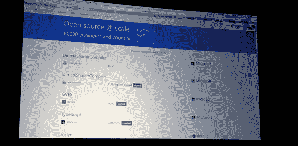

# 微软是如何最终转向开源的

> 原文：<https://thenewstack.io/microsoft-finally-came-around-open-source/>

微软已经走过了一段很长的路来努力最初热身，后来采用开源软件——从小型 skunkworks 项目到全面采用，现在支持超过 10，000 名工程师为开源做出贡献。

在这里举行的 [Linux 基金会开源领袖峰会(OSLS)](http://events.linuxfoundation.org/events/open-source-leadership-summit) 上的一次演讲中，来自微软的两位“杰夫”——[微软开源项目办公室主任杰夫·麦卡弗](https://www.linkedin.com/in/jeffmcaffer/)和[微软开源项目办公室首席工程师杰夫·威尔考克斯](https://www.jeff.wilcox.name/)——提供了一些关于事情进展的见解，因为这个软件巨头已经发展到有如此多的人不仅涉足开源项目，而且热心地为开源项目做出贡献。

麦卡弗说，GitHub 上有 10，000 名微软工程师，有 7，000 个仓库，每年有 1，000 个发布请求和 27，000 个使用注册，这相当于微软在 GitHub 上的参与度每年增长两倍。

Wilcox 说，微软开发人员热衷于开源的一个原因是因为其首席执行官热衷于开源技术。

“萨提亚(微软首席执行官纳德拉)对开源如此热衷，以至于人们觉得他们应该走出去创建回购，”他说，并指出纳德拉关于开源重要性的思想对许多工程师来说是一个通过加入竞争来推进自己职业生涯的机会。

但是当然，并不总是这样。回到比尔·盖茨和早期史蒂夫·鲍尔默的时代，开源是一个肮脏的字眼。事实上，正如麦卡弗指出的那样，这无异于微软的一种疾病。事实上，鲍尔默将 Linux 和 GNU 通用公共许可证比作一个“[癌症](http://www.theregister.co.uk/2001/06/02/ballmer_linux_is_a_cancer/)”这是他[后来违背](https://www.zdnet.com/article/ballmer-i-may-have-called-linux-a-cancer-but-now-i-love-it/)的立场，但当时，微软觉得开源是一种致命的威胁。这一点在今年的 OSLS 不止一次会议上被提及。

“无论如何，微软与开源的关系是复杂的，”Pund-IT 首席分析师查尔斯·金说。

他说，当 Linux 在上世纪 90 年代末出现时，它被许多人誉为微软对个人电脑“有害”影响的解毒剂。“毫不奇怪，微软的领导层，特别是首席执行官史蒂夫·鲍尔默，在 Linux 对桌面计算的影响很小很久之后，对这种威胁做出了激烈的反应，甚至是戏剧性的反应，”金补充道。

微软在某种程度上放松了对开源的依赖。在微软发布了著名的[“万圣节”文件](https://www.gnu.org/software/fsfe/projects/ms-vs-eu/halloween1.html)之后，从一份泄露的反 Linux、反开源备忘录开始，该公司也开始研究如何开始与迅速成为开发者世界运动的东西互动。

该公司发起了一项[共享资源倡议](https://www.microsoft.com/en-us/sharedsource/)，并任命[杰森·马图索](https://www.linkedin.com/in/jason-matusow-24a0942/)负责监督这项工作。共享源代码允许个人和组织访问某些微软源代码，以供参考和在某些情况下进行开发。

Matusow 在成为微软互用性高级主管之前一直负责这个项目。一路走来，微软推出了“ [Rotor](https://msdn.microsoft.com/en-us/library/cc749640.aspx) ”，也被称为共享源代码公共语言基础设施，这是微软的核心 CLI 的共享源代码实现。NET 框架。

“转子”是“一个纯粹的切割通过。Docker 的顾问、前微软高管 Stephen Walli 告诉新的堆栈。“所有以 Windows 为中心的技术都被移除了(例如 WinForms、ADO.NET、ASP。网)。它依赖于平台适配层(PAL)在 Mac OSX 和 FreeBSD 上运行。微软的员工做了所有的工作，除了 PAL 是由 Corel 在渥太华建立的，以履行公司之间的合同义务。作为共享资源计划的一部分，它是在学术研究许可下发布的。该许可证不是开源许可证。

从那时起，微软开始雇佣开源开发者，如菲尔·哈克(Windows 开源软件的领先开发者)、“T2”、“约翰·拉姆”(IronRuby 的创造者)、“T4”、“吉姆·胡古宁”(IronPython 的创造者)和其他人，帮助在团队中培养开源意识。其他微软名人包括 [Mark Russinovich](https://twitter.com/markrussinovich) ， [Scott Guthrie](https://www.linkedin.com/in/guthriescott/) ， [Soma Somasegar](https://twitter.com/SSomasegar) ， [Scott Hanselman](https://www.hanselman.com/) 和其他人帮助推动了更广泛的开源应用。一路走来，像 Walli 这样的人，他们曾担任“Rotor”的项目经理， [Bill Hilf](https://www.linkedin.com/in/bill-hilf-b554/) ，他曾担任微软开源和平台战略的总经理，帮助推动了这项事业。

同时，[现任谷歌产品管理副总裁的 Sam Ramji](https://twitter.com/sramji) 曾在微软担任平台战略高级总监，领导公司的全球开源和 Linux 战略，包括公司战略、技术研究、市场营销和全球执行。

麦卡弗说，在微软最初的否认阶段和随后对开源软件的测试之后，该公司成立了一个子公司[微软开放技术，也称为 MS OpenTech](https://blogs.msdn.microsoft.com/interoperability/2012/04/12/announcing-one-more-way-microsoft-will-engage-with-the-open-source-and-standards-communities/) ，以更加认真地对待开源软件。在微软资深人士让·保利和开源社区主管吉安诺戈·拉贝林诺的领导下，OpenTech 女士帮助微软和社区建立了更好的关系。

该部门的首批成果之一是 Windows 上 [Redis 的更新版本。Redis 是一个开源的、网络化的、内存中的、键值数据存储。](https://github.com/MSOpenTech/redis)

“在微软开放技术公司，我们专注于为我们的客户提供更多的选择和机会，在异构环境中将微软和非微软的技术联系在一起，”微软开放技术公司网站上的一则简介写道。“我们相信开放对我们的客户、社区和我们的业务都有好处。”

2015 年，微软将 MS OpenTech 集团收归公司，因为不再需要它的角色。就在一年前，人们说地狱结冰了，猪开始飞了，因为微软承诺开源它心爱的东西。NET，并把它带到跨平台的 Linux 和 Mac 上。去年，[微软加入了 Linux 基金会](https://thenewstack.io/evolution-action-microsoft-joins-linux-foundation/)。

“今天，MS Open Tech 已经实现了它的关键目标，开源技术和工程实践正在迅速成为整个微软的主流，”Paoli 当时在一篇博客文章[中写道。“现在是 MS Open Tech 重新加入微软公司的时候了，并帮助该公司采取下一步措施，深化其与开源和开放标准的合作。”](https://msopentech.com/blog/2015/04/17/nextchapter/)

他补充道，“通过[。NET 基础](https://thenewstack.io/switch-open-source-working-net-microsoft/)，微软已经开源。NET，还有几十个。基于. NET 的项目，并将它们带到 Linux 等平台上。我们已经围绕 TypeScript 建立了一个强大的开源社区，并与 Angular 和 [Ember](http://emberjs.com/) 等项目合作，将它带给新的开发人员受众。我们有开源技术，如 [WinJS](https://developer.microsoft.com/en-us/windows/develop/winjs) 和 [Windows 驱动程序框架](https://msdn.microsoft.com/en-us/library/windows/hardware/ff557565(v=vs.85).aspx)。”

尽管如此，让 OpenTech 女士回来，“留下了一个缺口，这就是我们进来的地方，”麦卡弗说，并指出他的办公室负责帮助将项目引入开源的过程自动化。例如，“我们没有时间支持 10，000 人进行身份认证，”Wilcox 说。

“我们希望使用 GitHub 的所有功能，并真正使用它，”他说。“我们试图通过内部门户复制 GitHub 上的一切。”

由于其多样化的 GitHub 用户群，微软开发了一个易于使用的 repo create 向导来帮助用户创建新的存储库。该公司还推出了何时使用私有存储库的指南。

“原来不用 GitHub 也可以用 Git，”Wilcox 打趣道。

此外，微软使用 Wilcox 所谓的“剧本”来帮助构建关于员工提议的开源项目的对话。该公司还深入了解了将数据收集到一个公共位置进行分析的项目。

威尔科克斯说:“我们有一种叫做‘爬虫’的东西，它能吸入数据，你可以对它进行分析。”

GitHub 上的 GHCrawler 条目称，该工具被称为 [GHCrawler](https://github.com/microsoft/ghcrawler) ，是一个 GitHub API 爬虫，它遍历 GitHub 实体的队列，以获取和存储它们的内容。“GHCrawler 非常适合:检索与一个 org、repo 或 user 相关的所有 GitHub 实体；有效地存储和检索实体；并在与 GitHub webhook 结合使用来跟踪事件时保持存储的数据最新，”它说。

与此同时，回到微软对 Linux 和它将打开的闸门的担忧，“有趣的是，真正的 Linux 革命发生在数据中心，而不是桌面——这是鲍尔默和他的支持者永远无法调和的一点。

金指出，对微软来说幸运的是，[塞特亚·纳德拉](https://www.linkedin.com/in/satya-nadella-3145136/)很好地理解了这个问题的重要性和讽刺意味。

“我相信公司正在非常努力地工作，以在众多开源社区中被视为一个好公民，”他说。“我不确定微软在开源方面已经达到了他们明显渴望达到的地位和合法性，但他们今天的处境比以往任何时候都好。”

图片:来自微软的杰夫·麦卡弗和杰夫·威尔科克斯在 Linux 基金会开源领袖峰会上的演讲，由[达里尔·塔夫脱](https://twitter.com/darrylktaft)拍摄。

<svg xmlns:xlink="http://www.w3.org/1999/xlink" viewBox="0 0 68 31" version="1.1"><title>Group</title> <desc>Created with Sketch.</desc></svg>