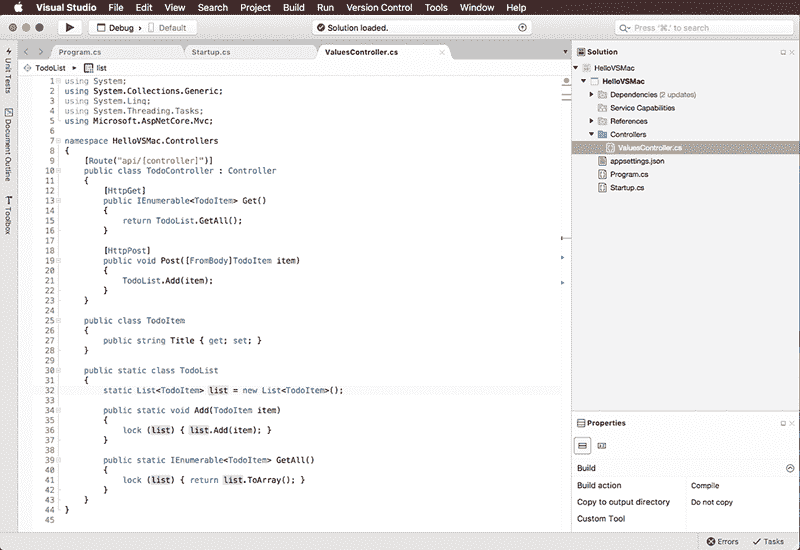
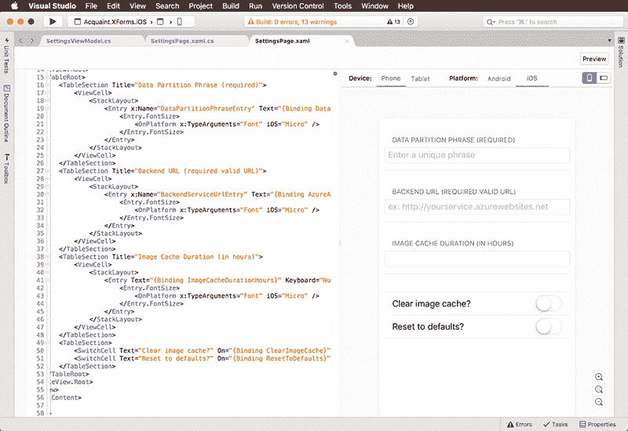

# 微软为跨平台、开源开发打造 Visual Studio

> 原文：<https://thenewstack.io/microsoft-hones-visual-studio-cross-platform-open-source-development/>

微软在其 [Connect()上继续推动为所有开发者提供一切；2016](https://connectevent.microsoft.com/) 大会本周在纽约召开，宣布了一系列工具和步骤，以更完整地支持跨平台、开源的开发环境和社区。

[Julia Liuson，](https://en.wikipedia.org/wiki/Julia_Liuson)微软公司副总裁兼 Visual Studio。微软的. NET 框架团队表示，公司将继续推进其“任何开发者、任何应用、任何平台”的策略来吸引开发者。

作为这项工作的一部分，在 Connect()；微软[展示了其新的 Visual Studio for Mac 解决方案](https://msdn.microsoft.com/magazine/mt790182?f=255&MSPPError=-2147217396&tduid=(193ddd75a1f03375a52344844b21b97a)(256380)(2459594)(TnL5HPStwNw-SPilY1XmN67OtHeeAjBJ6Q)())，该解决方案使开发者能够使用流行的开发环境在苹果的 Mac 操作系统上编写云、移动和 macOS 应用。然而，Visual Studio for Mac 不是微软旗舰 Visual Studio 工具集的完整版本，而是微软今年早些时候收购 Xamarin 时获得的 Xamarin Studio 的一个新的、更微软化的版本。Xamarin Studio 是一个跨平台的 C#开发环境。

(256380)(2459594)(TnL5HPStwNw-SPilY1XmN67OtHeeAjBJ6Q)())

Mac 版 Visual Studio

IDC 分析师阿尔·希尔瓦(Al Hilwa)告诉 New Stack，“对 Mac 开发者的更深入支持是这一总体方向的又一步，也是对微软收购的 Xamarin Studio 资产的一个很好的利用。”“将 Visual Studio 品牌视为一个 ide 家族的品牌，而不是一个单一的品牌，这一点很重要。”

此外，为了扩大其对其他平台的吸引力，微软还宣布了对 Linux preview 的 [Azure App Service](https://azure.microsoft.com/en-us/services/app-service/) 支持，以及对 Azure App Service 上 Node.js 和 PHP 堆栈的原生 Linux 支持。Azure App Service 是微软的 PaaS 产品，旨在让开发者能够为任何平台或设备构建云、网络和移动应用。

(256380)(2459594)(TnL5HPStwNw-SPilY1XmN67OtHeeAjBJ6Q)())

Xamarin。表单 XAML 实时预览

此外，微软进一步利用其 Xamarin 资产，宣布了 Visual Studio Mobile Center preview，该产品汇集了云和生命周期服务，可帮助开发人员构建、测试、分发和监控 Objective-C、Swift、Java、Xamarin 和 React Native 中构建的应用程序，适用于 Android、iOS 和基于 Windows 的设备。

“我们正在推出一系列移动产品，真正利用我们收购的 Xamarin 资产，”Liuson 说。“我们将 Xamarin Insights、Xamarin 测试云以及 HockeyApp 等一些微软内部资产结合在一起。我们将所有这些整合到 Visual Studio 移动中心中。”

HockeyApp 是一项面向开发者的移动崩溃分析和应用分发服务，开发者在 iOS、Android 和 Windows 上开发应用，微软两年前收购了这项服务。

Liuson 还指出，三星正在发布 Tizen 的 Visual Studio 工具预览。该产品基于微软的开源软件。NET 核心实现，使开发人员能够构建。微软表示，Tizen 操作系统的 NET 应用程序运行在全球数百万台三星设备上，包括电视、可穿戴设备、移动设备和许多物联网设备。

微软云计算和企业集团执行副总裁斯科特·格思里在一份声明中表示:“我们希望帮助开发者使用他们选择的工具和平台，实现更多的成就，并利用行业向云优先和移动优先体验的转变。”。“通过与社区合作来提供开放、灵活和智能的工具和云服务，我们正在帮助每个开发人员实现前所未有的创新水平。”

三星加入了。NET 基金会。该公司的 Tizen OS 是一个 Linux 基础项目。作为开放其平台的一部分，在 Connect()；微软宣布它已经作为白金会员加入了 Linux 基金会。微软也宣布谷歌已经加入。NET 基础。

希尔瓦在一份声明中说:“微软正在通过扩大其支持的平台来改变其对开发者的吸引力。”。“新的合作伙伴关系和承诺使微软能够在开发人员所在的地方与他们见面，扩大其对移动和云开发人员的影响，并在物联网、数据科学和认知计算等新兴领域建立起来。”

与此同时，微软还为最新版本的 Visual Studio 起了一个官方名字，并发布了 Visual Studio 2017 Release Candidate(RC)。微软还宣布推出 Visual Studio Team Foundation Server 2017 和 Azure Application Insights，为任何为任何平台开发任何应用的开发人员提供协作和 DevOps 平台。

希尔瓦说:“这些举措旨在继续努力拓宽 Windows 以外的微软开发者生态系统。”“这些公告将公司进一步转变为一个广泛的平台玩家，加强对非 Windows 开发者的支持。加入 Linux 基金会本来是不可想象的，但现在看起来很自然，因为该公司努力将 Linux 工作负载吸引到 Azure，移植 SQL Server 和开源. NET。”

<svg xmlns:xlink="http://www.w3.org/1999/xlink" viewBox="0 0 68 31" version="1.1"><title>Group</title> <desc>Created with Sketch.</desc></svg>