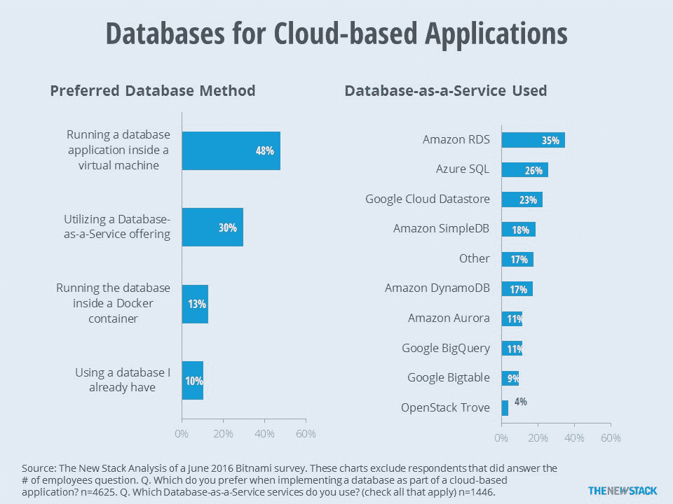
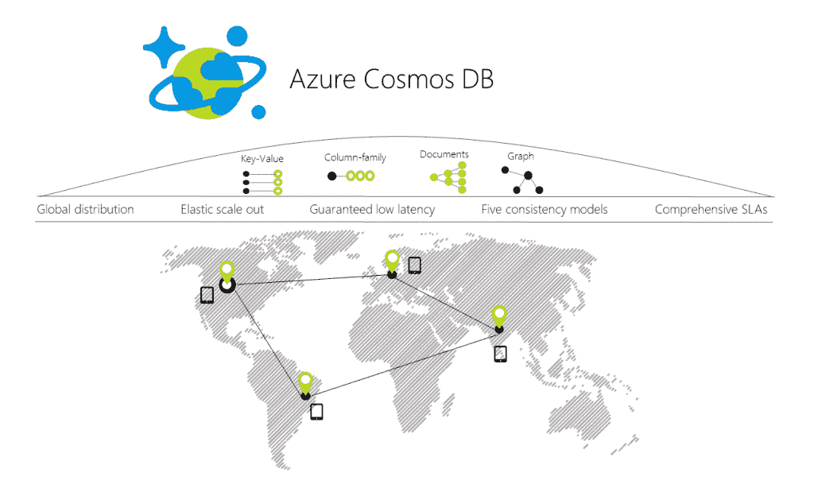

# 微软推出了 Cosmos DB，一个全球分布式多模式 Azure 数据库服务

> 原文：<https://thenewstack.io/microsoft-introduces-cosmo-db-globally-distributed-multi-mode-azure-database-service/>

随着[微软首席执行官塞特亚·纳德拉](https://www.linkedin.com/in/satya-nadella-3145136)引领新云服务的登场，微软建设本周在西雅图拉开帷幕。 [Azure](https://azure.microsoft.com/en-us/) 在[主题演讲](https://www.youtube.com/watch?v=Mo6kRl430h4)期间获得了许多新产品，包括对 [MySQL](https://www.mysql.com/) 的新支持和一个名为 [Cosmos DB](https://docs.microsoft.com/en-us/azure/cosmos-db/introduction) 的全球数据库。

纳德拉为开发者展示了微软的工业物联网解决方案，Azure IoT。使用 Azure 的物联网工具，开发人员可以构建反应式应用程序来做一些事情，如启动紧急关机或预测工厂设备的维护。Azure IoT Edge 系统还允许更轻松地管理边缘设备，并能够通过 web 界面向它们推送更新的软件。

“当你在同一个地方有很多很多设备时，现在就会在工厂或家里创建一个临时数据中心。为此，我们有 [Azure Stack](https://azure.microsoft.com/en-us/overview/azure-stack/) ，这样你就有了计算和存储能力。纳德拉说:“你有能力运行认知服务，比如商用相机上的计算机视觉。

当然，在所有这些新设备的背后，是大量的数据。微软也有针对这些数据的解决方案。 [Rimma Nehme](https://www.linkedin.com/in/rimma-nehme) 在主题演讲中上台展示 Azure 的最新数据库产品 Cosmos DB。这个多功能数据存储是一个全球分布式数据库，能够处理键值对、文档、图形和列族数据。

“想象一下，你想开发一个全球范围的智能应用，用户遍布全球。它必须超级快，必须具有难以置信的弹性，并且必须在世界各地都可以使用，”Nehme 在主题演讲中说道。她接着演示了如何围绕漫威漫画世界构建一个应用程序，展示了角色之间的众多人际关系。

Nehme 表示，创建一个新的 Cosmos DB 可以通过与启动大多数 Azure 服务相同的点击界面来完成。发布时，开发人员可以从两个 API 中选择:MongoDB 或 SQL。Nehme 表示，微软今天也发布了图形和键值存储的预览 API。

Azure 门户包含了 Cosmos DB 的更多控件和工具。这包括一个基于网络的数据探索工具，它允许开发者可视化信息之间的联系。

Cosmos DB 可以分布在九个数据中心区域，用户可以针对每个区域进行读写操作。“我可以回答全球范围内的任何图形查询，保证读取延迟不到 10 毫秒。关键信息是，无论数据模型如何，无论您使用的 API 如何，无论数据分布甚至故障如何，我们都将继续为您提供一个单一的系统映像，用于所有这些全球分布的资源，以便您的开发人员可以专注于您的应用程序，而不是它们背后的数据库，”Nehme 说。

一致性是 Azure Cosmos DB 的另一大优势。Nehme 说，Cosmos DB 提供了[五种不同的一致性模型](https://littlemindslargeclouds.wordpress.com/2013/10/10/defining-consistency-guarantees/)，而不是只提供强一致性模型或最终一致性模型。这包括三种中间一致性模型:有界过时、会话和一致前缀。

微软还打破了一些云提供商的传统，宣布其围绕 CosmosDB 的服务水平协议将涵盖不仅仅是可用性。事实上，Cosmos DB 通过一套涵盖所有这些因素的新 SLA，保证了 99%的正常运行时间的延迟、吞吐量、一致性和可用性。

支持其数据库产品的还有两项新的 Azure 服务: [MySQL](https://docs.microsoft.com/en-us/azure/store-php-create-mysql-database) 和 [PostgreSQL](https://www.postgresql.org/) 即服务。这两个数据库产品现在对 Azure 用户可用，为可能还没有使用 SQL Server 的开发人员拓宽了选择。

更重要的是，微软宣布推出微软 Azure SQL 数据库迁移服务 T1，允许开发者将他们现有的数据库迁移到 Azure SQL 数据库中。该服务涵盖 Oracle 和其他 SQL 兼容数据库。

通过 Pixabay 的特征图像。

<svg xmlns:xlink="http://www.w3.org/1999/xlink" viewBox="0 0 68 31" version="1.1"><title>Group</title> <desc>Created with Sketch.</desc></svg>