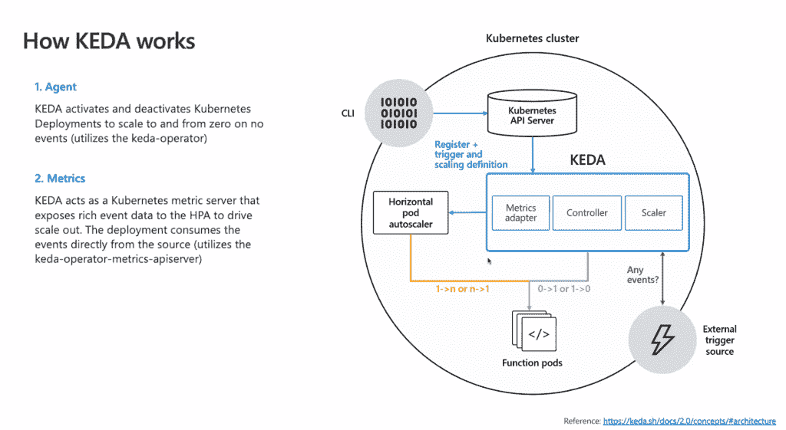

# CNCF·KEDA 2.0 在 Kubernetes 上扩展了事件驱动编程

> 原文：<https://thenewstack.io/microsoft-keda-2-0-scales-up-event-driven-programming-on-kubernetes/>

虽然在 Kubernetes 的基础上仍有大量工作要做，但它也已经达到了一个成熟的水平，其中许多创新都在周围的生态系统中，无论是扩展和操作符，还是改善开发人员体验的方法。

[KEDA](https://keda.sh/) ，一个 Kubernetes 事件驱动的自动缩放器——刚刚达到 2.0 版本——有助于使 Kubernetes 更适合无服务器和事件驱动的计算。正如 Kubernetes 的联合创始人和[微软](https://www.microsoft.com)公司副总裁 [Brendan Burns](https://twitter.com/brendandburns) 在最近的一次 AMA 上指出的，它给企业一种方法，从开发者那里消除 Kubernetes 的一些复杂性，而不必创建自己的平台架构。“我们看到一些模式，人们实际上在利用生态系统，虽然不是平台架构团队，但他们正在安装像 KEDA 这样的功能系统服务运行时，在他们的 Kubernetes 集群上为他们提供更多以开发人员为中心的应用。”

他预计这种方法会变得更加普遍。“人们现在正在经历很多痛苦才能将他们的应用程序放入 Kubernetes，如果我们能在这方面提供帮助，那太好了。我认为在几年内，人们会禁止大多数开发者使用原始的 Kubernetes APIs。我们将进入一个在这些公司中有规则的地方。我们已经看到人们说，“不，这太低了。就像用汇编语言一样；你做不到，你得用这些更高级的原语。"

## **缩放缩放器**

正如微软负责 Azure 功能和 Kubernetes 无服务器技术的首席产品经理杰夫·霍兰去年在 Kubernetes 向新堆栈解释的那样，KEDA 是一个定制控制器，它增强了 Kubernetes 中的水平 Pod 自动缩放器。

“默认情况下，Kubernetes 实际上只能进行基于资源的扩展，查看 CPU 和内存，在许多方面，这就像是治标不治本。是的，大量消息最终会导致 CPU 使用率上升，但我真正希望能够扩展的是，队列中是否有一百万条消息需要处理。”

基于资源消耗的扩展总是被动的；KEDA 可以主动进行扩展，以便任务到达时工作负载已准备就绪。

KEDA 允许你设置自定义指标，比如队列中消息或事件的数量，或者 Kafka 中的主题延迟，在需求影响性能之前扩大容器，然后随着事件的减少缩小容器；如果需要，如果排队等待处理的事件数量仍然很少(比如说，一个触发器可以在 15 分钟内指定不超过五条消息)，则可以一直减少到零。

KEDA 使用定标器来处理特定的事件源；它已经有了像 RabbitMQ、Kafka 和 NATS 流媒体这样的关键资源。KEDA 为各种工具和服务添加了新的定标器，其中许多都是由社区贡献的。Codit 的 KEDA 维护者 Tom Kerkhove 告诉新的堆栈:“我们正在构建我们已经拥有的平台，但通过新的提供商、可扩展性和平台统一来扩大我们的范围。“我们推出了大量新的定标器，专注于不同的领域。”

这包括添加新的平台，如 IMB 的 MQ scaler，扩展现有的平台支持，如 Azure Log Analytics，以使这些客户更容易地使用他们需要的东西，并通过引入其他身份验证方法来改进现有的 scaler，如 Azure Monitor scaler 的托管身份支持。

新的 Metrics API scaler 和外部推送选项(而不是当前的基于拉的模型)提高了可扩展性:“用户可以通过扩展我们尚不支持的度量系统来扩展 KEDA，但他们拥有所需的所有控制，”Kerhove 解释道。“另一个原因是刺激社区构建更多的缩放器，看看哪些是最受欢迎的，这样我们就可以将它们合并到我们的核心中。我们希望我们的用户扩展他们需要扩展的内容，而不仅仅是我们支持的内容，因此我们为他们提供了相应的工具。”

如果事件源有一个 REST API，KEDA 2.0 现在可以通过度量 API 使用它，而不需要定制的缩放器，因此您可以根据来自生产系统的内部 API 的定制度量来扩展工作负载，或者使自动化流程的云服务(如 Dynamics 和 Salesforce)也触发工作负载来处理流程，作为事件驱动流的一部分。

“我们允许客户通过 HTTP 与现有的公制系统集成，以便他们可以在其上扩展。这可以是使用我们还不支持的外部系统，或者简单地基于已经可用的内部 API，并重复使用这些信息，”Kerkhove 解释道。还有一个 [go 客户端库](https://github.com/kedacore/keda/tree/main/pkg/generated)，这样开发者可以直接从应用程序中使用 KEDA API。

KEDA 2.0 还使用 Metrics API 来揭示有关 KEDA 自身行为的更多信息，包括运营商和 Metrics 服务器 pod 上的活跃度和就绪性探针，以及正在使用的每个定标器的 Prometheus metrics。“通过探测器和普罗米修斯指标，我们旨在为我们的用户提高 KEDA 运行时的可操作性，让他们能够检查它是否仍在运行，并了解他们的缩放对象如何运行，”Kerkhove 告诉我们。

Roubalik 补充说，普罗米修斯指标是新的。“我们刚刚开始公开它们，我们可能会在后续版本中扩展这一功能。我们公开了关于什么被缩放、错误数量等等的数据；然后，用户可以收集这些指标，了解哪些指标得到了调整，以及调整的方式。”最初，度量标准涵盖 ScaledObjectScaledJobs 的指标将在未来的版本中提供。

## **统一粒度缩放**

为了处理长时间运行的流程，KEDA 具有扩展作业以及整个部署的粒度，因此它可以避免缩减实例，因为这会扼杀只需要几分钟处理时间的长时间运行的执行。Kerkhove 说，KEDA 2.0 使之更加灵活。

“我们希望为人们提供根据需求扩展工作负载的能力。这就是为什么我们在 ScaledObject 旁边引入了 ScaledJobs，因为它们具有不同的缩放行为。例如，作业需要每个消息一个实例，并运行到完成，而 ScaledObject 更像是一个不断运行的守护进程，我们只是根据指标扇出/入。这曾经是同一个 CRD，但我们注意到它令人困惑，所以我们决定将它们分开。”

它还可以使用多个触发器进行自动缩放，每个触发器使用不同的缩放规则。

“在 2.0 之前，这在一个 ScaledObject 上是不可能的，但这又回来了几次，例如，我们希望扩展队列深度和 CPU。另一个例子是，如果一个容器正在处理多个队列，我们需要监控这两个队列，并相应地进行扩展。”

“从长远来看，我们可以在此功能的基础上进行更智能的自动扩展。例如，今天，如果队列堆积如山，我们可以扩展我们的工作负载，但如果我们看到我们的数据库已经被淹没，我们会使情况变得更糟[通过在 Kubernetes 上扩展工作负载]，因此我们会验证使用率是否低于 x%，”

KEDA 2.0 对资源如何扩展有更高的粒度，它有自己的 CPU 和内存缩放器，这意味着您可以使用 KEDA 进行所有扩展，而不需要混合 KEDA 和 HPA 扩展。

“我们努力让自动缩放应用程序变得非常简单，但要做到这一点，我们需要成为一个统一的自动缩放平台，”Kerkhove 解释道。“这就是为什么我们推出了 CPU 和内存缩放器，以便您可以使用 KEDA 来扩展一切，而不必再在某些方面与 HPAs 混合使用。作为其中的一部分，我们开放了 HPA 配置。因此，更高级的用户可以调整底层的 HPA 本身。”

但也许最大的变化是，它现在不仅可以扩展部署，还可以扩展实现 Kubernetes [**/scale** 子资源](https://kubernetes.io/docs/tasks/extend-kubernetes/custom-resources/custom-resource-definitions/)的任何东西；这包括 StatefulSets 和任何其他自定义资源。

“现在人们可以用 **/scale** 子资源扩展任何东西，它允许其他项目扩展它们自己的组件。例如，我们让 ArgoCD 在此基础上扩展他们自己的资源，”Kerhove 说。

Argo 使用 KEDA 进行推广。Knative 一直在尝试使用 KEDA 来自动缩放 Knative 事件源，并最终扩展到经纪人和渠道，来自 Red Hat 的 KEDA 维护者 Zbynek Roubalik 告诉我们。“有意向在 Knative Eventing 组件(不服务)上添加/扩展子资源。通过这种方式，KEDA 可以在竞争中扩大这些组成部分，比如来源、经纪人和渠道。”在 kna tive sandbox[中有一个概念验证项目](https://github.com/knative-sandbox/eventing-autoscaler-keda)，支持将 KEDA 2.0 与 Kafka 和 AWS SQS 一起用作源，以及对 RabbitMQ Broker 和 Redis 流源的实验性支持。

Knative 并不是唯一一个关注 KEDA 的无服务器平台:裂变正在构建一个现成的 KEDA 连接器目录，这些连接器已经被编写来扩展其在 Kubernetes 上的无服务器功能。DAPR 是事件驱动的分布式应用运行时，刚刚达到其 1.0 里程碑，[使用 KEDA 在 Kubernetes](https://docs.dapr.io/developing-applications/integrations/autoscale-keda/) 上进行自动缩放。

阿里云正在使用 KEDA 在生产中自动扩展其企业分布式应用服务，其他几个项目也采用了 KEDA 进行扩展。Apache Airflow 和天文学家[使用](https://www.astronomer.io/blog/the-keda-autoscaler/) KEDA 基于 SQL 查询自动缩放工作流(Airflow 中的未决、排队和正在运行的任务存储在元数据库和 Polidea 中，天文学家团队贡献了 Postgres 和 MySQL 缩放器)。

KEDA 最初由微软和红帽开发，今年早些时候成为了云原生计算基金会沙盒项目，该项目有望在 2020 年底或明年年初从 T2 毕业并孵化。还讨论了将部分或全部功能移植到 Kubernetes scaler 中，以使其更广泛地可用。与此同时，该项目正在改善其安全状况，并且有一个针对即将到来的功能的[公开路线图](https://github.com/kedacore/keda/projects/3)。这包括几个新的缩放器的计划，还包括更雄心勃勃的想法，如使用历史数据和预测分析来更加主动地进行缩放。

<svg xmlns:xlink="http://www.w3.org/1999/xlink" viewBox="0 0 68 31" version="1.1"><title>Group</title> <desc>Created with Sketch.</desc></svg>