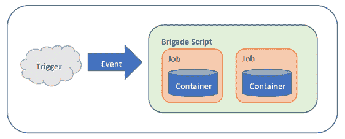
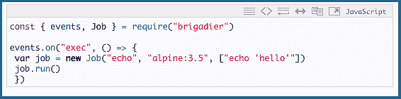
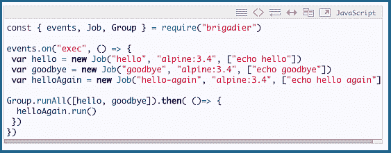

# 微软发布 Brigade:Kubernetes 的事件驱动脚本工具

> 原文：<https://thenewstack.io/microsoft-launches-brigade-event-driven-scripting-tool-kubernetes/>

微软一直在努力确保这些天来，当开发人员和工程师抬起他们的目光投向云原生的天空时，他们看到的天空是蓝色的。

为此，微软一直在用开源工具填充容器空间，使容器化的工作负载更快采用、更容易使用，并且越来越可靠地自动化。到目前为止，2017 年已经看到微软[收购了开发](https://blogs.microsoft.com/blog/2017/04/10/microsoft-acquire-deis-help-companies-innovate-containers/)[掌舵人](https://github.com/kubernetes/helm)的 Deis 。Helm 是一个软件包管理器，用于安装和管理 Kubernetes 应用程序的生命周期，也是一个高效的工具，用于查找、使用和共享 K8s 工具和软件。该公司还推出了[草案](https://github.com/azure/draft)，这是一种通过监控开发人员工作流程的实时代码、预提交“内部循环”来检测应用语言并将简单的 docker 文件和 Helm 图表写入源代码树来简化应用开发和部署的工具。

> 使用 Kubernetes，Brigade 通过将容器链接在一起使构建应用程序变得容易。

现在，同一个团队引入了[旅](http://brigade.sh/)，这是一个框架，用于编写在容器内部执行的工作流任务。Kubernetes-native 工具允许开发人员构建 K8s 容器的有序工作流，从一个到多个，然后在监听任意触发事件时空闲。一旦被触发，部队就会冲进来。

“Brigade 是一个工具，您可以使用您的本地[minikube](https://github.com/kubernetes/minikube)或您的 kube/context 指向的任何 Kubernetes 集群，通过 JavaScript 轻松、快速、轻松地自动化您能想到的几乎任何事情。根据微软的发布公告，这是一种你完全拥有的“结构化无服务器”的形式。

换句话说，Brigade 的功能就像一个结构化的管道，用户在其中定义一系列任务，然后每当指定的触发事件发生时，Brigade 就会按照指定的方式运行直至完成。

瞄了一眼，大队:

*   是 Kubernetes-native，一行安装。
*   支持项目和可定制的事件模型。
*   使用 JavaScript，使一个旅管道成为一个应用程序。
*   支持任意复杂的(并行或同步)管道。
*   在容器中执行函数。
*   完全支持 Kubernetes 卷、pod、基于角色的访问控制(RBAC)和秘密。

集装箱在他们的左边，集装箱在他们的右边，他们大胆地骑着，嗯…

Brigade 是 Kubernetes 内部的一项服务(它本身是基于 JavaScript 的)。当一个旅“作业”——事件流程中用户定义的步骤——接收到一个 JS 文件时，它会解释脚本并创建适当的底层 Kubernetes 资源。作业转换成 K8s pods，相关的容器从容器源注册表中取出(微软真心希望是基于 Azure 的)。然后，Brigade 管理这些 pod 的执行，并控制它们之间的数据流，同时监控错误。

在最简单的层面上，Brigade 监听触发器，然后发出一个事件。然后在 Kubernetes 集群中执行注册来处理该事件的脚本。根据发布公告，该工具是完全可定制的——只需“一点点编码”——但方便地附带了一个预定义事件库，用于常见场景，如处理 GitHub 和 DockerHub webhooks。

然而，大型图书馆是 Brigade 的建造者在设计上避免的。受 shell 脚本的启发，他们的巧妙方法是将容器链接到 Kubernetes 的脚本中:Brigade 不是从内置库中访问模块，而是使用容器本身作为脚本的构建块，然后执行事件驱动的任务。根据微软的说法，这意味着 Kubernetes 平台的一次重大增强，通过将容器链接在一起使构建应用程序变得容易。

他们不去思考为什么，他们只去做或者去死…

一个旅处理的事件从创建一个或多个“工作”开始(“作业”是 Brigade 的术语，指用户定义流程中的单个步骤或任务)。一个旅脚本可以并行(默认)或按定义的顺序执行任意数量的作业。“链接”方面意味着任何一个作业返回的输出都可以被捕获、修改并传递给另一个作业。

下面是一个简单的脚本，演示了 Brigade 如何加载一个基本的 Linux 容器并在其中执行一个命令:

创建了一个新作业，从现成的 [Alpine Linux 3.5](https://hub.docker.com/_/alpine/) Docker 容器开始，然后在容器内部运行一个简单的 echo 命令。

仍然使用简单的容器，但是这次使用了一些工作流，请看:

【T2

该脚本声明了三个作业— hello、goodbye 和 helloAgain。然后，它创建一个管道，通过并行运行 hello 和 goodbye 来执行，然后，当这些操作完成时，运行 helloAgain。这是一个非常简单的例子，但是演示了在 Brigade 中构建工作流管道是多么直接和简单。

早期的容器技术侧重于扩展和管理长期运行的服务。有了 Brigade，诸如批处理、代码质量测试和事件驱动的程序流等短期任务现在也得到了容器处理。

*给你读点诗:[轻装旅的冲锋](https://www.poetryfoundation.org/poems/45319/the-charge-of-the-light-brigade)，阿尔弗雷德·丁尼生勋爵。*

<svg xmlns:xlink="http://www.w3.org/1999/xlink" viewBox="0 0 68 31" version="1.1"><title>Group</title> <desc>Created with Sketch.</desc></svg>