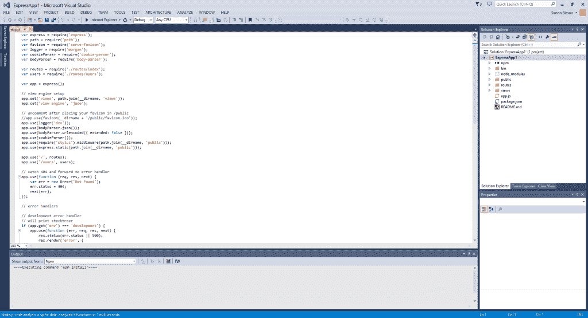

# 用于 Visual Studio 的 Node.js 附加工具

> 原文：<https://thenewstack.io/microsoft-launches-visual-studio-node-js-tooling/>

上周，微软宣布为使用 Node.js 的开发人员发布一组 Visual Studio 插件。目前可用于 Visual Studio 2012 和 2013 的 Visual Studio (NTVS)节点工具可以与免费的 Visual Studio 社区工具以及微软 IDE 的商业版本一起使用。

NTVS 提供了构建快速应用程序和使用 npm 的工具。

使用 Apache 2.0 许可证授权，这些工具和源代码可以通过微软的 CodePlex 存储库获得，提交代码和发出拉请求的能力也是如此。Visual Studio 中的安装快速而简单，工具安装后很容易访问，具有新的菜单项和新的项目模板。有几个先决条件:如果你计划使用来自 Azure 网站的 Node.js 或 io.js 支持，那么你需要安装 Visual Studio Azure 工具，当然你需要在你的开发 PC 上安装最新的 Node.js。

由于 NTVS 是一个 Visual Studio 插件，它可以访问完整的 Visual Studio IDE，包括其语法突出显示和自动代码格式化。还有代码完成，因为静态分析工具处理你写的代码和你安装的任何 npm 包。虽然有对 io.js 的支持，但它还不完整，因为 ECMAScript 6 在 Visual Studio 中还不完全支持，并且新的语言语法会导致 IntelliSense 代码分析工具出现问题。

也许 NTVS 最有用的功能是它的互动窗口。就像 Xcode 中的沙盒 Swift playgrounds 一样，它允许您在将代码片段添加到应用程序之前，使用 Node.js 的本地副本快速试用代码片段。这是一个有用的工具，不仅仅是作为一个便笺，也是在调试时隔离和测试代码元素的一种方式。

像这样的调试工具使得使用成熟的 IDE(如 Visual Studio with Node.js)变得容易得多。通过挂钩远程调试工具和探查器，您可以快速掌握应用程序并确定生产和性能问题。还支持与 Visual Studio 的单元测试工具和 Visual Studio Online devops 服务的集成，包括与 Git 和 Github 的集成。

如果您使用 Node.js 框架，NTVS 静态代码分析工具将针对 100 个顶级 npm 包进行测试，IntelliSense 工具也将在 Express 和 Seneca 等流行框架中进行测试。Express 用户获得了内置项目模板的额外好处，因此您可以快速设置基于 Express 的站点，Visual Studio 的 npm 安装程序会为您处理设置。它完全支持 npm，并通过熟悉的解决方案资源管理器公开和管理依赖关系。

微软的 NTVS 工具是对 Visual Studio 的一个受欢迎的补充。随着 Node.js 对于微服务开发和可伸缩的容器化应用变得越来越重要，让开发人员选择在他们的 Visual Studio 项目中使用它是非常有意义的。结合 Visual Studio 的免费社区版，它应该使开发人员能够快速入门 Node.js，而不仅仅是使用文本编辑器。在 Visual Studio 中结合 NTVS 和 Xamarin 意味着你将拥有一个端到端的开发工具，从服务到跨平台的客户端。

在我们使用它的一周里，我们发现它是一个有用的工具；通过将 Node.js 服务构建到一个熟悉的 IDE 中，NTVS 消除了编码 node . js 服务的许多挫折。通过支持部署服务，并集成到连续交付工作流中，它可以使 Visual Studio 不仅成为您的 Windows 应用程序的家，而且成为驱动它们的微服务。

通过 Flickr Creative Commons 的特色图片。

<svg xmlns:xlink="http://www.w3.org/1999/xlink" viewBox="0 0 68 31" version="1.1"><title>Group</title> <desc>Created with Sketch.</desc></svg>