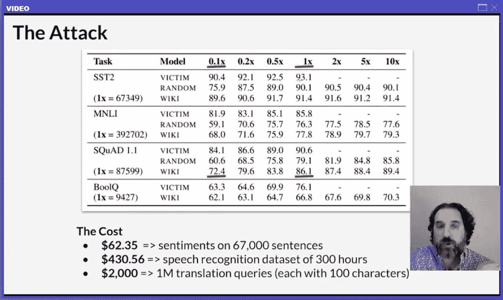
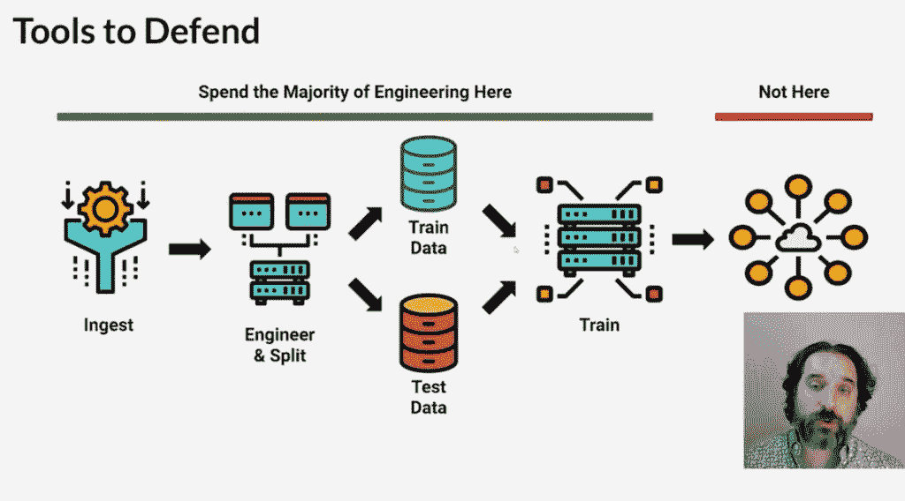
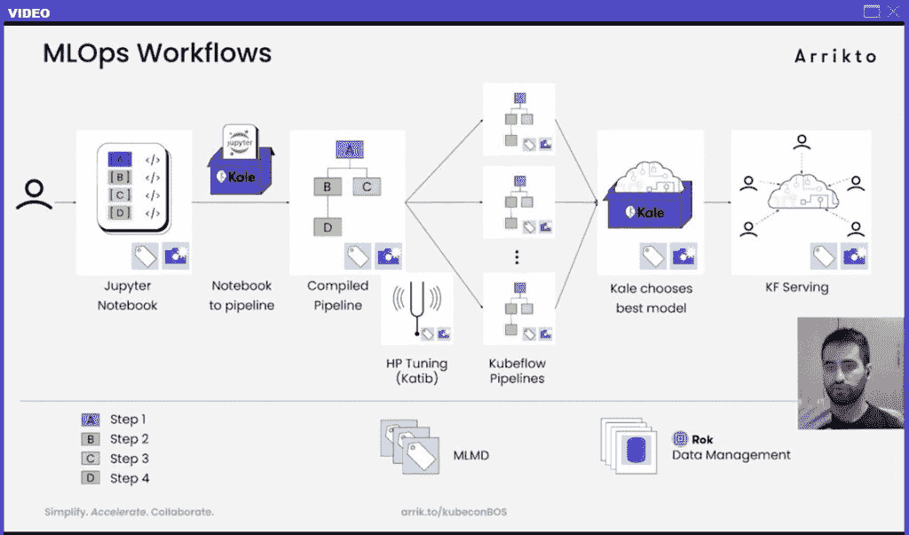

# 微软:机器学习模型很容易被逆向工程

> 原文：<https://thenewstack.io/microsoft-machine-learning-models-can-be-easily-reverse-engineered/>

[Honeycomb](https://www.honeycomb.io/) 正在赞助新 Stack 对 Kubecon+CloudNativeCon 北美 2020 的报道。

本月早些时候，在 KubeCon+CloudNativeCon 的[演示会上，](https://docs.google.com/presentation/d/1Etn50JQdOL9Lsa065sngUmIZ0yk63NKwlXDNiHR0Ta4/edit?usp=sharing)[微软](https://www.davidaronchick.com/)首席技术官办公室 Azure Innovations Group 的合伙人兼产品经理警告说，机器学习模型的生产成本可能高达数百万美元，可以通过秘密手段轻松复制。

虽然现在没有简单的方法来防止这种攻击，但 Aronchick 建议，最好的防御方法是开发和运行 MLOps 管道，这种管道可以轻松应对新的攻击媒介。MLOps 是将数据科学家的工作与制作和运行模型的整个开发和推广过程相集成的实践，包括保护每个步骤的步骤。阿龙奇克本人负责开发 KubeFlow，这是一个为 Kubernetes 打造的机器学习操作平台。

“你不能回避的事实是:你的模型会受到攻击，你的管道会有问题。这个游戏是关于减轻伤害和快速恢复的。你可以使用 MLOps 管道来实现这一点。

在他的演讲中，Aronchick 提供了一些例子，说明恶意黑客如何复制 ML 模型供自己使用。

一种被称为蒸馏的攻击试图通过使用 API 提交查询并记录结果来复制一个否则无法访问的黑盒模型。例如，对于图像识别模型，攻击者可以提交各种形状并记录结果。通过足够的输入，用户可以确定模型正在寻找哪种形状(即，三角形)。阿龙奇克说:“我能够只用这些例子来重建基本模型。”。

两个不同的研究人员能够用这种方法在不到 5000 次查询中重建一个模型，或者说在不到两天的时间里每分钟 2 次查询。“真的不是很多，”阿龙奇克说。

另一种类型的攻击称为模型提取，专注于自然语言处理(NLP)，其中模型用于回答针对大量文本的查询。如今，NLP 的实现通常基于 Google 的 [BERT](https://arxiv.org/abs/1810.04805) (变压器的双向编码器表示)模型。他说，谷歌研究人员发现，无论是通过呈现随机单词，还是来自模型自己的训练材料语料库的单词，他们都能够“获得模型正在寻找的真正准确的表示”。

例如，研究人员能够通过模型语料库(例如，维基百科页面)中所有单词的单次迭代，获得模型本身 86%的准确率。

阿龙奇克估计，通过这种技术，只需要价值几千美元的云计算就可以逼近这样一个模型:“这比首先训练这个模型所需的数百万美元要少得多。”

他还深入研究了数据泄漏，ML 系统可能会无意中泄露个人身份数据。例如，浏览器或电子邮件阅读器上的自动完成功能提供了最终用户习惯的线索。“这将揭示我在其他电子邮件中写的很多东西，”他说。慢跑应用程序可以通过多名跑步者的模式来揭示绝密建筑的位置。一个用户联系人的图表可以揭示一个秘密组织或任务，比如创建一个工会的运动。

虽然阿龙奇克没有提供任何具体的建议来防止违法者复制数百万美元的模型，但他强调了建立一个可以根据这种违规行为轻松改变的系统的重要性。你可以花费精力应对每一次攻击，但“最多你可以停止(攻击)，但你并没有增加很多价值。”最好是主动建立一个可以快速发展的管道，以防止新的攻击。

“如果你向世界展示(你的模式)，它会受到攻击。最重要的是你能多快地更新、迭代和检测这些攻击，并迅速做出改变，”他说。

该演示还包括一个基于 MLOps 的工作流示例，由 [Arrikto](https://www.arrikto.com/) 软件工程师 [Yannis Zarkadas](https://twitter.com/yanniszark) 提供。KubeFlow 充当 CI/CD，可以连接数据科学家的 Jupyter 笔记本。笔记本的结果可以检查到 GitHub 中，并通过训练进行充实，用 [Kale](https://github.com/kubeflow-kale) 进行推理超参数调优(对于大数据处理可能还有 Spark)。

要查看完整的演示，请登录 KubeCon+CloudNativeCon [虚拟会议网站](https://onlinexperiences.com/scripts/Server.nxp?LASCmd=L:0&AI=1&InitialDisplay=1&ShowKey=113608&ClientBrowser=0)。该演示在“机器学习+数据”专题下的分组会议中进行。

KubeCon+CloudNativeCon 是新堆栈的赞助商。

库勒·德·皮沙贝的特写。

<svg xmlns:xlink="http://www.w3.org/1999/xlink" viewBox="0 0 68 31" version="1.1"><title>Group</title> <desc>Created with Sketch.</desc></svg>