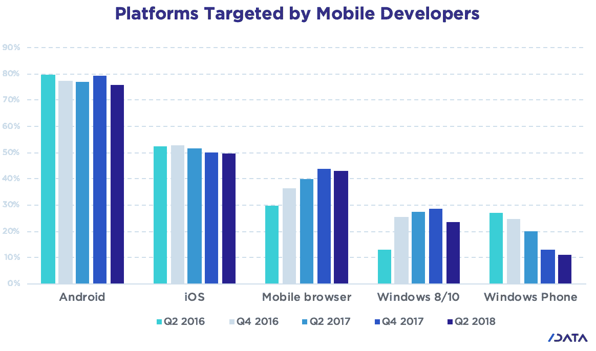

# 微软移动开发者转向通用浏览器

> 原文：<https://thenewstack.io/microsoft-mobile-developers-moving-to-generic-browsers/>

微软继续战略性地放弃其建立面向消费者平台后端的承诺，如其 [Edge 浏览器](https://www.theverge.com/2018/12/4/18125238/microsoft-chrome-browser-windows-10-edge-chromium)和 [Cortana 助手](https://www.businessinsider.com/microsoft-ceo-satya-nadella-cortana-amazon-alexa-2019-1)。现在它停止了对 [Windows 10 移动操作系统](https://www.cnbc.com/2019/01/18/microsoft-ending-windows-10-mobile-says-switch-to-iphone-or-android.html)的支持。

对于移动设备，该公司建议客户转向支持的 Android 或 iOS 设备，但以微软为中心的开发人员将何去何从？根据 SlashData 的数据，11%从事移动项目的开发人员仍然主要编写 Windows 操作系统的应用程序，无论是 Phone、8 还是 10。在这个群体中，51%的人也在开发 Android 应用程序，36%的人在开发运行在移动浏览器上的应用程序，30%的人在开发 iOS 应用程序。随着微软退出移动设备领域，真正的赢家似乎是开发人员自己编写在浏览器中运行的代码。

在过去两年中，开发 Android 和 iOS 应用程序的开发者比例略有下降，而开发移动浏览器的开发者比例上升了 43%。虽然在浏览器上运行应用程序会对性能产生负面影响，但它增加了跨平台的移动性，并减少了开发人员对一个供应商生态系统的锁定。对微软来说，依赖移动浏览器作为默认平台有一个额外的好处，那就是比在苹果或谷歌控制的操作系统上运行风险更小。由于微软已经承诺在自己的产品中使用 Chrome 浏览器的核心组件，它正在打赌，谷歌宇宙的这一部分不会被操纵，以使其创始人获得不公平的优势。

该数据来自 SlashData 半年度开发者经济调查。我们鼓励您参与当前的研究，该研究深入探讨了增强现实/虚拟现实和游戏主题，这两个领域都是微软做得特别好的。

来源:SlashData。在过去两年中，开发 Android 和 iOS 应用程序的开发者比例略有下降，而开发移动浏览器的开发者比例上升了 43%。

> 参加开发者经济调查，有机会赢得一台 [Oculus Rift](https://www.oculus.com) 或其他奖品。

## 对微软的影响

超过 600 万开发人员使用 C#，这是微软生态系统的核心。这些开发人员中的许多人都是作为业余爱好者开发移动应用程序，而不是以专业方式获取报酬。我们预计不会有任何重大的迁移离开微软的核心社区。

> 微软不再试图创建一个封闭的生态系统，在这个系统中，它拥有跨大多数产品类别竞争的软件。

决定终止产品并不能证明微软很弱。相反，几个月前，微软成为世界上市值最高的公司，它上次保持这一位置是在 2003 年。微软不再试图创建一个封闭的生态系统，在这个系统中，它拥有跨大多数产品类别竞争的软件。随着桌面不再是面向消费者的开发人员的主要关注点，微软没有责任开发一个应用程序生态系统，并为该领域建立自己的用户基础。相反，可以将其大量的内部开发人员集中在构建将被最多人使用的功能上。

因为微软将继续挑挑拣拣，但当它退出一个领域时，预计它会完全拥抱开源，即使该项目不是内部发起的。

最后，开源也让我们看到了微软的未来:开发者工具和云。查看最近的 GitHub 报告(是的，微软正在收购 Github)，我们发现 Visual Studio 和 Azure 文档是去年贡献者最多的两个项目。

通过像素的特征图像。

<svg xmlns:xlink="http://www.w3.org/1999/xlink" viewBox="0 0 68 31" version="1.1"><title>Group</title> <desc>Created with Sketch.</desc></svg>