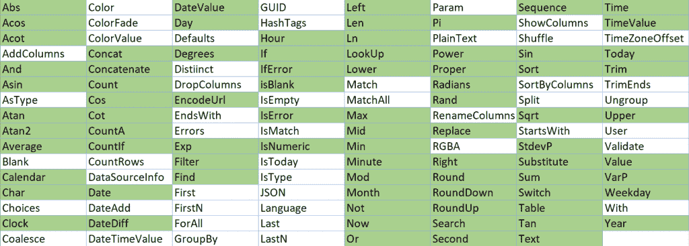
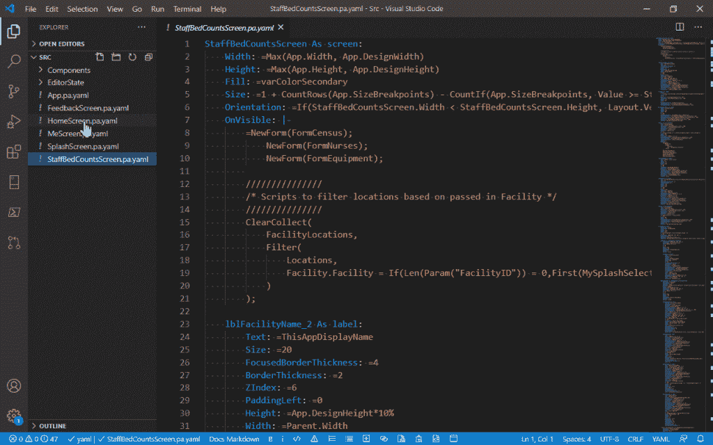
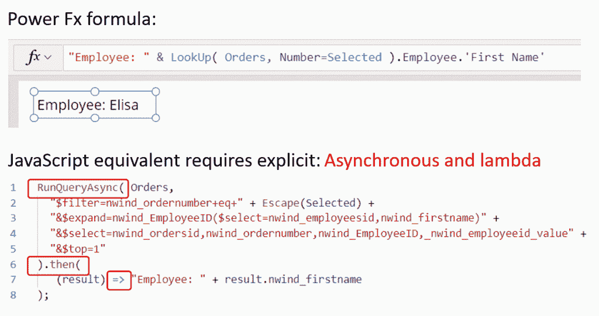

# 微软开源了 Power Fx 语言，用于在低代码应用中定制逻辑

> 原文：<https://thenewstack.io/microsoft-open-sources-the-power-fx-language-for-customizing-logic-in-low-code-apps/>

早在一月份，微软[发布了一个实验工具](https://github.com/microsoft/PowerApps-Language-Tooling/blob/master/README.md#setting-up-a-dev-box)，通过将它们导出到 GitHub，可以更容易地在 Power Apps 中创建的拖放式低代码画布应用程序上进行协作。代替不透明的 blob 文件，该实用程序提取可编辑的源代码(在 YAML 的子集中编写[)，这些代码可以在像 Visual Studio 代码这样的 IDE 中编辑，签入源代码控制系统，并通常成为标准应用程序生命周期管理的一部分，在那里您可以区分更改，发出拉请求并合并 PRs 以更新应用程序。](https://github.com/microsoft/PowerApps-Language-Tooling/blob/master/docs/YAMLFileFormat.md)

这是第一次看到 Power Fx 一种基于 Excel 的低代码的[开源编程语言](https://github.com/microsoft/power-fx)。Canvas 应用程序公式语言有时也称为 Power Apps 表达式语言，因为如果语句和变量一直是用它编写的，它就是公式，但它也是 SharePoint 表单的自定义方式，并在 Dynamics 365 设置中使用。

现在微软正在把它变成一种开源的、强类型的、声明性的函数式语言，开发者可以在需要时使用命令式逻辑和状态管理。

绿色函数是 Power Fx 函数，与 Excel (Microsoft)中的函数相同

## 低码悬崖边缘

为什么 low code——一个旨在让没有开发专业知识的人能够构建应用程序的运动——需要一种编程语言呢？没有一个低代码平台能够覆盖用户想要实现的一切，所以它们需要可扩展。在可视化开发环境中工作可以让您构建工作流，并通过静态分析和增量编译将组件连接在一起，但创建自定义逻辑使应用程序不仅仅是简单的列表和格式并不总是容易的。组织希望能够创建自己的组件来补充内置选项。如果一个低代码应用程序足够有用，以至于被广泛使用，他们可能会希望专业开发人员接管它，添加更多功能，并使它成为官方选项。

据 Gartner 称，低代码开发将在 2021 年[增长 23%。事实上，IDC 预测，在 2018 年至 2023 年间，将会有比过去 40 年更多的新应用被编写出来——多达 5 亿个。这意味着在接下来的几年中，大多数企业软件都可以用低代码工具来开发——至少最初是这样——由知道软件需要做什么的业务专家来开发，而不是由根据需求文档工作的开发人员来开发。](https://www.gartner.com/en/newsroom/press-releases/2021-02-15-gartner-forecasts-worldwide-low-code-development-technologies-market-to-grow-23-percent-in-2021)

这也意味着组织将以前所未有的速度构建更多的软件，并希望在情况发生变化时能以同样快的速度更新或替换软件。

通常，扩展用低代码平台构建的应用程序意味着将它交给专业开发人员，他们最终可能会使用他们熟悉的工具重写它——这意味着最初的应用程序创建者要么必须学习完整的编程语言，要么停止为应用程序做贡献。

但是软件开发是一项团队运动；低代码需要能够参与开发人员所依赖的亲开发工具，有经验的开发人员需要低代码平台，让他们能够灵活地扩展应用程序，而无需从头开始重新创建。最近，微软一直在强调 Power Apps 与专业开发人员的关系，将它与 GitHub Actions(和 Azure DevOps)连接起来，使他们更容易添加自己的组件。

下一步是使底层表达式语言成为 Power 平台中工具的一流编程语言，并作为一个开源项目用于低代码；无论是链接预建组件的简单配置，还是更复杂的逻辑。

Visual Studio 代码中的 Power Fx 代码(微软)。

**进化出代码和低级代码的语言**

Power Fx 由微软开发，代号为 Tangram 和 Siena，基于 Excel 公式语言；它有相同的语法和功能，许多公式可以从 Excel 复制过来，并会立即工作。但它也吸引了来自微软其他低代码工作的工作，如用于创建连接到 Excel、SharePoint 列表、Azure 移动服务或任何 REST API 的触摸屏友好平板应用的[项目和 Tangram 孵化项目，该项目承诺交互式 3D 和“全新的方式来查看、交互和使用消费者和商务人士深感兴趣的数据”(该项目从未成为一个具体的项目，但听起来非常像 Power BI)，以及像](https://docs.microsoft.com/en-us/archive/blogs/projectsiena/project-siena-enabling-business-users-to-create-mobile-apps-for-the-enterprise)[微软求解器基金会](https://docs.microsoft.com/en-us/previous-versions/msdn10/hh145003(v=msdn.10))这样的编程优化工具。

[领导函数表达式语言设计团队的 Radu Gruian](https://www.linkedin.com/in/rgruian/) 与 [Robin Abraham](https://www.linkedin.com/in/robin-abraham-b206059/) (他在“终端用户软件工程”方面做了大量研究)共同创建了 Siena 项目，之后与 [Vijay Mital](https://www.linkedin.com/in/vijaymital/) (他曾是 Power BI 技术的架构师)一起创建了 Power Apps 平台。 [Shon Katzenberger](https://www.linkedin.com/in/shon-katzenberger/) 从事解算器基础、C#语言设计和 Tangram 达里尔·鲁宾是微软第一批杰出的工程师之一。

他们希望创建一种 Excel 用户熟悉的语言，并保持 Excel 的即时计算，只要编辑一个公式，您就可以看到结果(和任何错误)，而不必经历多个步骤来编译、运行和测试代码。在传统的编程语言中，可能有许多不同的代码影响一个变量；在电子表格中，虽然可以有基本的计算，但是只有一个地方可以计算特定的值。但他们也融合了帕斯卡、米兰达、数学和线性求解者的思想。

[幂 Fx 报表](https://docs.microsoft.com/en-us/power-platform/power-fx/overview)像 Excel 公式一样以=开头。这很熟悉，但这也意味着用于将表达式绑定到属性[的 YAML 没有被解析](https://docs.microsoft.com/en-us/power-platform/power-fx/yaml-formula-grammar)。以后也支持不以+开头的非公式。

Power Fx 公式对条件语句使用与 Excel 相同的 IF (TEST，THEN，ELSE)格式，对文本处理使用相同的字符串求值函数(包括&而不是 JavaScript 的+)。类型、运算符和函数基于 Excel，或者基于 SQL，用于 Excel 中不可用的数据操作和强类型(类型是派生的而不是声明的，所有值的类型在编译时都是已知的)。与 Excel 不同，函数可能有副作用，但该语言试图将这些副作用最小化。而且因为 Excel 没有注释，Power Fx 采用了 c 中的 line 和 inline 注释。

Power Fx 使用声明性逻辑将对象绑定到这些公式，声明性逻辑描述您想要做什么，而不是何时或如何做，点符号引用对象属性，如按钮上的填充、字段的标题或记录或文本框的内容。

它还支持命令逻辑，用于刷新数据集、重置控件、导航到不同的屏幕、提交表单和其他在电子表格中不需要但在应用程序中需要的任务。

本月早些时候，在微软 Ignite 大会的一次会议上，Clay Wesener 向[解释道](https://myignite.microsoft.com/sessions/7b163566-b18b-4c07-9e2e-1d69b0f3a229)，Power Fx 比 JavaScript 更简洁，Power 平台通过治理工具、质量检查器和协作工具完成一些开发工作

“我已经用一行 Power Fx 有效地替换了七行代码。不仅编写起来更容易、更快，而且最重要的是，我的查询已经被委托来提高性能。我增加了错误处理的好处。我已经使用了查询投影，这基本上意味着它走得更快，效率更高，作为一名开发人员，我不必考虑这一点。”

Power Fx 选择了许多东西，使得开发对非专业人员来说不那么混乱。增量编译器意味着你不需要事件处理程序；如果您有滑块来更改背景颜色，当滑块在公式中设定值时，颜色会自动更改。单独的计算可以使用当前的背景色将滑块上的手柄和标签更改为对比色；更容易改变独立的公式，而不影响应用程序中其他地方的逻辑；如果你在改变按钮颜色的公式中犯了一个错误，这不会阻止应用程序工作——但按钮颜色将会是错误的。没有未定义的值；如果某个东西没有被定义，它将被视为空白(或错误)。

异步数据操作意味着用户不需要创建承诺或理解 lambda 函数、数据库键或数据投影。大量数据将以 100 条记录的区块自动返回，用户无需限制数据请求。

像 Excel 一样，如果您的母语(如法语)使用逗号或句号来分隔小数，您也可以这样做。像用户友好的显示名称一样，这使得 Power Fx 代码更容易本地化。

因为 Power Fx 语言仍在发展中，所以每个保存的 Power Fx 代码文档都包含一个语言版本标记。如果语言以不兼容的方式改变，“反向压缩转换器”会在下次编辑时重写不兼容的公式(显示一条消息，其中包含指向主要更改的文档的链接)。这样，语言可以快速发展，但旧代码仍将运行。

## **Pro 代码**

Power 平台有许多不同数据源和 web 服务的连接器；这些都包含在 Power Fx 中，以及允许 Power Fx 代码与 JavaScript 交互的代码组件，开发人员可以编写定制的连接器来与其他 REST APIs 和服务对话。

Power BI 有 DAX(数据分析表达式)和 M(Power 查询语言)用于数据转换，这些不会消失，但 Power 平台中还没有定制它们的语言的工具现在将使用 Power Fx。“Dataverse”中计算列的选项——数据存储在云中以用于 Power 应用程序或 Teams 应用程序的方式(根据数据类型使用 Azure SQL、Cosmos DB 和 Azure Data Lake 目前是有限的；他们可以通过 Power Fx 变得更加丰富，Power Fx 将成为在 Dataverse 和 SharePoint 中处理数据的原生方式，用于汇总、业务规则和使用公式进行验证。

Power Fx 和 JavaScript 中的相同代码(微软)

它还将用于声明变量以定制 Power 虚拟代理中的聊天机器人交互，在云和桌面上添加 Power Automate 中的定制逻辑(当前的表达式语言相当复杂)。在接下来的几个月里，Power Fx 还将获得与 AI Builder 配合使用的新功能，因此您可以使用比现有控件更多的功能来处理 AI 模型、预测和智能对象。

所有这些都可以是低代码开发人员和专业开发人员使用他们熟悉且高效的工具进行协作的事情。

由[布鲁诺·凯尔泽](https://unsplash.com/@bruno_kelzer?utm_source=unsplash&utm_medium=referral&utm_content=creditCopyText)在 [Unsplash](https://unsplash.com/s/photos/low-rider?utm_source=unsplash&utm_medium=referral&utm_content=creditCopyText) 上拍摄的专题图片。

<svg xmlns:xlink="http://www.w3.org/1999/xlink" viewBox="0 0 68 31" version="1.1"><title>Group</title> <desc>Created with Sketch.</desc></svg>