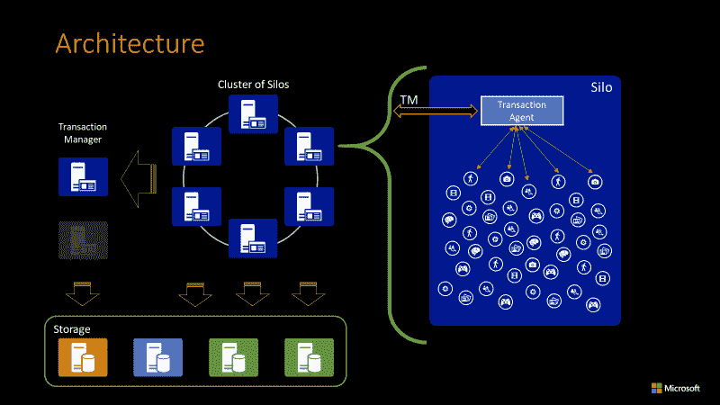
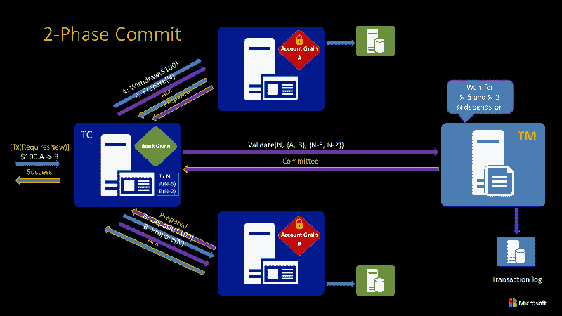
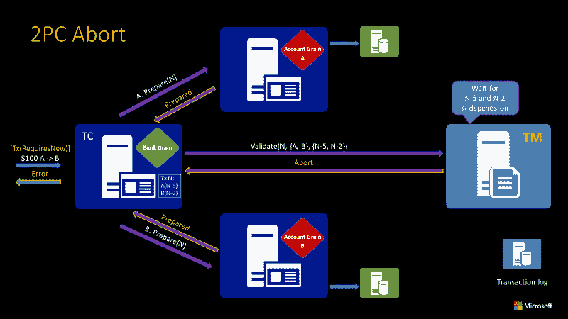

# Microsoft Orleans 将分布式事务引入云

> 原文：<https://thenewstack.io/microsoft-orleans-brings-distributed-transactions-to-cloud/>

像 [Orleans](https://github.com/dotnet/orleans) 、Akka Cluster 和 Distributed Erlang 这样的分布式 actor 框架都不是数据库，但是 [Orleans 2.1](https://thenewstack.io/microsofts-orleans-distributed-app-framework-is-now-cross-platform/) 增加了熟悉的数据库事务抽象，完成了 ACID 保证——原子性、一致性、隔离性和持久性保证，确保事务无论发生什么都是有效的。

分布式应用曾经是专家构建数据仓库的领域；现在，任何与大量在线客户打交道的大公司都需要一个云规模的分布式应用程序。早期的 web 开发模式是分层的架构，仍然依赖于完整的数据库，包括事务和担保，以提供持久的状态，但是扩展这些被证明是困难的，我们需要记录和重放事务的方法来处理错误。

迁移到支持无状态前端和无状态中间层的分布式云系统和 NoSQL 数据库给了我们规模，但这些非事务性系统也带来了自身的问题。使用云服务的开发人员不得不学习如何处理最终一致的数据存储的特性。基于微服务的应用程序本质上是分布式的，并且通常最终包括试图近似事务以获得一致性的临时方法，而没有任何正式的规范来使其高效或有效。

对事务的通常看法是，它们对于云来说太慢了，不能扩展到每秒数百万用户和数千事务。“这个行业在 15 年前就放弃了交易，但我们相信我们可以让交易以良好的性能大规模运行，”来自奥尔良团队的微软首席软件工程负责人 Sergey Bykov 告诉 New Stack。

事务为您提供了一致性，并且事务以人们认为的相同的顺序方式工作。原子性意味着一个更新要么完全成功，要么完全失败，所以你不会留下半个变化；如果你从一个账户向另一个账户转账，金额会离开第一个账户，并显示在第二个账户，否则交易不会被应用。隔离意味着你看不到部分结果，所以它永远不会看起来像是价值已经到达第二个帐户而没有离开第一个帐户。

Bykov 指出，像[命令查询责任分离](https://www.martinfowler.com/bliki/CQRS.html) (CQRS)这样的事件源和方法是持久的，但它们只提供最终的一致性，它们没有原子性或孤立性。

“最终一致性和事件源是很好的模式，但有时你需要有保证。在游戏中，假设你想用一枚金币换一枚炮弹，并在数百万用户的规模上进行交易。如果你用完了硬币(因为交易出错)，这是一次糟糕的经历，”Bykov 说。“游戏中的经济实际上是金融交易，人们希望他们的交易得到保证。原子性和隔离性是开发者想要的。作为开发人员，我们想要的是系统能够正常工作并照顾好它，而不需要构建复杂的机制来达到同样的效果。”

Bykov 说:“如果你在一个有 10 或 100 个节点的集群上运行一个应用程序，并且你让 grains 分布在代表用户或他们的实体(如订单或游戏会话)的所有节点上，这一功能意味着你第一次可以有两个或三个或 n 个项目可以一起更新。”

奥尔良交易的编程模型很简单；您必须配置筒仓来使用事务，然后将事务属性放在方法上。当一个被标记为事务性的方法被调用时，存储在内存中的本地状态被写入存储并被锁定，以及任何依赖关系的细节。

如果出现失败，奥尔良可以干净利落地退出交易，让一切恢复原样

Orleans 运行时将状态和任何依赖关系的详细信息发送给事务管理器，事务管理器分配一个事务 ID，等待任何依赖关系完成，然后尝试提交更改。如果有任何失败，就像该交易依赖于失败的交易一样，“一切都被解开，就像它没有发生一样。”这意味着，当 Orleans 使用不支持事务的 blob、table 或 key-value 存储时，它可以提供 ACID 保证。

Orleans 的 2.0 版本中包含了一个测试版的事务，它使用一个事务管理器来协调所有的事务。这需要一台单独的服务器，这是一个单点故障，也是额外的运营成本，因为您必须部署和维护它。甚至像获取余额这样的只读操作也意味着要与事务管理器进行一次往返以验证事务；“这增加了延迟，但不会影响整体性能，”Bykov 指出。

在强制写入两阶段提交(Google Spanner 用户用于读写事务)之前持有锁在云存储中很慢，这限制了在给定时间内可以完成的事务数量。为了解决这个问题，Orleans 累积事务请求并成批发送它们，因此它返回一批结果；这意味着在两阶段提交的第一阶段可以释放所有的锁，从而避免阻塞。

Bykov 说，依赖链可能会导致级联中止，其中一个事务中止，然后导致整个事务链依次中止，但这只会在服务器崩溃等物理故障的情况下发生，这种情况应该很少见。

使用单个事务管理器，在一个集群上每秒可以处理 50，000 或 100，000 个事务；对于云存储，传统的两阶段提交会将规模限制在每秒 25 个事务。Orleans 2.1 通过切换到分布式事务管理器消除了可伸缩性限制。“发起事务的颗粒成为事务管理器，因此每个颗粒都可以是事务管理器，并且该模型不应该有任何扩展限制”。这降低了原始性能，但系统中也没有单一瓶颈，不需要部署任何超出正常 Orleans 运行时的东西。

在 2.1 中，分布式事务是“发布候选质量”；交易的最终版本将会有另一个点版本。这将有相同的 API，但将通过更高层次的测试和分析；“我们有内部团队(在微软)在上面验证、测试和构建应用程序，所以我们可以放心地宣布它已经准备好了，”Bykov 解释道。其中一个客户是一家游戏虚拟商务服务公司，该公司原本需要非常复杂的代码，但现在由于交易的存在，编程模型变得简单多了。

在 Orleans 2.1(以及分布式事务最终发布的未来版本)中，事务管理器是分布式的，以避免瓶颈并提高可伸缩性

云规模的分布式事务将以前根本无法一起工作的概念结合在一起；Bykov 指出,“说我们可以扩展分布式事务是一个大胆的提议，因为人们很久以前就放弃了”,但是事务可能不是奥尔良唯一的数据库抽象。

这个[想法](https://rise.cs.berkeley.edu/event/rise-seminar-9-14-18-actor-oriented-database-systems-a-talk-by-phil-bernstein/)来自微软杰出的科学家[菲尔·伯恩斯坦](https://www.microsoft.com/en-us/research/people/philbe/)——事务处理的先驱，SQL Azure 数据库引擎的设计者之一。除了交易，他对他所谓的“面向行动者的数据库系统”的研究涵盖了索引(这可能是奥尔良的下一个功能)以及查询处理、流、复制和地理分布。

正如 Bykov 指出的，这是开源的，不是专有的。“这不依赖于任何数据库；它是分布式事务的中间层，”他指出，奥尔良社区已经为 AWS DynamoDB 提供了一个事务存储提供商。如果你把 Orleans 中的演员想象成分布式虚拟对象，这个概念很像容器化的微服务， [Bernstein 的论文](https://www.microsoft.com/en-us/research/wp-content/uploads/2016/10/EldeebBernstein-TransactionalActors-MSR-TR-1.pdf)涵盖了在 JVM 以及。奥尔良使用的. NET。如果这个想法成功，我们可能会将分布式事务视为一系列服务和框架的一个选项。

<svg xmlns:xlink="http://www.w3.org/1999/xlink" viewBox="0 0 68 31" version="1.1"><title>Group</title> <desc>Created with Sketch.</desc></svg>