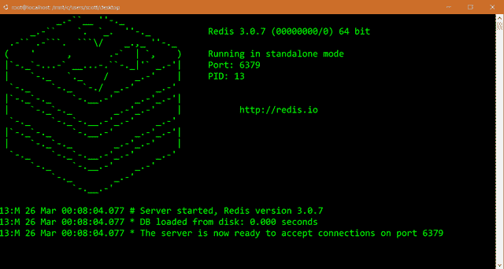
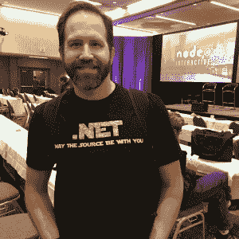
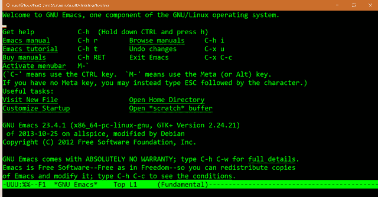

# 微软工厂痛击 Windows 10，吓坏了所有人

> 原文：<https://thenewstack.io/microsoft-plants-bash-windows-freaks-everyone/>

《个人电脑世界》(PC World)的一个标题尖叫道:“[地狱冻结在](http://www.pcworld.com/article/3049664/windows/hell-freezes-over-microsoft-partners-with-ubuntu-to-bring-bash-shell-to-windows-10.html)之上”，预计到周三微软将在即将到来的 Windows 10 版本中提供 Ubuntu Linux 二进制文件的消息会让极客世界多么震惊。然后，微软花了一周的时间让世界相信这是真的——通过视频、推文、博客帖子，甚至是关于黑客新闻的外联努力。

“你们要求我们帮助你们提高工作效率，我们听取了，”微软 Windows 开发者平台副总裁[凯文·加洛](https://www.linkedin.com/in/kevin-gallo-6b67a81)在周一微软 [Build 2016 大会](https://build.microsoft.com/)上解释道。“我们将继续投资为开发者打造 Windows home，无论你为哪个平台打造。”

https://www.youtube.com/watch?v=wo-ygJTQRPw#t=37m42s

对于公众来说，它将与 Windows 10 的第三个稳定版本一起到来，将于今年夏天在 Windows 10 一周年更新中发布，代号为“红石 1”。最新版本已经可以通过 Windows Insider 计划获得[。“从今天开始，Windows Insider 计划的开发人员可以访问 Windows 周年 SDK 预览版来探索新功能，”微软负责 Windows 的执行副总裁在博客文章](https://insider.windows.com/)中宣布。 

微软首席执行官塞特亚·纳德拉在第一天的主题演讲中暗示了这一消息。纳德拉告诉观众:“我们还将讨论 Windows 如何成为你的终极开发平台，你可以在 Windows PC 上为 Windows 及其他平台开发所有应用。”

但是当天晚些时候，真正的细节来自 Gallo，当时他宣布久负盛名的 Gnu Bash shell 将登陆 Windows。

他解释说:“我们知道，Windows 的每一项创新和进步都是由围绕它的生态系统决定的。”。“当我们与 web 开发人员交谈时，他们仍然很难使用 Windows 作为他们的主要开发工具，因为他们中的许多人都有依赖于开源命令行工具、脚本和框架的工作流。我们将解决这个问题，让 Windows 成为你的家。”

他的声明之后是看似震惊的掌声和一些零星的欢呼。然后，他通过执行熟悉的 bash 命令，如 **ls** 和 **cd** ，赢得了观众的喝彩。

“当然，我最喜欢的编辑器是 Emacs，”他对更分散的掌声说，“所以我要用 Emacs。但是你可以用任何你喜欢的。他们都在那里……”

微软的斯科特·汉瑟曼。

“这不是在虚拟机中运行的 Bash 或 Ubuntu，”微软首席项目经理斯科特·汉瑟曼在后续博客文章中进一步解释道。“这是运行在 Windows 本身上的真正的本地 Bash Linux 二进制文件。它又快又轻量，是真正的二进制。这是一个真正的基于 Windows 的 Ubuntu 映像，包含我使用的所有 Linux 工具，如 awk、sed、grep、vi 等。速度很快，而且很轻便。”

## 等等，什么？

然后冲击波开始波及世界其他地区。“我已经很多年没有这么兴奋了，”Gallo 的博客帖子上的一条评论写道。“作为一名长期的 MS 开发人员，看到该公司积极捍卫其统一和更稳定平台的愿景，令人深感满意。”

但是，Linux 和 Windows 之间奇怪的新友谊似乎让从事这项工作的人都感到惊讶。Canonical 的 Ubuntu 产品和战略团队成员 Dustin Kirkland[在活动中作为“赞助嘉宾”分享了他的经验](http://blog.dustinkirkland.com/2016/03/ubuntu-on-windows.html)。“这对我来说可能有点奇怪，因为我已经有将近 16 年没用过 Windows 了。”

这种感觉似乎是相互的。“在#Build2016 与来自@Canonical 的人们共进午餐，”微软 Edge 浏览器工程师 Jacob Rossi 在推特上写道。“从未想过我会在微软有这样的经历！”

为了传播消息，微软工程师开始出现在黑客新闻的评论中。一个名叫“bitcrazed”的用户在他的简介中称自己是微软 Windows 团队的高级项目经理。他吹捧该公司正在“让 Windows 命令行再次变得酷起来！”

一位用户在[的](https://news.ycombinator.com/item?id=11390917)上写道:“老实说，似乎所有的路都通向微软吞并整个 Linux 用户群”。

> “我已经尝试过在 Windows 上的 Bash 中运行 vim 来编辑 PowerShell 脚本的工作流，这些脚本是我在单独的 PowerShell 提示符下执行的。”——微软项目经理 Joey Aiello。

“吞咽？不是。支持，是的！”有点疯狂的[回应了](https://news.ycombinator.com/item?id=11391811)。“我们希望 Windows 成为您的家——为所有平台和所有设备开发应用的最佳场所。句号。如果你没有注意到的话，这是一个非常非常不同的微软，一个我最近重新加入的，正致力于这项功能的微软！”

他在[之后](https://news.ycombinator.com/item?id=11391961)发帖称:“我想把这一点说得非常清楚——这是一个只面向开发者的命令行工具集。”。“它不是为支持 GUI 桌面/应用程序而构建的。它不是为运行生产 Linux 服务器工作负载而构建的。它不适合运行微服务或容器化环境。

"同样，这是一个只支持命令行的开发工具集！"

## 但是是 Linux 吗？

当然，黑客新闻上有一场关于这是否真的算作 Linux 的激烈辩论

“是的，从技术上讲，Linux 只是内核，从技术上讲，在不同的内核上运行 Ubuntu 运行时并不是运行 Linux，”一位用户[提到](https://news.ycombinator.com/item?id=11391763)。"然而，“Linux”几乎总是指 GNU 工具和 Linux 内核."

bitcrazed [再次加入](https://news.ycombinator.com/item?id=11391931)，暗示未来 Windows 可能不仅仅支持 Linux 的 Ubuntu 版本。“Linux 的 Windows 子系统(WSL)是独立于发行版的。我们选择 Ubuntu 的第一个版本是因为它在开发者中很受欢迎，但是没有什么技术上的原因(除了我们完全准确地实现了必要的系统调用)为什么它不能在未来支持其他发行版的用户环境。”

“重要的是，WSL 不附带发行版，”他随后补充道。“我们在安装时下载一个真正的 Ubuntu 用户域映像，然后在其中运行二进制文件。”

另一名黑客新闻用户暗示，这可能会吸引用户使用 Windows，然后他们会爱上微软的命令行工具 [PowerShell](https://msdn.microsoft.com/en-us/powershell/mt173057.aspx) 。其他人似乎担心 PowerShell 的未来，促使另一个微软出现在评论中，一位用户自称为[乔伊·艾洛，](https://twitter.com/joeyaiello)微软 PowerShell 项目经理。“首先，让我说，我是 Linux 的超级粉丝，对于 Bash 即将登陆 Windows，我感到无比兴奋……”他[发帖](https://news.ycombinator.com/item?id=11392734)。

“因为今天 Bash 主要在用户模式下运行，所以它更适合开发人员的情况。我已经体验过在 Windows 上的 Bash 中运行 vim 来编辑 PowerShell 脚本的工作流，我在单独的 PowerShell 提示符下执行这些脚本。事实上，我可以很好地插入 PowerShell 窗口，快速运行“bash-c”vim/mnt/c/foo . ps1”，进行一些编辑，然后马上回到我现有的 PS 提示符下。这真的是你工具箱中的另一个(真的非常棒的)工具。"

“这实际上可能会阻止我在开发人员社区中看到的向 OSX 的外流，”[另一位黑客新闻用户](https://news.ycombinator.com/item?id=11390726)发帖称——艾罗似乎很清楚这一点。后来他[又补充了](https://news.ycombinator.com/item?id=11392771)，“现在 Windows 上的 Bash 对于开发人员来说非常棒，尤其是对于那些来自 OSX/Linux 工作流的人来说……”

## 证据就在演示中

“这里没有烟雾和镜子 Russ Alexander 在开始演示时补充道。“我们会非常清楚地表明这一点。”在 Windows 命令提示符下，Russ 键入 bash——当他按下 return 键时，下一行显示熟悉的 bash 提示符。

他指出也支持 Ruby 和 Python，并运行了一系列标志性的 Linux 命令:

|  | )(我)(们)(都)(不)(知)(道)(,)(我)(们)(还)(不)(知)(道)(,)(我)(们)(还)(不)(知)(道)(,)(我)(们)(还)(不)(知)(道)(,)(我)(们)(还)(不)(知)(道)(,)(我)(们)(还)(不)(知)(道)(,)(我)(们)(还)(不)(知)(道)(,)(我)(们)(们)(还)(不)(知)(道)(,)(我)(们)(还)(不)(知)(道)(,)(我)(们)(还)(不)(知)(道)(,)(我)(们)(还)(有)(些)(什)(么)(好)(的)(情)(感)(。 【GCC】【地狱世界】)(我)(们)(都)(不)(知)(道)(,)(我)(们)(还)(不)(知)(道)(,)(我)(们)(还)(不)(知)(道)(,)(我)(们)(还)(不)(知)(道)(,)(我)(们)(还)(不)(知)(道)(,)(我)(们)(还)(不)(知)(道)(,)(我)(们)(还)(不)(知)(道)(。  |

一名用户在视频中评论道:“这是真正的魔法。”。

Bash 的标准制表符补全功能也在运行，这使得输入命令更快。Russ 在 Ubuntu 上运行 apt-get，然后使用文件资源管理器浏览结果目录。他在 bash 中编译了 Ruby 代码，这些代码是用微软的 Visual Studio 代码在 Windows 中编写的。“有差距，”拉斯警告说。“有些系统调用我们还没有完成。我们知道有些东西不起作用。”比如 MySQL，top，还有很多 RubyGems。“我们正试图尽可能缩小差距，”他承认道。

然后他们敦促开发人员提供反馈，并承诺在 Twitter、StackOverflow 和 Serverfault 上提供支持。

## 极客的反应

但最有趣的是极客们的街头反应。“检查日历。没有。不是 4 月 1 日，”一位读者[在黑客新闻](https://news.ycombinator.com/item?id=11382488)上写道。另一个人开始后悔他们最近的广告屏蔽决定。

“哈哈哈——我刚刚用 [GRC 的 Never10](https://www.grc.com/never10.htm) 工具停止了不断烦人的纠缠升级到 Windows 10。现在，我不再那么确定了。”

在[的主要讨论线索](https://news.ycombinator.com/item?id=11388418)中，有几个更简洁的反应:

"很明显，末日即将来临."

" rm -rf /*现已在 Windows 上运行。"

“如果他们开源它就好了，这样它就不会有一天从我们脚下被拽走:)

"我对此非常高兴。"

在 Twitter 上，有人甚至开始想象[一个困惑的 Windows 10 用户](https://twitter.com/iamdevloper/status/715287648022241288)试图问命令行，“我怎么才能把开始按钮加回去？”

微软的高级项目经理 Rich Turner 开始转发一些令人惊讶的反应——比如数据分析师[发推文](https://twitter.com/meowklaski/status/715626354205597696)“我和我的同事都吓坏了。”而且他还转发了另一位用户的[复杂比喻](https://twitter.com/matejForman/status/715604798788276224):“就像你妈妈在酒店早餐桌上的果酱。还是酒店，但是感觉更好。”

微软在官方的 Windows 开发者订阅上发布了他们的推文。“Bash on @Ubuntu on #Windows10？这不是演习！”他们在推特上发布了一段视频，链接到高级项目经理 Rich Turner 和 Russ Alexander。它很快被嵌入到网络上的博客帖子中，在 24 小时内就有超过 40 万的浏览量

“我们完全疯了，我们决定集成 Linux 用户模式和 Windows，”Rich Turner 在视频中说。“是的，真的。我们实际上已经从 Ubuntu 获得了 Linux 用户模式代码，并且我们在 Windows 中、在 Windows 内核中构建了一个子系统，以展示一个看起来，实际上和 Linux 一样的界面。”

专题图片:罗伯特·盖洛在 Build 上发言。来自微软的其他图片，除非另有说明。

<svg xmlns:xlink="http://www.w3.org/1999/xlink" viewBox="0 0 68 31" version="1.1"><title>Group</title> <desc>Created with Sketch.</desc></svg>