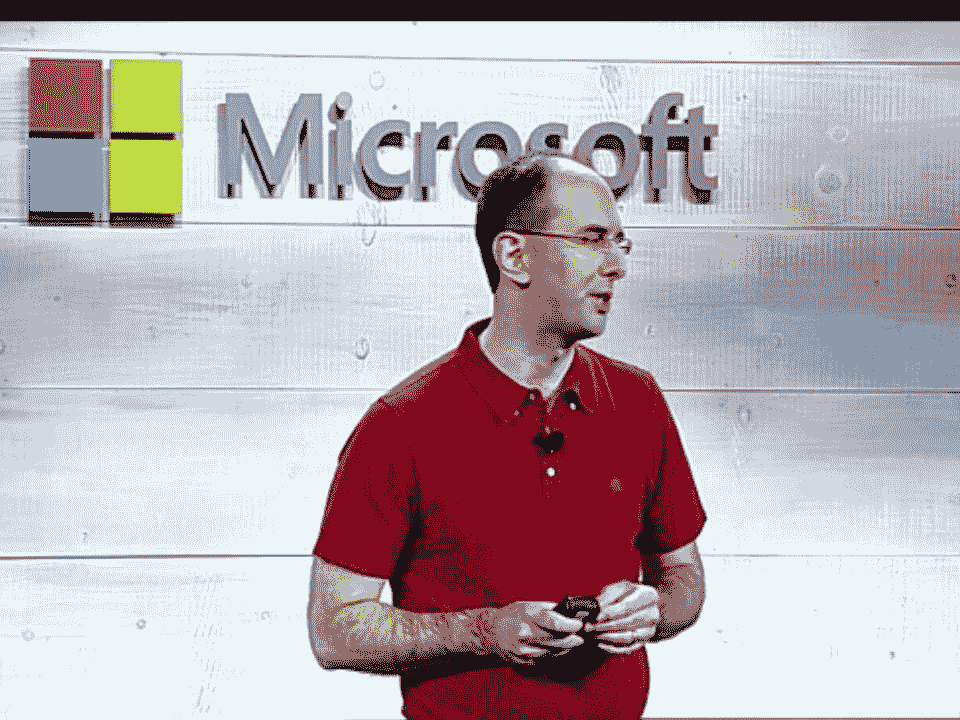

# 微软宣称热爱 Linux，增加了对 CoreOS、Cloudera 和大量新功能的支持

> 原文：<https://thenewstack.io/microsoft-professes-love-for-linux-adds-support-for-coreos-cloudera-and-host-of-new-features/>

在今天早上的网络直播演示中，微软围绕 Azure 发布了一系列[公告，似乎旨在强调 Azure 的开放性以及“微软多么热爱 Linux”，首席执行官塞特亚·纳德拉说。他们还利用网络直播展示了该公司计划如何继续与市场领导者亚马逊网络服务竞争。](http://news.microsoft.com/2014/10/20/CloudDayPR/ "Microsoft")

在他的讲话中，纳德拉煞费苦心地指出了 Azure 支持非微软技术的许多方式。“我们将永远为 Linux 发行版提供一流的支持，”他说。"这是我想弄清楚的事情."

他说目前有 20%的 Azure 用户是在 Linux 上使用的。“我想确保每个人都认识到这一点。这不是新消息，”纳德拉在谈到微软对 Linux 的支持时说。他还指出，Azure 支持 Oracle 和 IBM 的一系列数据库技术，以及 Cassandra、Hadoop 和 MongoDB 等技术的开源发行版。除了之外，Azure 还支持许多不同的语言和框架。最后，他指出，像 Active Directory 这样的 Azure 服务支持其他云服务，如 Salesforce 和 Workday 以及亚马逊网络服务。

微软负责云计算和企业的执行副总裁 Scott Guthrie 说，从今天开始的这些公告还包括对 [CoreOS](https://thenewstack.io/the-coreos-operating-system-as-a-service-is-new-and-thats-the-biggest-challenge/ "The New Stack") 的支持，这是 Azure 中第五个提供企业支持的 Linux 发行版。CoreOS 是围绕容器模型构建的，附带 Docker。

微软还宣布在 Azure 上推出[云时代](https://thenewstack.io/cloudera-delivers-cloud-on-ramp-to-hadoop/ "The New Stack")。Cloudera 联合创始人兼首席战略官迈克·奥尔森(Mike Olsen)表示，他已经与微软合作了大约六个月，以实现这一目标。“今天，我们的大多数客户已经在内部构建了大型基础架构来运行这些系统，但他们对公共云部署和混合云越来越感兴趣，”他说。“我们相信数据将会存在于数据诞生的地方。如果我们要实现释放大数据价值的愿景，我们必须在公共云中运行。我们必须在数据所在的地方。”他演示了只需点击一个按钮就能运行一个 90 核心的 Cloudera 实例。“这是在云中启动 Cloudera 的一种非常简单快捷的方式，”他说。

然而，他对在 Azure 上提供 Cloudera 有更多的兴趣。“我们看到的微软最令人兴奋的机会之一是微软的分析和数据处理技术套件，”他说。他说，例如，Excel 与 Cloudera Impala 相连，用户可以很容易地将数据提取到 Excel 中。此外，他还演示了将数据从 Cloudera 拉入 Power BI，这是微软相对较新的云 BI 工具。通过使用自然语言搜索，他展示了零售商如何快速轻松地查看查询大量零售数据的图表。

微软还发布了另外四个关于 Azure 新功能的公告。在宣布这些消息时，高管们强调了 Azure 与他们所说的服务最大竞争对手——AWS 和谷歌——的竞争力。

微软表示，很快将在全球拥有 19 个 Azure 区域，比其他公共云提供商都多。如此大的规模吸引了像 Milliman 这样的企业，它为每个客户使用 50，000 个 Azure 计算核心；AccuWeather，每天处理 60 亿次数据请求，曾经是 AWS 用户；还有喜力啤酒，它使用 Azure 来开展营销活动，比如脸书游戏。

微软负责云和企业的执行副总裁 Scott Guthrie 今天发布了一系列公告。

Guthrie 说，市场上只有三家供应商能够提供这类客户需要的能力和功能:微软、AWS 和谷歌。“我们计划通过我们提供的企业级支持和独特的混合解决方案来区别于其他两家公司，”他说。

为此，微软今天发布了以下声明:

*   g 系列虚拟机和高级服务器。该产品包括最新的英特尔至强处理器，具有 32 个 CPU 内核、450 GB 内存和 6.5 TB 本地固态硬盘存储。Guthrie 表示，这是公共云中可用的最大虚拟机规模。
*   Azure 高级存储。这项新的存储服务将支持每个虚拟机 32 TB 的存储。
*   蔚蓝市场。用户将能够在 Azure 上找到初创公司和独立软件开发商提供的服务，并从一个新的市场轻松部署它们。
*   微软云平台系统全面上市。这是一个恢复旧的想法，要么是为时过早，或执行不力。微软早在 2010 年就开始谈论 Azure 设备。它是一个打包的硬件和软件，允许企业在模仿并能够集成公共 Azure 的前提下构建私有云。但是产品[似乎没有腿](https://www.zdnet.com/blog/microsoft/where-are-those-windows-azure-appliances/8439 "ZDnet")。当被问及谁在使用这款设备以及它是否还在销售这款设备时，微软通常给出含糊的答案。今天，微软似乎正在复兴这个概念。云平台系统由戴尔硬件和微软软件组成，允许企业或服务提供商构建自己的 Azure 云。用户可以从同一个 Azure 门户管理私有云和公共 Azure 云。Guthrie 说，这两种云有一致的 API，相同的管理程序和“Azure 提供的许多核心功能”。他说，通用动力、汉莎航空和马自达已经在使用该产品。

在这些声明之前，上周有消息称微软支持 Docker。

微软正在构建低级容器功能。顶层将是标准的 Docker。中间接口层允许 Docker 与底层 Windows 容器功能进行通信。

在 Linux 中，低级容器将具有类似的 C Group band 名称空间。它将在 Windows 内核中提供类似于 Linux 内核中的隔离功能。

低级容器是专有的，构建在 Windows 上。中间层是开源的。Windows 内核将会有一个开放的 API。

Docker 首席执行官 Ben Golub 在上周的一次采访中说:“和任何专有软件一样，你必须对提供商有一定程度的信任。

新的 Docker 集成意味着任何人都可以在 Windows 上编写开源应用程序。“我们正在编写一个开源守护程序，它将在 Windows 和 Docker 之间架起一座桥梁，”他说。

根据 Golub 的说法，需要解决的问题是:“如何开始、停止。记录或检查窗口中的容器？如何在容器上构建应用程序？”

<svg xmlns:xlink="http://www.w3.org/1999/xlink" viewBox="0 0 68 31" version="1.1"><title>Group</title> <desc>Created with Sketch.</desc></svg>