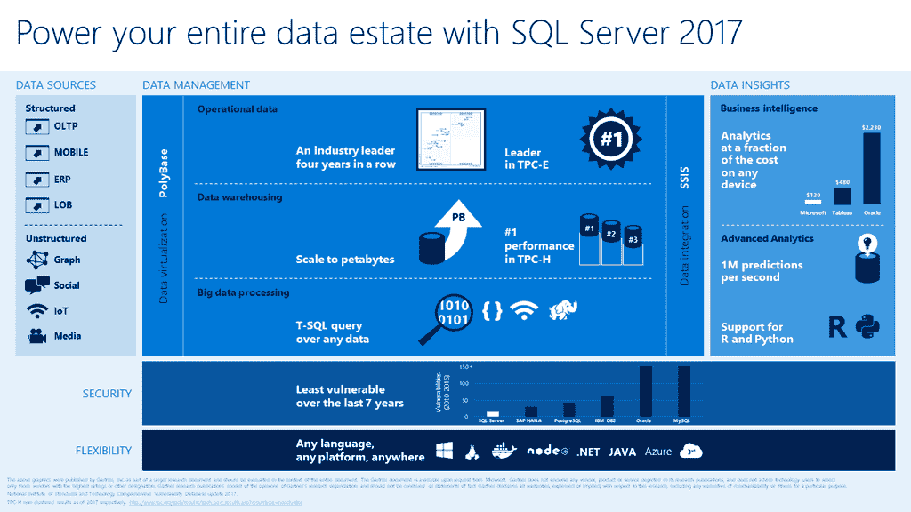

# 微软把人工智能放在数据所在的地方

> 原文：<https://thenewstack.io/microsoft-puts-ai-data/>

如果你想做机器学习，你需要数据来做。然而，到目前为止，机器学习工具的复杂性通常意味着使用 TensorFlow、[微软认知工具包](https://github.com/Microsoft/CNTK)等框架进行开发，使用 R 和 Python 以及专业统计工具，或者使用云 API 进行机器学习服务。

这些方法都需要从数据库中获取数据，然后将机器学习系统的输出与应用程序集成。这些转换、转移和集成使得开发和部署变得更加复杂，降低了速度，容易出错，并且不鼓励您尽可能频繁地重新训练模型(以避免“ML rot”)。

随着 SQL Server 2017 关系数据库管理系统(RDMS)的第二个[社区技术预览版](https://blogs.technet.microsoft.com/dataplatforminsider/2017/04/19/sql-server-2017-community-technology-preview-2-0-now-available)，微软正在添加作为存储过程的数据库内机器学习功能，以及对 Python 和 R. SQL R 服务的支持，现在称为 [SQL 机器学习服务](https://thenewstack.io/microsoft-bringing-together-general-database-developers-sql-tools/)，并且该界面还允许您接触到 GPU 驱动的分析、数据处理和机器学习工具，如深度学习框架。

微软数据集团副总裁 Joseph Sirosh 向新的堆栈解释说:“你永远不必将数据从数据库中取出，因此你拥有你所习惯的所有安全和审计工具。”。他将 SQL Server 2017 称为“第一个支持人工智能的商业、交易型 RDBMS，支持数据库中的智能。可管理性是数据库带来的巨大价值，现在您拥有了智能管理系统。”

## 速度和安全性

虽然微软有越来越多的[机器学习](/category/machine-learning/)服务(认知服务现在包括 25 个 API)，但是你可以将大量的机器学习工具连接到 SQL Server 2017。“人工智能的创新速度是开源的，”西罗什说。查询可以使用 Python 或 R 代码来调用基于 GPU 库来转换数据，然后对转换后的数据运行深度学习，并获得深度学习的预测。

“智能解决方案将不会局限于任何一家公司，它们将像所有计算一样民主化，并将由主流开发人员创建，”西罗什说。“如果你想一想开发人员需要什么来创造他们的智能革命，我们认为他们需要在他们使用的平台中简化智能和提高智能的可用性。”

> “当你把算法放在数据平台中的数据旁边时，你就不必到处晃动数据；算法处理数据，运行速度大大加快，因为它是就地运行的。”约瑟夫·西罗什。

他说，将智能放入数据库关乎性能，但也关乎可管理性和开发人员的生产率。“我们从中学习的数据是海量的；你不能在网络上移动它而不产生令人难以置信的减速。当您将算法放在数据平台中的数据旁边时，您不必到处晃动数据；算法处理数据，运行速度大大加快，因为它是就地运行的。”

合规性和安全性是将您学习到的数据保存在数据库中的另一个好理由；毕竟，如果泄露的话，往往是关于你客户的数据会损害你的品牌和你的底线。“数据库提供高可用性、访问控制、安全性、加密；你可以利用这一点。你可以用驻留在数据库中的数据来训练深度学习模型，你可以将它们部署在数据库本身中，而你从来没有从数据库中取出数据。”

因为 SQL Server 中的智能功能被视为任何存储过程，所以用户还可以利用其他 SQL Server 内置的安全性和访问控制，如隐藏用户无权查看的行和列。西罗什指出:“你可以通过一个可以访问所有数据的身份来学习，但当你部署(你的智能应用)时，使用它的身份可能无法访问隐私敏感的数据，因为这些数据可以被屏蔽掉。”。如果需要扩充的训练集有限，您甚至可以在 SQL Server 中创建数据模拟和假设情景。

## 机器学习和应用程序相遇的地方

一旦你的机器学习系统被训练，你需要操作它。这通常意味着用另一种语言重写 R 代码，比如 JavaScript，这样你就可以在 web 服务器上运行它，同时也为运行它提供系统；又是一个低效耗时的步骤。

如果您需要像 Hadoop 一样从多个来源提取数据，SQL Server 已经包含了 Polybase 技术，这极大地简化了 Hadoop 的查询。Sirosh 说，考虑到“他们支持并发性、连接、数据管理以及安全性”，管理员可以使用来执行繁重的工作，而不是计算不同数据源之间的连接并建立一个高度可用的系统，因为随着使用量的增加，构建、分析和扩展都很复杂。

SQL Server 2017 提供了一个内置的平台，可以为机器学习模型提供监控和性能工具，以及常用的数据库开发工具，如[SQL Server Management Studio](https://docs.microsoft.com/en-us/sql/ssms/download-sql-server-management-studio-ssms)和 [SQL Server 数据工具](https://docs.microsoft.com/en-us/sql/ssdt/download-sql-server-data-tools-ssdt)以及 Visual Studio。你可以期待这些工具在未来被更好地集成，Sirosh 建议，以及更多的机器学习模型被内置。“未来，我们希望将人工智能功能变成简单的 SQL 功能，就像 SQL Azure 中的‘分析人脸’功能一样。”

微软正在将把数据和智能工具放在同一个地方的相同原则应用到 [R 服务器](https://www.microsoft.com/en-us/cloud-platform/r-server)和它的 Azure 云数据服务。Azure 数据湖分析让你运行 U-SQL，R，Python 和。NET 代码针对 Pb 级数据库和 U-SQL，包含了许多来自认知服务的 API 作为您可以调用的函数。

如果你在微软的全球分布式 NoSQL 服务中存储数据，现在该服务与 Spark 集成，所以你可以对这些数据进行机器学习。而微软 R Server 9.1 包含了微软的几个机器学习算法，加上预先训练好的神经网络模型，用于情感分析和图像识别。

但对于许多企业来说，SQL Server 仍然是他们的数据所在，也是驱动应用程序创建和使用这些数据的驱动因素。SQL Server 的历史与 Windows Server 的历史非常相似，都是微软利用高可用性、数据分析和商业智能等曾经只为昂贵的高端系统保留的功能，并以合理的价格将其引入主流企业。

虽然机器学习和人工智能领域远比数据库市场复杂，但如果微软能够将 SQL Server 转变为一个平台，让企业能够在自己的数据库系统中舒适地使用机器学习和人工智能，在那里他们拥有熟悉的控件和开发工具，那么人工智能和人工智能可能会真正在未来的企业中找到一个家

通过 Pixabay 的特征图像。

<svg xmlns:xlink="http://www.w3.org/1999/xlink" viewBox="0 0 68 31" version="1.1"><title>Group</title> <desc>Created with Sketch.</desc></svg>