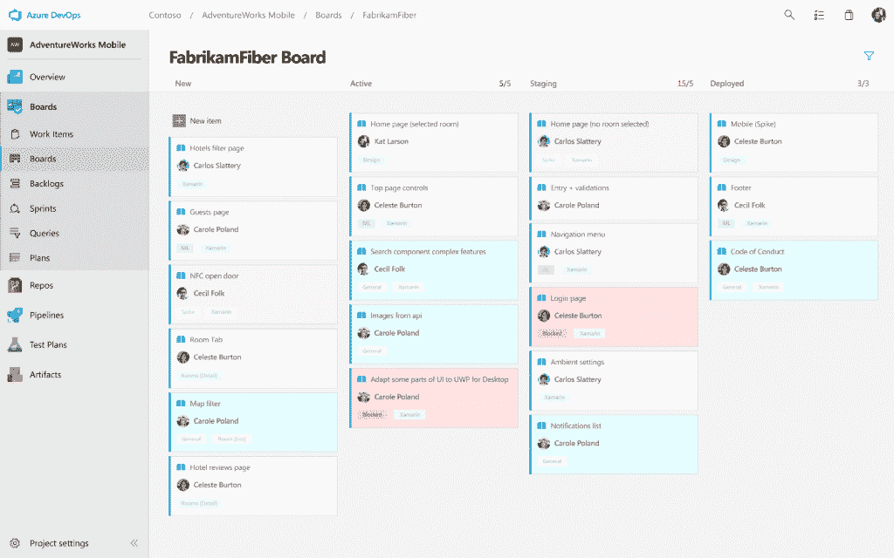

# 微软品牌重塑带来云原生 Azure DevOps

> 原文：<https://thenewstack.io/microsoft-rebranding-leads-to-cloud-native-azure-devops/>

周一上午[发布公告](https://azure.microsoft.com/en-us/blog/introducing-azure-devops/)称，Visual Studio Team Foundation Server(TFS)的用户可能有理由怀疑它已经在工作中，微软将 Visual Studio Team Services(VSTS)——其开发者工作流协作引擎，包括 TFS，以及该公司的主要收入来源之一——转移到该公司的 Azure 云服务中。此举创建了一个名为 Azure DevOps 的新产品线，现已推出，同时将几个面向开发人员的产品和服务整合为一套面向 CI/CD 的 SaaS 服务，其明显意图是与 CloudBees 的 Jenkins 竞争。

“Azure 现在有一套新的五个 DevOps 服务，” [Jamie Cool](https://azure.microsoft.com/it-it/blog/author/jamiec/) ，微软新任命的 Azure DevOps 产品管理总监告诉新堆栈。“他们将帮助开发者能够更快地发货，[*更高的质量。当我与人交谈时，“DevOps”对不同的人可能有不同的含义。因此，对我们来说，在这种情况下，我们真的认为 DevOps 是为客户提供持续价值的人员、流程和产品。”*

## 闪亮的新管道

Cool 解释了这五个服务如何共同支持他所描述的 DevOps 管道，本质上与 CI/CD 同义。这种管道现在将被建模为 Azure 的云原生服务的一部分，尽管他强调其目的不一定是在 Azure 本身中降落可交付的软件。只有管道存在于公共云中，而可以想象的是，通过测试阶段的更新可以部署在任何内部场景或其他人的公共云中。(酷派只明确提到了亚马逊 AWS，尽管周一发布的新产品文献也列出了谷歌云平台。)

新服务的支柱将是 Azure Pipelines，酷派表示，它将自动构建和部署 Windows、Linux 和 MacOS 的加速发布周期组件。微软将其引导组件通过这些管道的工具描述为*代理*——在组件前进到客户心目中的任何目的地时监控组件生命周期的服务。

“本质上有一个持续的管道，”Cool 说，“你用它来运输和交付你真正的软件。你把你的源代码、你的工件和软件包输入到管道中。您测试进入管道的代码。你越来越多地使用看板、敏捷、不同的方法来做所有这些的规划。”

“看板”指的是一种基于丰田汽车公司设计的生产系统的公告板式的可视化和指导协作工作流程的系统。最初，它是一种可视化地记录正在进行的零件制造流程以及依赖于这些流程的其他流程的方式，以将工作支出仅保留在短时间间隔内必要的零件上。看板的创始人，传奇的丰田副总裁[大野泰一](https://www.toyota-global.com/company/toyota_traditions/quality/mar_apr_2004.html)，用短语“准时制制造”将他的概念翻译成英语美国汽车制造商后来接受了这个概念，创造了缩写“JIT ”,比 Java 虚拟机早了十多年。

今天，项目管理 SaaS 服务 [Asana 使用看板概念的一种形式](https://asana.com/uses/kanban-boards)作为一般企业跟踪工作和职责的手段。Azure DevOps 将对 Ohno 的 Azure Boards 系统使用自己的观点，Azure Boards 是其五大支柱服务之一。另外三个是:Azure Artifacts，作为服务的包管理器进行代码共享，兼容 NPM、Maven、NuGetAzure 测试计划，客户可以使用它对 web 应用组件进行脚本测试；和 Azure Repos，它托管无限数量的私有 Git 存储库。

## Git 和 GitHub 在新方案中的位置

这最后一个支柱相当有趣，因为最近有消息称[微软即将收购 GitHub](https://thenewstack.io/microsoft-to-acquire-github-to-expand-developer-reach/) ，有望于今年年底完成。GitHub 被认为是围绕开源模式重新定位整个基于服务器的软件市场的人。分析师和观察人士一直在焦急地期待微软将 GitHub 硬连接到其现有的产品线中，最引人注目的是我们直到周一一直称之为 Visual Studio 的产品线。

但在周一发布的一份关于新堆栈的说明中，微软发言人没有宣布这两个协作系统已经集成，无论是现在还是未来。该发言人确实指出了 [Azure Pipelines 在 GitHub Marketplace](https://github.com/marketplace/azure-pipelines) 上的即时可用性，称其象征着“我们与 GitHub 的长期合作伙伴关系的深化，以使 CI/CD 体验对开发者来说尽可能简单。”但这位发言人继续指出，在同一个市场上存在八种不同的系统，“给 GitHub 客户提供了极好的选择。”

今天对 GitHub market place Pipelines 页面的检查证实，微软正在为开源项目提供资源，包括每月多达 10 个并行任务和无限分钟的公共存储库。对于私人回购，该服务每月只为第一个平行作业免费提供前 1800 分钟。这为使用微软工具的开源开发者提供了一种免费使用品牌 CI/CD 服务的新方法，包括免费访问 Windows 和 Linux 虚拟机池以运行测试。

“在过去的六、七年里，微软无疑一直在向一个新的地方前进，”Cool 说。“作为其中的一部分，我们已经真正接受了开放、可扩展工具的概念，我们已经接受了开源，无论是消费它还是回馈它。我们将此视为旅程中的下一步，也是我们在该领域所做的事情。”

## 前方的岔路口

Visual Studio 品牌并没有消失。事实上，Windows 领域之外的许多以前没有参与该品牌的开发人员，现在都通过免费的独立代码编辑器 Visual Studio Code (VS Code)来这样做。几年前，微软没有与 Eclipse 正面交锋，而是让大多数人感到惊讶，因为[让它作为替代编辑器集成到 Eclipse IDE](https://www.zdnet.com/article/microsoft-integrates-visual-studio-with-open-source-eclipse-ide/) 中。

但是 TFS 的转变，很快将被重新命名为 Azure DevOps Server，标志着从 2006 年开始的微软历史[的一个篇章的结束，它的第一次努力是将 Visual Studio 从一个应用程序重新设计成一个在线服务。云现在是微软以开发人员为中心的努力的中心，甚至对于那些本身不是云原生的项目也是如此。](http://www.eweek.com/development/microsoft-announces-release-of-team-foundation-server)

未来的问题将是微软基于 CI/CD 的主要开发者协作服务与 DevOps 之间的直接关联。CI/CD 对 VSTS 来说并不陌生。但随着这一举措，微软加入了越来越多的有竞争力的供应商的行列，这些供应商大胆而有力地将交付 CI/CD 的工具和服务与 DevOps 结合起来。这可能会使该公司的立场与 DevOps 从业者的立场相反，devo PS 从业者主张将人类实践与基于软件的工具和基础设施分离。

现在詹金斯身上发生的事情可能会成为微软未来吸引力的预演，如果它遵循同样的道路的话。据 InfoWorld 周一报道，CloudBees 首席技术官兼 Jenkins 创始人 [Kohsuke Kawaguchi](https://www.cloudbees.com/team/kohsuke-kawaguchi) 已经开始倡导 Jenkins 走两条独立的发展道路:一条是原生云，另一条更传统但更快速。虽然前者将拥抱微服务，但后者将被鼓励尝试新事物，更频繁地破坏代码，并“快速失败”

这毫不隐晦地承认，云原生服务用户的开发生命周期的速度可能尚未达到，甚至可能永远也不会达到内部开发所需的高速度，在内部开发中，组织的系统管理员和 It 操作员(组合中的“运营”部分)仍然是一部分。

微软的 Jamie Cool 更倾向于将云原生开发框架为由加速和控制成本的并行需求所驱动。

“有一大批客户正在转向云计算，”他告诉新堆栈，“他们从中获得了巨大的利益。显然，其中一个好处是在多个方面节约成本。但另一个巨大的好处是，实际上，这都与 DevOps 转型有关。他们都想走得更快；他们都想经历这种云转型。迁移到云与 it 密不可分，因为您节省了资金，但也节省了时间，让事情变得更快。你不必花几天时间让 IT 部门为你做准备；你只需要按一下按钮就可以了。”

*《新书库》执行主编约阿布·杰克森为这篇报道进行了采访。*

CloudBees、谷歌和微软是新堆栈的赞助商。

<svg xmlns:xlink="http://www.w3.org/1999/xlink" viewBox="0 0 68 31" version="1.1"><title>Group</title> <desc>Created with Sketch.</desc></svg>