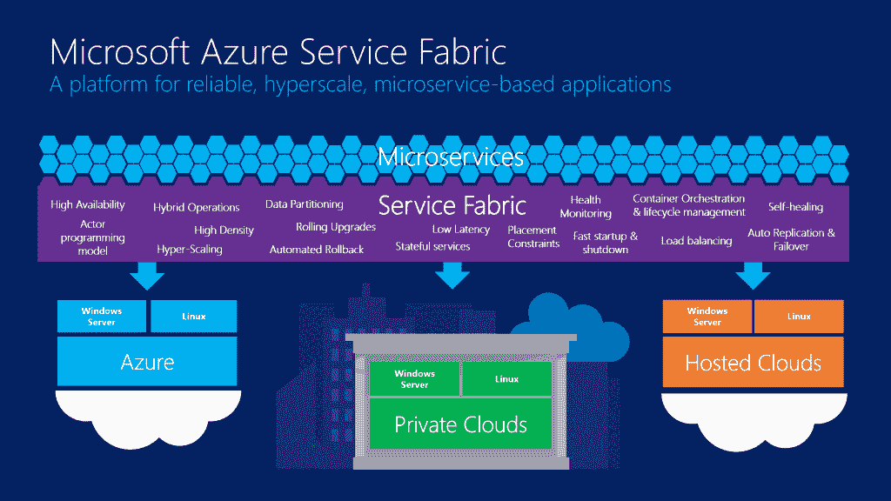

# Azure Service Fabric 是其平台即服务的重新发布

> 原文：<https://thenewstack.io/microsoft-retools-relaunches-azure-platform-service-offering/>

微软[今天宣布了其 Azure 平台即服务功能](http://azure.microsoft.com/blog/2015/04/20/announcing-azure-service-fabric-reducing-complexity-in-a-hyper-scale-world/)的新版本，推出了 Azure Service Fabric。旨在支持和管理使用 C++和。新的服务结构补充了 Azure 原有的 App Fabric PaaS 工具。

正如 Azure 首席技术官 Mark Russinovich 所指出的，大规模构建和运行云服务有很多复杂性，“传统工具无法可靠、灵活地管理这种复杂性。所以开发人员一直在手工开发他们自己的系统。事实是，解决方案并没有真正解决开发人员面临的所有问题。”

这就是 Azure Service Fabric 的目的，Russinovich 将其描述为“真正理解微服务和它们运行的底层基础设施之间的绑定”虽然它对 Azure 客户来说是新的，但它不是一个全新的服务，因为关键的微软服务已经在使用它——其中包括 Azure SQL 数据库、Skype for Business、Cortana 和 Azure 的 NoSQL DocumentDB 服务。它最初将为 Windows 发布，尽管未来的版本将增加对 Linux 的支持，正如 Russinovich 所说，“我们将解决那些选择在 Linux 上构建的初创公司。”

Azure Service Fabric 解决了大规模微服务的管理问题。如果您正在运行一个大型部署，您不会想要关闭所有的服务实例来部署一个更新，因为您不太可能知道有多少实例正在运行。对自动滚动更新的支持意味着每次只有一小部分微服务关闭，Azure 会在更新期间监控系统健康。如果出现故障，还可以选择快速回滚到以前的版本。

Russinovich 指出这是多年工作的结果:“它确实被微软内部的所有用法所强化。这不是一个基于内部位的版本，我们正在发布我们正在使用的内容。”

对有状态微服务的支持可能是 Azure Service Fabric 最重要的新特性。Azure 最初的 PaaS 平台是无状态的，这意味着开发人员需要构建自己的工具来处理状态。微软在 Azure DocumentDB 中使用 Service Fabric 的有状态服务，这意味着 Service Fabric 中支持各种一致性模型，从强到弱。您使用什么取决于您自己，以及您的应用程序需要什么。正如 Russinovich 所建议的，一旦你熟悉了服务结构框架，“你就可以选择卸下训练轮，尽情狂欢。”

这意味着在出现故障时，用户状态会在整个结构中复制。目前，复制仅在数据中心内受支持，因为默认情况下假设距离很近，尽管 Russinovich 指出，跨不同数据中心的副本环复制有内部支持，尽管这不是大多数云应用程序的典型场景。微软正在考虑未来版本中延迟更高的跨数据中心复制，以便客户可以构建更具弹性的服务。

Azure Service Fabric 开发者模型是基于微软在它的 Orleans 开源中使用的相同的 actor 模式。NET 框架。Russinovich 充满热情，“这绝对是云服务的一个伟大模式。”代码将用 C++、C#和其他语言编写。NET 语言(包括对微软 F#函数式编程语言的支持，这应该允许相对容易地将 Erlang 和 Scala 应用移植到 Azure Service Fabric)。虽然服务结构参与者在默认情况下是高度一致的，但是可以选择利用服务结构提供的各种一致性模型来调整应用程序的运行方式。

微软的 Azure Service Fabric 跨公共云、私有云和托管云运行。

开发人员将能够在他们喜欢的任何级别上使用 Azure Service Fabric。在一个层次上，有 Azure 数据库开发人员使用的非常低级的原语，然后是简化复杂的分布式编程任务的更高级别的托管服务。一种高级服务是消息队列，它可以跨结构将消息复制到所有当前运行的副本，而无需开发人员保存和管理微服务实例目录。Russinovich 将在今年的 BUILD 大会的基础会议上更详细地介绍 Azure Service Fabric 编程模型。

微软最初承诺 Azure 服务将能够在内部运行。虽然一些服务被移植到 Azure Pack，但它不是 Azure PaaS 平台的完整实现。随着 Azure Service Fabric SDK 的发布，微软将允许您构建可以在自己的服务器和其他云上运行的应用程序，甚至可以作为单个服务器高密度系统进行开发和测试。

Russinovich 指出，“我们的重点不是锁定。”因此，设置自己的 Service Fabric 实例将相对容易，只需在计算节点上安装 Service Fabric SDK，并创建一个详细说明哪些服务器或虚拟机是集群的一部分的清单。构建清单只是识别服务器，然后将清单加载到 Azure Service Fabric 中。如果您想要更改服务器的数量，您可以编辑清单，服务结构将动态调整。单个机箱部署可以与 Visual Studio 集成，因此开发人员可以在构建和测试应用程序时模拟大量节点和集群。

Azure Service Fabric 正在采取与亚马逊的 AWS Lambda 相同的微服务方法。虽然 Lambda 的设计是在事件触发时启动用 JavaScript 编写的 actors，但它们专注于管理流向运行在 EC2 上的服务器或其他 Amazon 云服务的信息流。尽管 Lambda 显然是 PaaS，但亚马逊仍然专注于提供基础设施，它提供的任何服务都旨在支持该基础设施。如果您使用 AWS 构建一个微服务驱动的应用程序，您仍然需要构建工具来管理您的服务、容器和服务器，即使您使用的是 Amazon 更加面向平台的工具。因为 AWS Lambda 是无状态的，所以你还需要构建工具来处理必要的状态。

随着物联网的兴起和 DevOps 的日益重要，采用基于微服务的方法进行云开发是非常有意义的。将它与 actor 模式相结合，以提供可伸缩性，同时仍然保持状态和一致性，这更有意义。微软在 Azure Service Fabric 上做了很多明智的选择，看看开发者如何使用它们会很有趣。正如 Russinovich 总结的那样，“这真正使有状态分布式编程民主化，这是最难的。”

<svg xmlns:xlink="http://www.w3.org/1999/xlink" viewBox="0 0 68 31" version="1.1"><title>Group</title> <desc>Created with Sketch.</desc></svg>