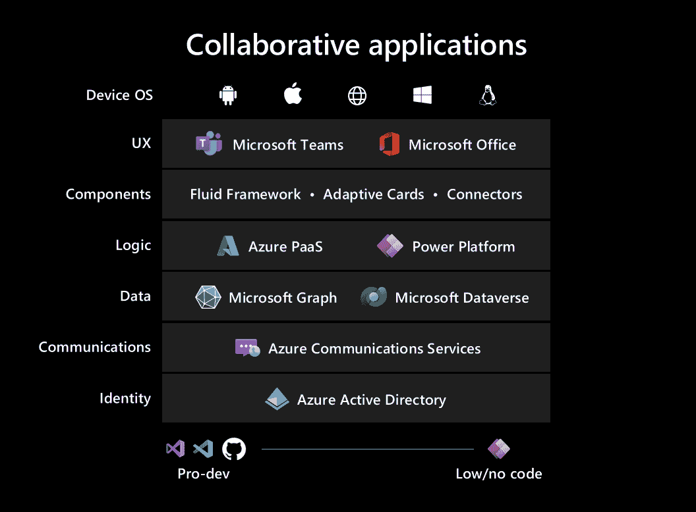

# 微软在 Build 大会上谈论协作应用

> 原文：<https://thenewstack.io/microsoft-talks-collaborative-apps-at-build-conference/>

在上周的微软 Build 大会上，微软宣布了一种被称为“协作应用”的“新”应用类型的增强特性和功能当评估软件是否是协作性的时，请记住这些类别:

*   任务管理
*   云存储
*   电视会议
*   文件管理系统
*   即时消息
*   社交网络(在企业层面)

几个值得注意的合作应用是 [Slack](https://slack.com/) 、 [Discord](https://discord.com/) 、 [Asana](https://asana.com/) 、 [Flock](https://www.flock.com/) ，当然还有[微软团队。](https://www.microsoft.com/en-us/microsoft-teams/group-chat-software)在一篇详述微软协作应用最新更新的博客文章中，微软公司副总裁 Jeff Teper 写道，协作应用是“一种新的应用模式，旨在将人员、流程和数据结合在一起，帮助用户在混合工作环境中茁壮成长。”

即将到来的主要更新之一是几个 [Microsoft Graph](https://docs.microsoft.com/en-us/graph/overview) 聊天 API。Microsoft Graph 是 Office 365 APIs 的 2.0 版本，更名为 REST API，可用于连接一系列 Office 365 服务。大多数人使用 Microsoft Graph 作为工具来访问和利用 Azure Active Directory。Teper 表示，最初的 API“使开发人员能够将团队聊天嵌入到他们的应用程序中，使他们的用户能够无缝协作，而不必在应用程序之间来回切换。”他接着描述了即将推出的 API 功能，其中一些功能包括“支持与联盟用户(如您的租户以外的用户)聊天，识别当前用户阅读和未阅读的消息，以及订阅用户聊天和成员变更。”

微软的查尔斯·拉曼纳在一次主题演讲中对协作应用发表了评论，他说它们“交织在一起，就像聊天或会议一样，在人们工作的地方呈现相关的数据和流程。”拉曼纳声称，“这是自十多年前移动应用改变世界以来的第一个新的应用类型。”

## 开发者如何创建协作应用？

微软去年首次开始谈论协作应用。微软团队副总裁 Nicole Herskowitz 在 2021 年 5 月[的博客文章](https://www.microsoft.com/en-us/microsoft-365/blog/2021/05/25/build-the-next-generation-of-collaborative-apps-for-hybrid-work/)中说，“我们需要一类新的应用，它们以协作而不是个人生产力为中心。支持同步和异步协作模式的应用，包括实时会议、即席消息传递、文档协作和业务流程自动化，所有这些都在一个组织层中。”

简而言之，这就是协作应用的全部:开发人员构建可以跨多个平台无缝工作的应用。正如 Herskowitz 所说，“一次构建，随处部署。”话虽如此，考虑到网络本身就是一个协作平台，这种说法可能有点站不住脚。任何在网络上构建和部署的应用程序都必须是协作性的，才能有效。也许微软*真正的意思是，他们的新应用将是开发者最具协作性的软件？从混合/远程工作到企业级开发团队，协作是技术社区的支柱。Herskowitz 明确表示，微软希望看到“开发人员构建以协作为核心的下一代应用”，同时使用微软团队和 Power 平台(加上工具和集成机会)。*

## **使用微软的云构建协作应用**

下载 [Teams Power App](https://powerapps.microsoft.com/en-us/landing/developer-plan/?&ef_id=Cj0KCQjwnNyUBhCZARIsAI9AYlEu3TEmklozsQ33moOYwlsOYeQi_SsHzKMriZKYJUylQiyJYUJx5kAaAq1MEALw_wcB:G:s&OCID=AID2202142_SEM_Cj0KCQjwnNyUBhCZARIsAI9AYlEu3TEmklozsQ33moOYwlsOYeQi_SsHzKMriZKYJUylQiyJYUJx5kAaAq1MEALw_wcB:G:s&gclid=Cj0KCQjwnNyUBhCZARIsAI9AYlEu3TEmklozsQ33moOYwlsOYeQi_SsHzKMriZKYJUylQiyJYUJx5kAaAq1MEALw_wcB) 应用程序后，用户能够创建自己的应用程序，这使得组织无需不断在不同服务和外部应用程序之间切换。虽然微软有一个关于用 Power App 创建应用程序的完整指南，但是如果你有在其他地方创建应用程序的经验，这个过程并不复杂。

从本质上讲，微软自己的协作应用程序是开发者创建自己的应用程序的基础。创建强大应用的团队， [Fluid](https://fluidframework.com/) 框架(支持多用户交互组件)，以及包含众多团队协作解决方案的总体[电力平台](https://powerplatform.microsoft.com/en-us/)。虽然开发人员在创建和部署“Power”应用程序时必须留在微软的生态系统中，但他们的目标是能够在各种系统上毫无问题地使用该应用程序。目前，您不能在外部使用团队开发的应用程序，但您可以将其他应用程序集成到您的应用程序中。

## **正式上市的液体套装**

在 Build 大会上，微软推出了一系列旨在简化协作应用构建的新功能。该公司还正式宣布了其[公开发布的流体框架](https://www.microsoft.com/en-us/microsoft-365/blog/2022/05/24/build-collaborative-apps-with-microsoft-teams/)。Fluid Framework 被描述为“支持 Live Share 实时协作功能的开源客户端 JavaScript 库的集合”，已经存在了几年。Teper 表示，“开发人员正在使用 Fluid Framework 和 Azure Fluid Relay 来实现他们应用程序上的实时交互。”

作为微软合作拼图的第一块，Fluid 作为“一个旨在帮助每个开发者构建更好的合作应用的新框架”进入了游戏领域。2020 年是[开源](https://devblogs.microsoft.com/microsoft365dev/fluid-framework-is-now-open-source/)，但是微软现在已经正式将框架产品化，用于一般用途。Teper 说，支持 Fluid framework 的完全托管的云服务 Azure Fluid Relay 也将在 2022 年年中可供公众使用。

<svg xmlns:xlink="http://www.w3.org/1999/xlink" viewBox="0 0 68 31" version="1.1"><title>Group</title> <desc>Created with Sketch.</desc></svg>