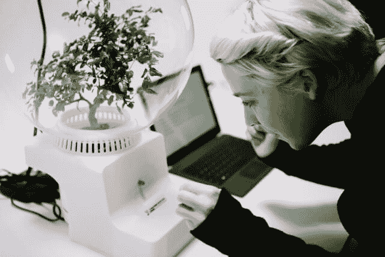

# 微软与植物对话

> 原文：<https://thenewstack.io/microsoft-talks-plants/>

微软研究人员和艺术家之间的一项特殊合作将自己标榜为第一个植物与人类的界面，现在正在吹捧微软所谓的“对我们未来的推测性一瞥”，在那里自然和数字世界可以交流。

根据微软的视频，这是“人类和植物之间共生信息处理的初步探索。”简而言之，这是一个令人难以置信的想法——微软的一个艺术家/工程组合已经找到了让人们思考它的方法。

我们已经知道植物使用由化学物质和电脉冲组成的语言对环境做出反应。植物显然有自己版本的大数据算法，不断处理来自环境的信号，包括化学和电子信号，并使用收集的信息来改变自己(和邻近的植物)以及周围的土地。描述该项目的网页讨论了细胞去极化和离子流，并详细介绍了一项名为“佛罗伦萨项目”(Project Florence)的奇怪实验，研究人员使用光频率触发植物的反应，这些反应由馈入电路板的电极接收。

微软网站上的一个视频展示了整个过程——细胞的变化，电线进入电路板——称之为“一种将计算和生物结合起来的新方式，或者模糊了人工和自然之间的界限。”

在视频中，一株植物对一条信息——“早上好”——做出如下回应。

"今天早上一切都很好…园丁们知道最好的…"

那么到底发生了什么？用户的输入被分析，以确定他们的内容和他们的情绪，这被转换成信号，最终通过改变植物的光源来传输。从植物反馈回来的信号——化学信号和电子信号——然后被捕获，与语言输入融合，并合成为一种反应。

好吧，这不完全是我们所认为的“与植物对话”网页将回复描述为原始信息的“转换”,如果你愿意，可以称之为“词汇释义”。

虽然植物不能完全理解语言信息，但它以新奇和不可预测的方式影响最终的输出。

微软的网页有点稀疏，但在 *Fast Company* 的合作设计网站上有更多关于该项目的信息。它解释说“一个非常温暖、友好的情绪[可能会表现为长时间的红色闪烁](http://www.fastcodesign.com/3060347/microsoft-is-teaching-your-plants-to-talk-back)，因为红光会导致植物开花。”显然，有一种算法可以利用来自第三方应用程序 Twitter 的对话片段来绘制植物的最终反应。

*Fast Company* 解释说:“佛罗伦萨的软件会搜索与植物情感相似的推文，并使用这些推文来填补空白。”。虽然这看起来有点武断，但 Fast Company 认为这是“一种可行的方式，可以将关于植物的潜在大量复杂数据转化为对一个人来说简单而有意义的见解。”

“我们希望围绕物联网创造一个想法……我们希望创造另一种未来，让我们远离‘你的冰箱会和你的手表说话！’微软研究员阿斯塔·罗斯韦告诉《快公司》。

这个项目是微软一个名为 [Studio 99](https://msrstudio99.wordpress.com/) 的研究项目产生的众多新奇事物之一，这是一系列由微软研究人员和来访艺术家合作创作的艺术项目。

12 月，该倡议对一个不寻常的数据集——天空的在线图像——运行了一个机器学习算法，然后创建了该数据的[可视化，以所有天空图像的视觉“摘要”(或缩影)的形式提供了单个全球天空的表示。另一个项目创造了一系列涂有特殊硅涂层的针织服装，穿着者喝水后](https://msrstudio99.wordpress.com/2016/01/25/epitomized-skies/)[会悄悄地慢慢改变颜色](https://msrstudio99.wordpress.com/2015/08/07/christina-sirbu/)。

接下来是佛罗伦萨项目——这是一个与植物对话的项目，Fast Company 建议该项目有朝一日可以应用于农业。微软已经开始扩大这项研究的范围:今年夏天，他们使用微软园区的一部分来安装一个水培农场。

<svg xmlns:xlink="http://www.w3.org/1999/xlink" viewBox="0 0 68 31" version="1.1"><title>Group</title> <desc>Created with Sketch.</desc></svg>