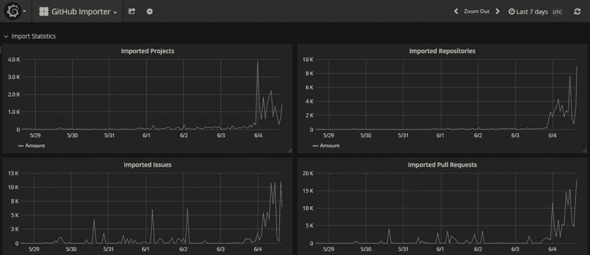

# 微软将收购 GitHub 以扩大开发者范围

> 原文：<https://thenewstack.io/microsoft-to-acquire-github-to-expand-developer-reach/>

为了巩固其在开发市场的地位，微软以 75 亿美元收购了世界上最大的开源软件在线仓库 GitHub。

在周一的新闻发布会上，微软首席执行官[塞特亚·纳德拉](https://twitter.com/satyanadella)强调，未来几年，开发者市场将呈指数级增长。科技之外的软件工程职位——如零售、医疗保健和能源——正以每年两位数的速度增长，比科技行业本身的开发人员职位增长快 25%。

纳德拉说:“随着每家公司都成为数字公司，每个行业的价值创造和增长将越来越多地由开发者做出的选择来决定。”"简而言之，开发者将处于解决世界上最紧迫挑战的中心."

微软[将作为独立实体运营 GitHub](https://blogs.microsoft.com/blog/2018/06/04/microsoft-github-empowering-developers/) 。 [Nat Friedman](https://www.twitter.com/natfriedman) 将接任 GitHub CEO；弗里德曼是 2016 年被微软收购的 Xamarin 的前首席执行官。弗里德曼将向负责微软云和企业集团的执行副总裁斯科特·格思里(Scott Guthrie)汇报工作。现任 GitHub 首席执行官兼联合创始人[克里斯·万斯特拉斯](https://www.twitter.com/defunkt)将以技术研究员的身份加入微软。这笔交易预计将在今年晚些时候完成，有待美国和欧盟监管机构的批准。

GitHub 当然是开发人员的主流，尤其是那些从事协作性开源项目的开发人员。这项服务基于 Linus Torvalds 开发的用于管理 Linux 内核的开源 Git 版本控制软件，拥有超过 2800 万用户。它托管超过 8500 万个项目，既有公共项目(作为其免费服务的一部分)，也有私人项目(作为付费服务)。在 2017 年的一项调查中，SmartBear 发现 45%的开发者使用 GitHub 作为存储库，其中 Atlassian[bit bucket](https://www.atlassian.com/software/bitbucket)(20%)和[git lab](https://about.gitlab.com/)(9%)是最接近的竞争对手。

据纳德拉称，微软本身已经是 GitHub 最活跃的用户，在这项服务上已经进行了超过 200 万次“提交”或更新。去年，在 500 强开源软件项目(包括非 GitHub 托管的项目)中，[有 24 个由微软的一个组织](https://thenewstack.io/week-numbers-comparing-corporate-open-source-contributions-github-organizations/)管理。它也是 Git 的最大贡献者之一，需要开源软件[来管理 Windows 10 的庞大代码库](https://thenewstack.io/microsoft-forged-scalable-git/)。

弗里德曼在新闻发布会上说，微软将寻找与自己大量开发工具的自然集成点，其中许多工具计划在 GitHub Marketplace 上提供。该公司还计划扩展其 VSCode 编辑软件，以便它可以无缝地与 GitHub 结合。

彭博上周末披露的这一消息在开发人员中引起了很多讨论，尤其是那些记得微软对开源软件更具竞争性的人(尽管该公司自 12 年以来已经在采用开源实践方面取得了很大进展)。竞争对手也在充分利用这一时刻:GitLab 周一报告了来自 GitHub 的[比平常更多的项目迁移。](https://twitter.com/gitlab/status/1003409836170547200)

然而，其他人持更乐观的观点。“如果你对收购前的 GitHub 感到满意，但对微软感到不舒服——我认为你应该更多地关注 GitHub 自身的挣扎和微软的转型。[在](https://twitter.com/adamhjk/status/1003467129830588416)的推文中写道首席技术官亚当·雅各布、[。](https://www.linkedin.com/in/adamjacob/)

Docker 产品经理 [Gareth Rushgrove](https://www.linkedin.com/in/garethrushgrove/) 在他自己的推特上分享了 Jacob[的观点:“我不清楚 GitHub 上市会不会比微软对开发者更友好。公开市场会要求 GitHub 每个季度都赚更多的钱。这将主要意味着对越来越多的东西收费，”他写道。](https://twitter.com/garethr/status/1003592992601632768)

*TNS 分析师 [Lawrence Hecht](https://thenewstack.io/author/lawrence-hecht/) 对本文有贡献*。

Chef 和微软是新堆栈的赞助商。

特征图片:Github 首席执行官兼联合创始人克里斯·万斯特拉斯(左)；Nat Friedman，微软公司副总裁，开发者服务；微软首席执行官塞特亚·纳德拉；以及微软首席财务官艾米·胡德(Amy Hood)。

<svg xmlns:xlink="http://www.w3.org/1999/xlink" viewBox="0 0 68 31" version="1.1"><title>Group</title> <desc>Created with Sketch.</desc></svg>