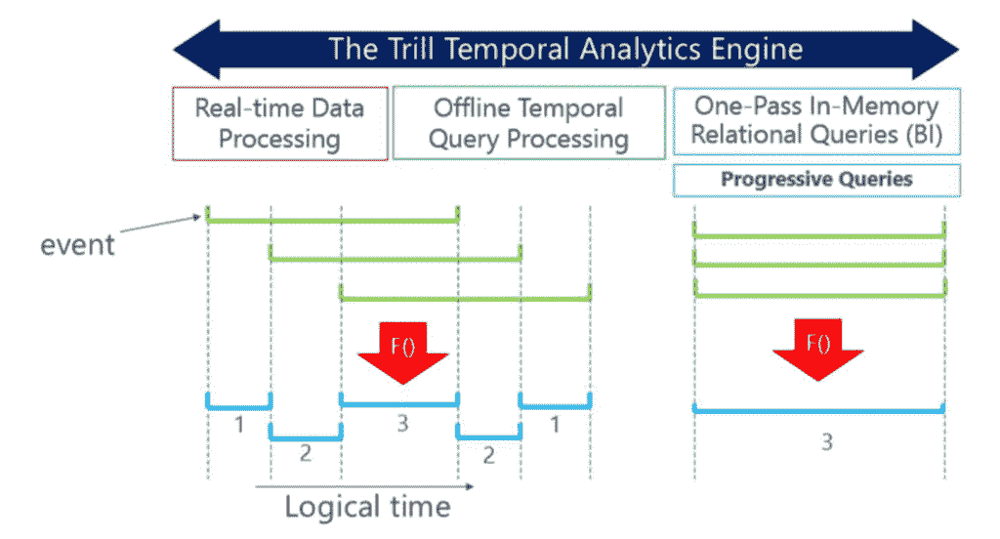
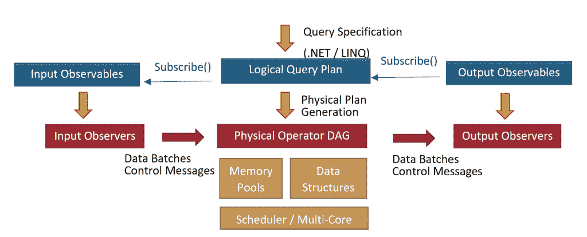

# 微软 Trill:一个开源的高性能流分析引擎

> 原文：<https://thenewstack.io/microsoft-trill-an-open-source-high-performance-streaming-analytics-engine/>

当微软开始构建成为开源的系统时。NET library Trill ，处理数据流和消息来检测和处理一天一万亿个事件并不是一个常见的需求。无论是物联网、遥测、网络广告、金融市场还是机器学习，处理海量数据现在都非常普遍。Trill 为您提供了一种[时态查询语言](https://cloudblogs.microsoft.com/opensource/2019/03/28/trill-101-how-to-add-temporal-queries-to-your-applications/)，可以通过在大规模的流数据中寻找复杂的模式来提供实时分析。

事实上，它命名的一天万亿次事件对于最新版本来说可能是保守的，一些操作以每秒数十亿次事件的内存带宽速度发生。

但 Trill 还可以查看历史数据(它处理这些离线关系查询的吞吐量与您从 SQL Server 等列式 DBMS 获得的吞吐量相当)，这使它成为一个可以满足全套分析需求的单一工具。开发人员可能希望使用日志来开发他们将要在实时数据流上运行的查询，或者比较当前和历史数据；Trill 允许您使用相同的引擎和数据模型(以及性能)来实现这一点。

Trill 在微软内部被广泛使用，从 Exchange 和 Azure 网络到分析 Windows 中的遥测技术。这是 Azure Stream Analytics 服务的动力所在(由于能够将 SQL 查询编译成 Trill 表达式，该服务仅用了 10 个月就完成了构建)。它用于 Halo 的遥测、游戏监控和调试([托管在奥尔良](https://thenewstack.io/microsoft-orleans-brings-distributed-transactions-to-cloud/)用于规模化)。当 Bing 在 2015 年采用 Trill 时，分析数 Pb 的数据从需要 24 小时变成了接近实时。将点击和印象转化为关于 Bing 广告活动表现和广告关键词竞价的客户报告需要 30 分钟到一个小时；Trill 将这一时间缩短到只有几分钟。

它已经被一些软件开发人员在外部采用；金融机器学习平台 [Financial Fabric](http://www.financialfabric.com/) 使用 Trill 对投资数据进行实时投资组合和风险分析。但是它有什么不同呢？

## 微服务和抽象

Trill 的优势

Trill 是一个用于时态或流数据的单节点查询处理器。它是...

*   组件化，因此您可以使用任何您想要扩展的分布结构，如 Orleans 或 Kubernetes。
*   从命令中分离出一种众所周知的查询语言来获得您想要的数据块，这在架构上很简单，可以基于简单的时间窗口，也可以基于数据的某些属性的复杂窗口。
*   由于极其高效的编码，使数据成为隐藏的列，所以速度非常快。
*   查看数据的形状，找到处理数据的最有效方式。
*   编译您编写的查询，使它们像内置方法一样高效。***——m . b .***

Trill 如此有效且易于使用的原因在于 API 的简单性，以及它是一个组件而不是一个完整的分析系统的事实。微软已经有了一个名为 StreamInsight 的系统，这是一个可以安装在服务器上的整体应用程序。Trill 团队没有将其移植到 Azure，而是对其进行了重构，创建了一个单程内存流分析引擎作为单节点。NET 库，开发人员可以将它集成到不同的系统中(例如，将它作为机器学习管道的一部分，而不是分析系统)，并通过调用标准的 IStreamable 抽象来使用它。用于推送数据的. Net 接口..

如果您需要将其扩展到单个节点之外，Trill 可以与 Orleans 或 YARN 这样的分布式结构一起使用；它还具有高可用性的检查点/恢复功能。有一个实验性的分布式 Trill 实现正在开发中，使用微软的 [Quill 平台](https://www.microsoft.com/en-us/research/wp-content/uploads/2016/08/quill-tr-2016.pdf)(每天千万亿字节组)和[应用公共运行时](https://github.com/microsoft/CRA)，这是一个用 Kubernetes 和 YARN 简化创建分布式应用的库。

许多流媒体系统都是给你提供完整的端到端体验的单片系统，而不是可以重用和重新分发的组件，因此这使得 Trill 更灵活地供开发人员构建到他们的解决方案中，微软的 [James Terwilliger](https://www.linkedin.com/in/jamesterwilliger) 解释道，他致力于 Trill 并帮助开源它。

“想在 Azure 上运行 Trill 吗？酷毙了。想在本地服务器上运行它吗？太棒了。想在运行 Linux 的 edge 设备上运行吗？没问题。“事实证明，这块布料本身就是一个很好的组件，不管是在 Orleans 还是 Jonathan Goldstein 的新项目 [Ambrosia](https://github.com/Microsoft/AMBROSIA) ，Terwilliger 说，他指的是 Trill 的原始开发者之一使用 CRA 建造的微服务织物当给定一个线程调度器时，Trill 自身最多只能在单个节点上进行线程调度——在这种情况下，Trill 会在线程间分配一些聚合或连接操作的负载。除此之外，Trill 希望 fabric 完成向外扩展的工作。"

为了更简单地编写查询，Trill 将查询逻辑分开。Trill-LINQ 使用标准的 C# LINQ 查询——包括 lambda 表达式，并对任意。Net 类型，嵌套或非嵌套-通过管理您正在分析的时态数据，使用单独的操作对您关注的时间窗口中的数据进行分组和聚合。生存期操作可用于设置查询操作运行哪些事件，然后 Trill 对该快照中的所有数据运行查询。

数据中的每个事件都有一个关联的生命周期，表示为时间间隔或开始和结束时间。如果数据没有按顺序到达，那么在它被接收到 Trill 时，需要按照时间顺序进行处理；这意味着操作员可以更简单、更高效，因为他们不必花时间检查订单。

## 时间窗口

如果你想要一个标准的滚动窗口(比如说每小时获取最后一个小时的数据)，有一个内置的操作可以做到这一点，但它通过调用一个通用的 AlterEventLifetime 方法来改变每个事件的生命周期。类似地，如果您想要创建一个跳跃窗口(数据快照在其中重叠，就像每五分钟查看一次最近十分钟的平均销售额)或数据滑动窗口，这两者都有内置的操作，但是它们使用相同的底层 AlterEventLifetime 操作符方法来更改生命周期。

您还可以使用 AlterEventLifetime 或内置宏 ProgressiveQuantizeLifetime 来创建您自己的、基于数据而不是时间的更复杂的窗口，例如在每个滚动窗口的边界重新计算总和的窗口。您可以剪辑事件生存期；例如，收集广告印象并将它们的寿命设置为十分钟或广告被看到后第一次点击的时间(以较短者为准)。Terwilliger 解释说，这给了你一组大多数流媒体系统无法提供的更精细的结果。

这使得 Trill 非常灵活和可扩展。支持所有常见的关系操作—连接、聚合、过滤、投影，以及一些其他更复杂的操作，如高级模式匹配您可以对数据进行分组，对组应用查询并选择一个值。使用 GroupApply 操作(本质上是执行 Map-Reduce)。

与 SQL Server 非常相似，用户定义的聚合由内置聚合使用的相同原语组成:创建对象的初始值设定项、向对象添加事件的累加器、删除事件的反累加器、计算对象之间差异的微分器以及转换对象以适应预期输出的结果构造函数。“使用这个框架有一些聪明的方法来实现规则引擎和模式匹配，尽管我们还有一个独立的功能，可以以更像正则表达式的方式进行高级模式匹配。”

Trill 还可以用作“渐进式”查询处理器，从部分数据中给出早期结果。

您不需要总是查看查询的所有结果来获得答案。这可能是因为部分结果告诉您查询没有正确编写，所以您可以通过在几个结果后停止查询来节省时间和资源。有时，您不需要处理所有数据来获得答案:如果您正在查询所有传感器的最高温度，而您实际上想知道是否有任何异常值报告温度高于 35 度，则显示更高值的第一个结果足以回答该问题。

Terwilliger 指出:“有时我们试图回答的问题与我们发送给数据库的查询并不完全相同，而部分答案将会给我们提供所需的所有信息。”。"这是一个在任何环境中都有用的特性，无论是临时的还是非临时的，无论是关系的还是非关系的."以更多的交互方式处理部分结果会占用更多的内存并降低吞吐量，所以 Trill 再次操纵数据生命周期。“使用 Trill 获得渐进结果的方法是巧妙利用时间线管理——毕竟，对计算机来说,“时间”只不过是一个单调递增的值。”

插图由微软提供。

## 列和编译

Trill 获得令人印象深刻的性能的部分方式是让您选择所需的延迟——为了从数据中获得最佳结果，您愿意等待多长时间——并批量处理数据流以提供该延迟。较大的批处理会提供更好的吞吐量，但是较小的数据批处理会提供更低的延迟:默认大小是每批 80，000 行。

Trill 对传递的数据进行一次传递，部分是为了避免重复加载和卸载大量数据的开销，同时也是为了避免依赖于数据流来源的端点的性能和可用性。“在 Trill 内部，我们只是希望数据是短暂的。如果像索引这样的东西可以用来加速查询处理，那是可以做到的，只是它是在 Trill 之外完成的，并且不被 Trill 所注意，”Terwilliger 说。

插图由微软提供。

除了复杂类型之外，批量数据还被转换成列格式。

即使数据被转换成列，用户编写查询时也好像数据在行中一样，这些查询被重新编写成紧密的循环，只需要最少的内存访问，并且循环中没有方法调用，从而提高了效率。如果您编写了自己的聚合方法，它们也将被重写，以便在列上更有效。Terwilliger 说:“Trill 试图尽可能高效地只保留需要的状态。

通过将当前操作保存在指令缓存中，协同定位特定字段或属性的数据可以加快查询速度，并且当您有列数据时，某些表达式(如选择字段)会更有效，因为您可以通过选取包含该字段的列并将其放入输出批处理来进行选择。Trill 还查看数据的形状，以便为重写的查询选择最有效的操作符。这可能是典型的数据库优化，比如是否有一个属性作为每个时间戳内的键，或者它可能更具体地针对带时间戳的数据，比如数据的生命周期是否都具有相同的长度或落在特定的时间边界上。

所有这些小好处加起来，还有更多优化计划，如使用 SIMD 一次在整个数据向量上运行单个计算。

## Trill 的未来

其他正在进行的工作包括利用微软最近开源的 [FASTER](https://github.com/Microsoft/FASTER) key-value store 来管理运营商状态，以有效管理大量状态，以及处理无序数据的新方法，允许用户指定多种级别的延迟。目前，Trill 处理乱序数据的方法是，要么用到达的时间标记迟到的数据，要么丢弃它，要么抛出一个异常。计划是使用[急躁排序](https://ieeexplore.ieee.org/document/8509288)，一种处理几乎但不完全有序的流数据集的排序技术——网络延迟或硬件故障可能导致一些无序的结果，这些结果可以重新排列。 [TRLLDSP](https://github.com/microsoft/Trill/issues/1) 将添加通常在 R 等数值框架中完成的信号处理，但代码仍处于原型阶段。

Terwilliger 说，目前，Trill 是一个. NET 库，但没有理由它不能与其他语言一起工作。“F#绝对是我们关注的对象。它的语法非常适合流数据。我们确实有一个同事在研究制作一个 API 包装器，让 F#的使用更加习惯化。也就是说，很少有特定于. Net 的架构。有一些功能，如 LINQ 表达式、不安全代码和 Roslyn 编译器，使实现 Trill 变得非常有趣。但是根据社区的兴趣，研究 Python 或 Scala 的实现可能会变得更重要。我们知道 Scala 拥有一些表达式管理和操作特性，这些特性是获得良好性能所必需的。”

现在它是一个开源项目，方向将取决于开发人员的采用和社区的兴趣，但 Trill 已经产生了重大影响。“许多来自原始研究出版物和技术报告的关键见解随后被添加到其他系统中，如 Spark 中的代码生成处理。展望未来，我认为 Trill 在一些地方填补了现有竞争格局中的空白，并有机会施加影响。一旦用户掌握了时态模型，数据操作符和时间线管理之间的清晰分离会使 API 变得非常简单。正则表达式和信号处理特性(前者已经在产品中，后者处于 alpha 状态)具有解决大问题的真正潜力。在中短期内，我认为你会看到微软内部的一些其他开源项目，也许是微软外部的一些项目，现在他们可以依赖 Trill 了。”

通过 Pixabay 的特征图像。

<svg xmlns:xlink="http://www.w3.org/1999/xlink" viewBox="0 0 68 31" version="1.1"><title>Group</title> <desc>Created with Sketch.</desc></svg>