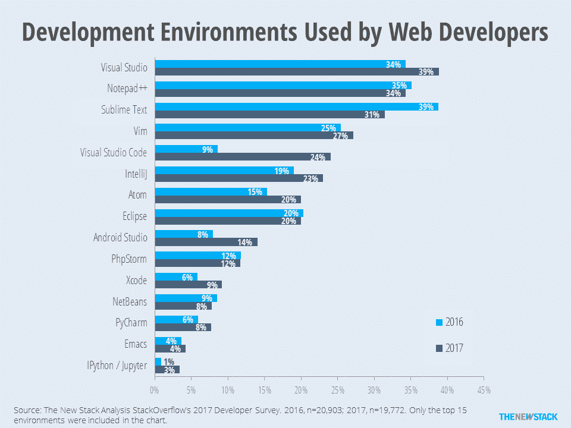
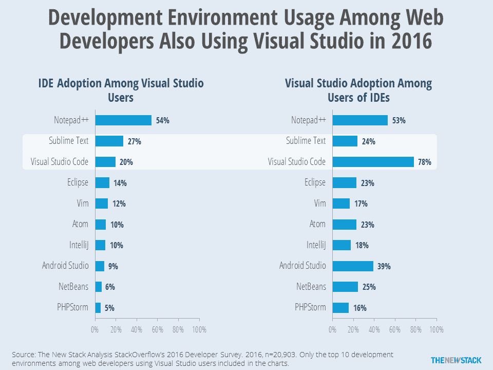

# 微软 Visual Studio 2017 专注于 DevOps 和五星应用

> 原文：<https://thenewstack.io/microsoft-visual-studio-2017-devops-five-star-app/>

微软最近[向其 Visual Studio 集成开发环境(IDE)](https://www.visualstudio.com/en-us/news/releasenotes/vs2017-relnotes)[Visual Studio 2017](https://www.visualstudio.com/vs/whatsnew)发布了最新更新，带来了许多生产力、性能和编码方面的增强。

Visual Studio 2017 故事中最突出的新片段是该公司专注于改善企业 IT 环境的 [DevOps](/category/devops/) ，允许企业开发者构建微软所谓的“五星级应用”

微软负责云应用开发和数据营销的公司副总裁 Mitra Azizirad 解释道:[五星级应用本质上是企业级应用，拥有人们在日常生活中习惯使用的最佳消费应用的完美外观和感觉。](https://www.linkedin.com/in/mitra-azizirad-626bb64/)

## 编码更快

微软正在重新设计 Visual Studio，以便让开发人员有更多的时间编写代码，减少他们担心如何构建、交付和维护应用程序的时间。

她说，就构建应用程序而言，它是关于拥有原生用户界面和高保真 API 访问，无论是跨 Android、iOS 还是 Windows。这是关于性能的，性能被认为是一个比其他任何东西都重要的特性。

“当我们从移动开发的角度考虑复杂性和处理时，你可以有几十个操作系统版本和数千种外形，”Azizirad 说。"能够通过一次提交以无缝的方式分发它是至关重要的."

这些应用程序还必须能够随时随地在任何平台上与用户联系，无论是 PC、手机还是可穿戴设备。因此，它们必须具有可伸缩性和适应性。对于这些企业应用程序来说，即使是几秒钟的延迟或中断也是代价高昂的。

为了帮助简化这些应用程序的构建，微软添加了许多东西来帮助您更快地编码，例如 Xamarin Inspector，以便您可以实时可视化您的应用程序，而不必停止调试。还有 [Xamarin Profiler](https://www.xamarin.com/profiler) 、Forms Previewer 和 iOS simulator，它们让开发人员能够针对 iOS、Android 和 Windows 提供原生体验。

此外，现在在 Visual Studio 2017 中首次出现了 Xamarin 应用程序模板，这些模板预配置了由微软 Azure 云服务支持的常见应用程序服务，如 [DocumentDB](https://azure.microsoft.com/en-us/services/documentdb/) 存储、身份验证、推送通知和监控。微软还增加了一个连接服务 UI，允许任何应用程序轻松添加 Azure 服务，并负责应用程序所需的配置。

与此同时，[。Visual Studio 2017 内置的 NET Core 1.0](https://www.microsoft.com/net/core) 针对 Windows 和 Mac 上运行的云和跨平台进行了优化。微软也推出了。NET Core 微服务参考应用，这是打造[的良方。网芯微服务](https://www.manning.com/books/microservices-in-net-core)。

## 直到我们倒下

微软 Visual Studio 2017 系列的一个关键目标是为所有开发人员提供 [DevOps](/category/devops/) 。

“我们知道个人生产力很重要，但 DevOps 实际上是为了改变流程，”Azizirad 说。“我们希望 Visual Studio 2017 能够让开发人员有更多的时间来编写出色的代码，并减少开发运维流程本身的时间。不仅仅是应用的构建，还有生命周期管理和 DevOps 流程。”

很明显，微软已经将 DevOps 更多地集成到了 IDE 中，提供了诸如实时单元测试之类的功能，因此团队可以在开发人员编写代码的同时编写测试，以缩短这些循环。这是在软件生命周期早期执行测试的“左移”方法的一部分。此外，[Visual Studio Team Foundation Server 2017](https://www.visualstudio.com/en-us/news/releasenotes/tfs2017-relnotes)的新更新包括一堆新的持续集成/持续交付(CI/CD)服务。

微软新的 DevOps 焦点来自于开发者的需求。Azizirad 说:“我们从人们那里听到很多关于 DevOps 有多难的说法，因此随着人们远离瀑布流程，这种能力将有助于提供一种更清晰的方法来收紧 DevOps 流程。”

具有讽刺意味的是，将开发者从专注于组件中解放出来，以便他们可以将更多的时间花在沉浸式体验和应用本身上，这已经成为微软与客户讨论的近 50%的内容，Azizirad 说。

“人们说，当你写完应用程序时，你还没有完成它；当你看到顾客脸上露出微笑时，你就大功告成了，”她说。“DevOps 是人们感觉持续改进的方式。因此，我们希望确保 Visual Studio 不仅被视为构建该应用程序的关键，还被视为整个生命周期管理的关键。”

[Pund-IT](http://www.pund-it.com/) 的首席分析师查尔斯·金说，他相信微软对这次 Visual Studio 周年更新所做的许多改变和改进反映了 DevOps 的根本重要性和现实性。

“鉴于人们越来越关注构建和更改应用程序以满足不断变化的业务目标，增强软件应用程序生命周期并实现与 IT 运营无缝交互的开发运维流程变得前所未有的重要，”King 说道。

他指出，新的 Visual Studio 功能，包括代码导航改进和智能感知代码完成，以及改进应用程序的创建和部署到微软的 Azure 云的过程，都有助于实现这一点。

“这些和其他功能突出了微软对 DevOps 效率对其客户的重要性的理解，以及该公司在 Visual Studio 和其他开发工具中针对这些问题的意图，”King 补充道。

考虑到这一点，微软预览了直接从 Visual Studio 中[配置 CI/CD 管道](https://blogs.msdn.microsoft.com/visualstudio/2017/02/06/continuous-delivery-tools-extension-visual-studio-2017/)的能力。微软 Visual Studio 项目管理总监 John Montgomery 在[博客文章](https://blogs.msdn.microsoft.com/visualstudio/2017/03/07/visual-studio-2017-productivity-performance-and-partners/)中说[Visual Studio 的连续交付工具](https://aka.ms/CD4VS)是 Visual Studio 2017 的新扩展，为 IDE 带来了 DevOps 功能。

此外，微软正在将其新的 [Enterprise DevOps 加速器产品](https://aka.ms/devopsnow)扩展到大中型开发团队，这些团队希望实现其工具链的现代化并专注于创新。这一服务整合了多种工具，包括面向两者的 Visual Studio Enterprise 和基于团队的 DevOps 云服务。净与非。网络团队。

## 丢下家人不管吗？

微软 Visual Studio 合作伙伴 Tasktop Technologies 的首席执行官 Mik Kersten 表示，他对微软带领 Visual Studio 前进的方向印象深刻，但担心它可能会将其他公司甩在后面。

“我对微软在 Visual Studio 2017 发布会上的表现印象深刻，也有点失望，”他说。

他说，他印象深刻，因为 Visual Studio 现在进一步扩大了其作为最全面和最简化的 IDE 体验的领先地位。他说他很沮丧，因为 Java 和 JavaScript 开发人员被一套更过时和不同的工具远远抛在了后面。

“通过这次发布，微软为 ide 设定了高标准，结合了对 C#和 TypeScript 的尖端编程支持，通过 Team Foundation Services 连接到敏捷集成，更重要的是，连接到对 Azure 和 Docker 的新 DevOps 支持，”Kersten 告诉 New Stack。

此外，他指出，Visual Studio 团队正在做“令人惊讶的事情”，使 IDE 成为微软云平台的入口，延续了该公司大力投资开发人员体验的伟大传统。

然而，“现在的问题是 Azure 是否会成为 Java 等非微软平台中心工作负载的合法目的地，”Kersten 说。“如果没有，亚马逊和谷歌将需要开始追赶 IDE 体验，以抓住越来越多的云原生开发者的心灵和思想，他们正被推回到文本编辑器的混乱世界。”

*TNS 分析师 [Lawrence Hecht](https://thenewstack.io/author/lawrence-hecht/) 为本文提供了堆栈溢出分析图表。*

由[迈克尔·赫希](https://unsplash.com/@hirsch)通过 [Pixabay](https://unsplash.com/?photo=Jit7W5Me_0c) 拍摄的专题图片。

<svg xmlns:xlink="http://www.w3.org/1999/xlink" viewBox="0 0 68 31" version="1.1"><title>Group</title> <desc>Created with Sketch.</desc></svg>