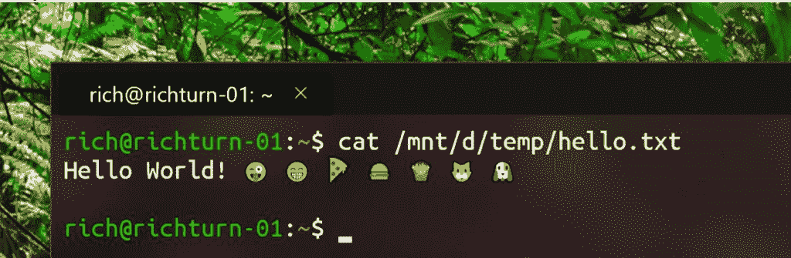

# 微软 Windows 获得了一个带有标签、富文本呈现的开源终端

> 原文：<https://thenewstack.io/microsoft-windows-gets-an-open-source-terminal-with-tabs-rich-text-rendering/>

虽然驱动 Windows 控制台和命令行的引擎一直在更新，以支持 Unicode、UTF-8、24 位颜色、VT 序列和丰富的命令行界面使用的[其他技术，但由于遗留原因，Windows 控制台应用程序本身未能充分利用它们。](https://blogs.msdn.microsoft.com/commandline/2018/12/10/new-experimental-console-features/)

但是，微软不仅在内部使用控制台来完成 Windows 构建过程等关键任务，而且向后兼容性对于许多依赖它的工业应用程序来说也是至关重要的，即使是对用户界面最简单的更改也可能破坏它们。

为了在不影响兼容性的情况下为开发人员带来最新体验，微软将推出一款全新的 Windows 终端应用，该应用基于更新和重构的 Windows 控制台子系统，支持丰富的字体、可配置的主题、多个选项卡、扩展和 GPU 加速的文本渲染。

新的 Windows 终端中的 PowerShell 核心选项卡设置为 25%的背景模糊透明度。

“新的 Windows 终端是对命令行体验的彻底更新，”Windows 开发者平台公司副总裁凯文·加洛告诉新堆栈。“我们的目标是建造有史以来最好的航站楼。”

“它有主题和许多定制。它有捷径。您可以不同地控制窗口；你可以有标签，你可以定义你如何做工作流程。我们支持 Unicode 等现代功能，因此您可以使用表情符号，并且支持东亚字体，这是一个非常受欢迎的功能。从文本可视化的角度来看，这是一种非常现代的体验。”

Windows 终端是一个 Win32 应用程序，因为它需要连接到通用 Windows 平台(UWP)沙箱无法访问的服务，但它是在 XAML 使用 XAML 群岛构建的，这种技术使得使用 UWP 的新用户界面元素成为可能。这意味着选项卡式用户界面使用新的 Windows 10 Fluent 设计系统，从透明度到主题，无所不包。

选择不同的命令行 shells 作为 Windows 终端中选项卡的配置文件。

你可以打开多个标签，每个标签都连接到一个命令行外壳或应用程序，你可以拖移一个标签，将其作为一个新窗口。终端支持 Windows 10 可用的所有 WSL 发行版，以及 PowerShell (Core 和 Windows)和 CMD，但您也可以有一个选项卡，通过 SSH 连接到远程设备，如 Raspberry Pi。(如果开发人员需要当前的 Windows 控制台应用程序来实现带宽兼容性，他们仍然可以通过直接运行 CMD 或 PowerShell 来启动它。)

每个用户的设置和配置选项都存储在一个结构化的文本文件中，开发人员可以直接编辑该文件，或者第三方工具可以用来自定义 Windows 终端体验。您可以将字体大小和样式、颜色主题、背景模糊和透明度等设置的组合保存为配置文件，并选择在每个选项卡或外壳中使用哪个配置文件。

除了多个标签，你还可以将每个标签分成多个不同大小的窗格，使用类似于 **tmux** 的工具一次显示几个应用程序。丰富的颜色支持让开发人员可以做一些在 Linux 上是标准的事情，但在 Windows 控制台上一直是个问题——比如从《财富》等应用程序中获取文本，通过 **cowsay** 和 lolcat 传输，所以“每日名言”看起来就像是由多种颜色的奶牛说的。

Windows 终端中显示 Unicode 和表情符号字符的 Ubuntu 标签。

Gallo 说，文本渲染是硬件加速的，使用 DirectWrite 和 DirectX 提供更快的性能；"如果你输入‘dir’，在一个很长的目录列表中滚动会快得多."GPU 驱动的渲染在处理大型 GitHub repos 时有着特殊的作用。“当你在 GitHub repo 中工作时，你有一长串文本在屏幕上飞舞，你最不希望的就是渲染速度变慢。”

该 GPU 加速的文本渲染引擎未来也将出现在传统的 Windows 控制台中，可以渲染 Unicode、UTF 8 和字体中的字形和符号，包括编程连字、图标和电力线符号。这不仅仅是让开发者在变量名中使用表情符号，更重要的是能够支持所有语言中变量和函数名的所有 Unicode 字符，以及软件在中国发布所需的中文/日文/韩文表意文字。

Windows 终端的图标。

Gallo 说，开发者可以添加功能，用扩展来定制 Windows 终端界面，微软将在扩展市场中托管这些功能。“我们有一个显示网页链接的预览；当你将鼠标悬停在“终端”中的一个 HTTP 地址上时，你会看到该网站的预览。

但这并不是开发者扩展新 Windows 终端的唯一方式；微软正在开源该应用程序，其第一个版本将于本周在 GitHub 上发布(该应用程序也将于今年夏天在 Windows Store 上发布，完整版本将于年底发布)。

其中包括用于构建 Windows 终端的控件。其中一些是用户界面控件，如 Fluent 选项卡控件，Windows 开发人员将能够将其用于自己的应用程序(包括使用 XAML 群岛的 Windows 桌面应用程序)。但是也有用于构建终端本身的控件(它现在使用标准模板库 C++组件来处理链表之类的事情)。事实上，开源 Windows 终端意味着微软也在开源标准的 Windows 控制台和 Windows 控制台子系统，后者托管所有的 Windows 命令行基础设施。向这些项目提交 pull 请求可能意味着社区贡献将被合并到 Windows 代码库中。

微软已经开源的 Windows 组件一直是更独立的产品，比如计算器。这不太可能是 Windows 操作系统的大部分成为开源的先驱，但这仍然是该平台的一个重大发展。Windows 控制台子系统是基础设施的一个关键部分，可以追溯到 Windows 和开源的早期，它表明了微软对于让 Windows 成为开发者的更好平台的认真态度。这将是一个长期的项目，但像 Windows 终端和 WSL 2 这样的步骤是一个良好的开端。

特征图片:使用 **tmux** 将 Windows 终端中的一个 Ubuntu 标签分割成多个窗格，运行不同的应用程序，如午夜指挥官、 **htop** 和 **cowsay** 。所有图片均由微软提供。

<svg xmlns:xlink="http://www.w3.org/1999/xlink" viewBox="0 0 68 31" version="1.1"><title>Group</title> <desc>Created with Sketch.</desc></svg>