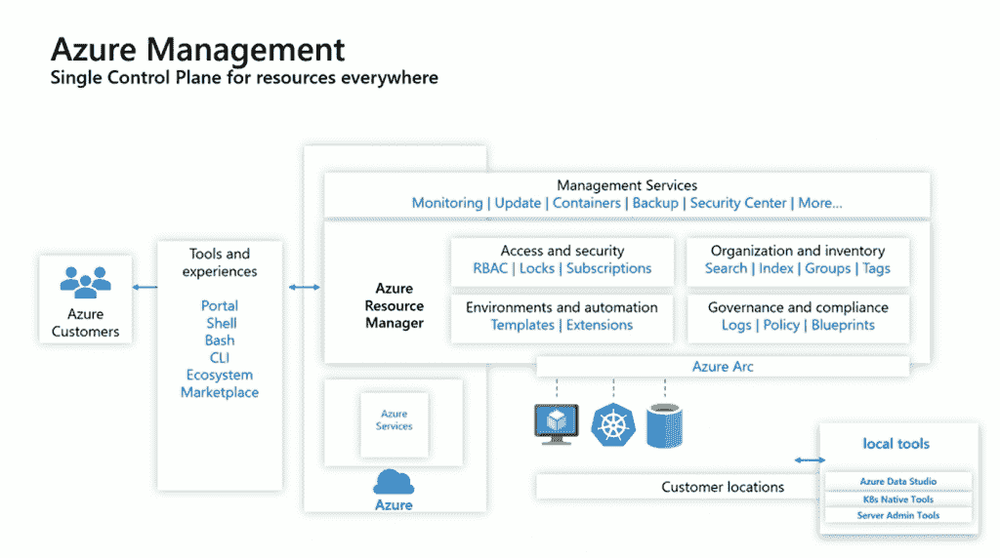
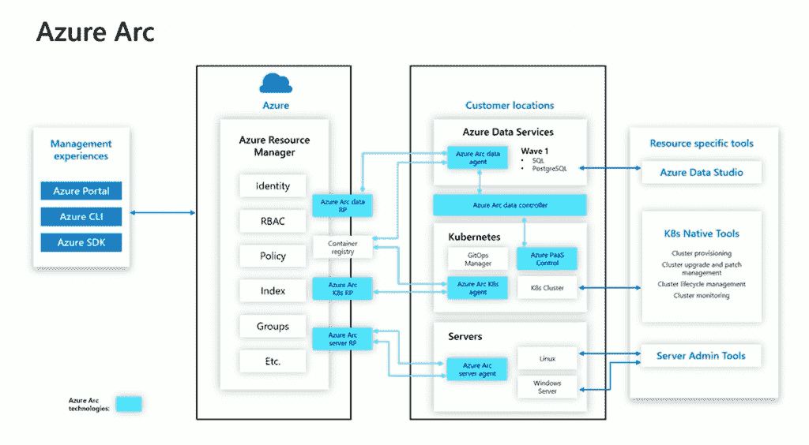

# 微软的 Azure Arc 提供企业级混合云

> 原文：<https://thenewstack.io/microsofts-azure-arc-offers-hybrid-cloud-on-enterprise-terms/>

微软对混合云并不陌生，但 Azure Arc 的发布使其方法更加连贯和全面。

Arc 是一种使用 Azure 管理、治理、策略、安全和更新工具来管理您自己的数据中心或另一个云中的基础架构的方法，无论是裸机、虚拟机还是 Kubernetes。它将 Azure Resource Manager 控制平面引入到不在云中的资源，因此您可以获得单个控制平面的一致性，而无需尝试替换生态系统中的所有其他工具。

您可以使用相同的标记组织虚拟机，并基于这些标记应用相同的策略，无论它们在哪里。你可以使用相同的 Azure Resource Manager 模板对 AWS 或 GCP 中的虚拟机应用基于角色的访问控制，就像在你自己的硬件上一样，你可以使用 Azure Security Center 加密文件系统和 Azure Automation 修补操作系统，你可以在 Azure Monitor 中查看所有这些系统的日志。无论在哪里，您都可以将这些云管理工具用于您现有的所有基础架构；如果你能连接到 Windows 服务器或 Linux OS 实例，你可以使用 Azure 云工具来管理它。

Arc 允许您在这些虚拟机和 Kubernetes 集群上运行您已经拥有的应用程序，或者推出已经打包部署到 Kubernetes 上的新应用程序。您还可以在基础设施上部署来自 Azure 的 SQL Azure 数据库服务和托管 PostgreSQL 超大规模服务。这是一种由微软管理和更新的数据库服务，就像它运行在云中一样。你为云服务付费，但是你在你自己的基础设施上，在你自己的数据中心得到它。
因此，如果数据重力或数据主权，或者仅仅是你在硬件上的投资金额，使公共云成为一个困难的选择，你仍然可以获得云管理和云数据库服务——这是拥有数据中心的企业自公共云流行以来一直要求的。

## 云，但在您的服务器上

Azure 公司副总裁 Julia White 告诉 New Stack,“从历史上看，我们将混合作为云的数据中心。“我们越来越多地看到多云以及互联设备变得越来越常见，因此应用程序正在从物联网设备到多种云再到数据中心的所有设备上运行。”

但是这种灵活性会变得非常复杂。“当我们考虑所有环境中的控制平面和一致性时，在每个环境中以多种不同方式运行的应用程序将会非常昂贵和复杂。仅仅有一个地方来组织它是有价值的，但是有了 Azure Arc，我们还提供了跨多个环境的治理。”

带有 Azure Arc 的 VM 管理服务处于公共预览中；Kubernetes 管理服务和两个托管数据服务一样处于私有预览中。

图片由微软提供。

微软确实计划在这些数据库服务之外为 Azure Arc 带来更多的云服务，所以你可以期待像 Azure 无服务器计算功能这样的东西。但它不会是 Azure 服务的全部，也可能不是微软最初的混合云设备 Azure Stack Hub 上已经可用的所有 Azure 服务。

“随着我们向前发展，我们将看看人们希望以分布式方式运行的逻辑角色是什么，”怀特说。“数据是一个非常明显的问题，所以这是一个很好的起点。这并不意味着 Azure 拥有的每个 PaaS 服务都有意义以分布式方式运行，所以我们不会只是开始引入不同的服务。但有些服务看起来非常明显，我希望你能看到我们在下一类服务方面快速前进。”

她还预计，这将吸引那些希望将云原生应用销售给不会在云中运行这些应用的企业的软件供应商。“如果他们的应用程序在 Azure 中运行，但他们现在无法解决内部使用案例，使用 Azure Arc 他们也可以在内部运行他们的应用程序。”

## Arc 不做的事情

要了解 Arc 如何适应企业基础设施——在您自己的硬件上或在多个云中——了解它不做什么是有用的。它不配置虚拟机，也不处理虚拟机的生命周期管理:您仍然使用以前用于虚拟机配置和服务器管理的任何工具来进行配置，无论是 vSphere 或 System Center，还是新的 Windows 管理中心或 AWS APIs。它也不提供 Kubernetes 同样，您可以使用现有的基础架构工具，以及现有的基础架构。

Azure 控制平面为您的基础设施提供策略，即使它在另一个云上，您也可以获得统一计费，但正如 Azure Arc 不会接管其他云上的虚拟机供应，它不会向您显示该基础设施的成本。在服务器和虚拟机上，在您自己的基础设施上或非微软的云中，您部署了一个代理，该代理还运行 Azure 实例元数据服务的实例，这是一个将设备的资源 ID 投影到云中的 REST 端点。对于 Kubernetes，您可以使用 Helm 手势安装代理，将集群连接到您的 Azure 订阅和资源组，并创建连接器集群资源。

图片由微软提供。

如果您使用 GitOps 拥有一个 repo，它是配置和应用程序部署的唯一来源，那么您可以使用 Arc 策略让您的 Kubernetes 集群监控 repo，下载并应用集群管理员和开发人员签入的清单和代码。但是，如果您有一个只是间歇性连接到互联网的集群，您仍然可以从 Arc 管理它，推送策略来设置它，然后断开连接运行。

Azure 总经理 Arpan Shah 告诉我们，Arc 并不想成为你使用的唯一工具。“我们希望提供治理，同时允许人们使用他们习惯的工具。因此，对于 Kubernetes，您可以使用 Kubernetes 控制平面，可以使用命令行工具，所有的本机工具。”

相反，它是关于不必使用多种工具，只是为了在云和您的数据中心中有相同的设置。“借助 Arc 中的策略，您可以在‘我的服务器是否有未过期的证书？我有不会过期的密码吗？我的所有服务器上的 TCP 端口 3443 都是开放的吗？“无论基础设施在哪里，Arc 都会在 Azure 门户中推送策略、监控合规性并为您提供警报和补救选项。

与超融合 Azure Stack Hub 或 AWS Outposts 设备不同，Arc 不是随新硬件一起购买的东西。White 表示，微软正在与 VMware 密切合作，以“确保 Arc 具有良好的虚拟化层集成体验”，但您并不局限于使用 vSphere(如果您不想使用 AWS APIs，这是 Outposts 上的唯一选择)。

Arc 不像 [Anthos](/anthos-kubernetes-infrastructure-to-make-developers-more-productive/) 那样是一个 Kubernetes 设备，后者是谷歌试图夺回对 Kubernetes 企业堆栈的控制权，包括用于服务网格和无服务器的 Istio 和 Knative，尽管它确实分享了通过同一个控制平面管理云和本地集群的想法。

VMware 的 [Tanzu](https://cloud.vmware.com/tanzu) 和 [Project Pacific](https://www.vmware.com/products/vsphere/projectpacific.html) 也专注于针对 vSphere 上的应用的 Kubernetes，并为 vSphere 管理员提供一种使用 Kubernetes 自定义资源定义(CRDs)在同一 ESXi 平台内管理容器和虚拟机的方法；同样，这与 Azure Arc 控制平面处于不同的层次，Azure Arc 控制平面允许管理员使用 ARM 模板和策略结构将相同的治理应用到云和数据中心系统(VMware 没有像 Azure 那样在内部运行的云服务)。这两个控制平面可能会共存，甚至微软和 VMware 可能会允许它们进行互操作(从像 Azure VMware Solutions 这样的合作中继续)。

Arc 也不是微软的 Kubernetes 发行版；你不会得到一个可以在你的硬件上运行的 AKS 版本，如果你想从微软购买一个可以提供 Kubernetes 服务的硬件，你可以使用 Azure Stack Hub。相反，Arc 可以与您选择的任何 CNCF 认证的发行版合作，包括托管的 Kubernetes 服务，并且您可以继续管理该 Kubernetes 基础架构。

Arc 也不同于 Azure Stack Edge，后者是另一种微软托管设备(有一系列不同的外形规格，包括可以放在背包中的坚固型号)；它运行容器，你可以从 [AKS](/kubernetes-for-edge-computing-the-microsoft-azure-approach/) 管理它们，但它实际上并不运行 Kubernetes。

Shah 指出，微软现在有三个混合云选项的原因是，尽管 Kubernetes 增长很快，但它并没有覆盖客户做的所有事情。“我们认为这不仅仅是容器的问题:世界上有裸机服务器，有虚拟机，也有容器，我们看到了这些在内部和云中的良好组合。所以有了 Arc，我们支持所有这些。我们在服务中分层:能够在 Kubernetes 环境中的任何地方运行 Azure 数据服务是非常强大的。如果客户有他们需要的应用程序，无论是出于合规性、延迟还是传统原因，他们都可以在任何地方、任何 Kubernetes 发行版上利用所有这些云创新。您可以获得云计费、最新的位、补丁和安全性。”

有了 Azure Arc，混合不仅仅意味着结合云和你自己的数据中心；它还统一了您与传统虚拟机(在企业世界中不会消失)和更新的容器化工作负载的工作方式，后者在越来越普遍但也越来越分散的 Kubernetes 上工作。企业不必放弃他们已经投资的任何基础架构，他们可以按照自己的节奏前进。

额外的灵活性意味着更多的复杂性；您仍然负责运行自己的基础设施，并且您必须清楚哪些管理是通过 Arc 完成的，哪些是通过现有的运营工具完成的。但是您可以做出决定，并且只需设置一次策略。这在很大程度上是企业一直要求的混合云。

VMware 是新体系的赞助商。

通过 Pixabay 的特征图像[。](https://thenewstack.io/the-most-important-factors-when-choosing-a-new-open-source-project/)

<svg xmlns:xlink="http://www.w3.org/1999/xlink" viewBox="0 0 68 31" version="1.1"><title>Group</title> <desc>Created with Sketch.</desc></svg>