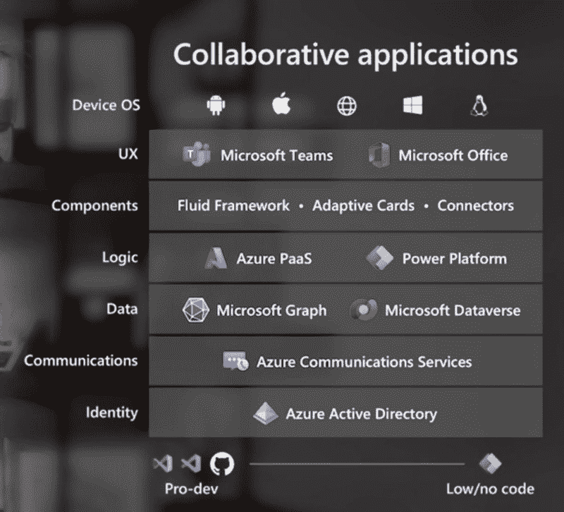
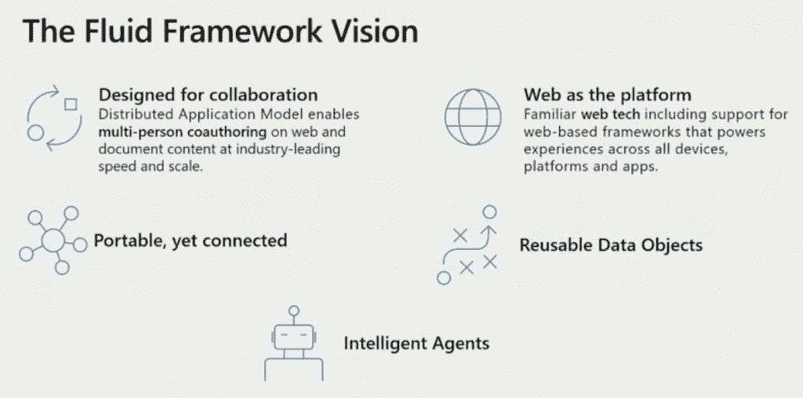
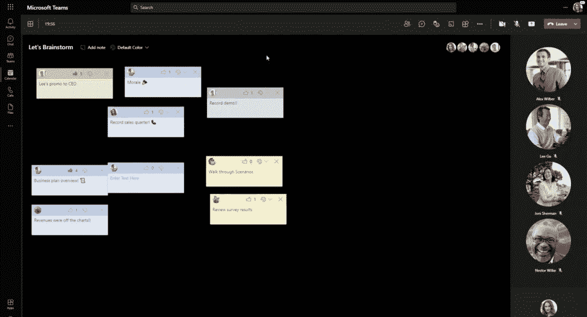

# 微软的协作应用——网络是引擎

> 原文：<https://thenewstack.io/microsofts-collaborative-apps-the-web-is-the-engine/>

“协作应用”是微软最近一年一度的开发者大会上出现的新词汇之一。这个短语指的是团队和办公室的应用平台，它让第三方开发者能够更多地使用微软的核心企业软件产品。开发人员既可以将他们现有的应用程序集成到团队和 Office 中，也可以通过新的 API 将它们与产品挂钩。最重要的想法是帮助企业员工相互协作，包括实时协作。

 [理查德·麦克马努斯

Richard 是 New Stack 的高级编辑，每周撰写一篇关于 web 和应用程序开发趋势的专栏文章。此前，他在 2003 年创立了读写网，并将其打造为全球最具影响力的科技新闻和分析网站之一。](https://twitter.com/ricmac) 

web 平台是微软协作应用程序愿景的一个关键部分，特别是对于较新的团队功能。正如[领导微软团队平台产品组的 Archana Saseetharan](https://www.linkedin.com/in/archana-saseetharan-a227053b/) 在[的一次构建演讲](https://mybuild.microsoft.com/sessions/2915b9b6-6b45-430a-9df7-2671318e2161?source=sessions)中所说，“团队应用平台是建立在开放的网络标准之上的，所以你可以使用你作为开发者已经知道并喜欢的框架来构建应用。”

当然，这只是微软跨越 Windows 世界和更广阔的网络世界的开发者策略的最新迭代。自从[微软 1996 年开发者大会](https://webdevelopmenthistory.com/1996-microsoft-activates-the-internet-with-activex-jscript/)(当时称为 PDC——专业开发者大会)以来，我们每年都会更新这一战略，当时该公司首次表示要将互联网融入其所做的一切。

“微软正在做的独特的事情的一部分，”比尔·盖茨在 1996 年谈到它的互联网方法时说，“[……]是与 Windows 的高度集成。”那一年，微软推出了 ActiveX，这是一种 Windows 组件模型，支持 Internet Explorer (IE)浏览器中的 ActiveX 控件。ActiveX 技术像 IE 一样繁荣了很长时间(后来仅仅存活了下来),但它从未在 Chromium 浏览器引擎中得到支持——微软最新的浏览器 Edge 就是基于 Chromium 浏览器引擎。所以现在，HTML5 和 JavaScript 是 Windows 开发人员在 web 集成方面的关键技术。

这让我们回到 2021 年和新生的团队应用平台。尽管微软 CEO 塞特亚·纳德拉在他的主题演讲中展示的图表中没有提到 JavaScript(见下文)，但它是开发人员在团队中构建这些“协作应用”的工具。正如微软 365 协作负责人杰夫·泰珀，[告诉 The Verge](https://www.theverge.com/2021/5/25/22452623/microsoft-teams-new-collaborative-apps-store-platform-iaps-build-2021) ，“如果你能开发网络应用，你就能扩展团队聊天、频道和会议。”

来源:微软内部版本 2021

## 流体框架

虽然开放 web 栈中的技术(如 JavaScript)在上图中不值得一提，但 web 已经融入了一些微软产品中。例如， [Fluid Framework](https://fluidframework.com/) —“组件”层的一部分——是一套相对较新的技术(在 2019 年的构建中首次展示),使[用户能够“跨应用组合和重用应用元素”它最初是为“多人共同创作”而设计的，是用 TypeScript(JavaScript 的超集)构建的，所以它有一个坚实的 web 基础。](https://developer.microsoft.com/en-us/office/blogs/new-improvements-across-the-microsoft-365-platform-help-you-build-collaborative-apps/)

来源:微软内部版本 2021

也许关于 Fluid 最重要的一点是，web 开发人员可以使用他们已经熟悉的 JavaScript 框架来构建 Fluid 应用程序。“你可以使用任何为网络设计的 UX 框架，”微软说。这包括当今流行的产品，如 React、Angular、Vue.js 和 Svelte。

在[的另一个构建会议](https://mybuild.microsoft.com/sessions/675d9c4a-771e-44b0-8559-979ac241b06e?source=sessions)中，[Fluid Framework 平台团队的项目经理 Dan Roney](https://www.linkedin.com/in/dan-roney/) 演示了一个集成在团队内部的头脑风暴应用。“头脑风暴显然适合 Fluid，”Roney 说，“因为它是一种人们合作使用的应用程序，并且受益于简单的 streamline 服务。”

来源:微软内部版本 2021

在构建时还宣布了团队中流体组件的预览。“用户可以直接在聊天中创建和编辑列表、表格和任务等实时组件，”365 部门的公司副总裁杰弗里·泰珀(Jeffrey Teper)说。他补充说，团队中的流体组件“可以在 Outlook 等办公应用程序之间共享”，并且可以跨设备访问。

## 从浏览器插件到混合应用

同样，自从 20 世纪 90 年代 ActiveX 出现以来，将 Windows 组件分散到各种在线产品中已经成为微软的一个常见主题。主要的区别是微软不再推行它自己的专有网络栈——它已经接受了像 JavaScript 和 HTML5 这样的开放网络技术。过去，大多数 ActiveX 控件只能在 Windows 机器上工作。但是，通过选择使用像 JavaScript 这样的开放网络技术，任何拥有“[现代浏览器](https://fluidframework.com/start/faq/)”(比如 Edge、Chrome、Firefox 或 Mac 上的 Safari)的人都可以使用和访问当今的流动组件。

即使在过去的十年里，web 的组件模型也取得了长足的进步。早在 2007 年，我参加了微软 MIX 大会，并有幸被邀请到[与微软首席软件架构师](https://web.archive.org/web/20110501145342/http://www.readwriteweb.com/archives/lunch_with_ray.php)[雷·奥茨](https://www.linkedin.com/in/rayozzie/)共进“博客午餐”(他在前一年从盖茨那里继承了这个职位)。在午餐期间，Ozzie 讨论了组件化的一般趋势，他注意到组件化已经成为浏览器的一部分有一段时间了。他接着谈到了当时流行的 web 组件，被称为“widgets”或“web services”(你们中的一些人可能还记得“起始页”，包括 Netvibes 和微软自己的 Live.com 产品——这些基本上是 widgets 的主页)。

回过头来看，与团队中现在可用的复杂的流体组件相比，浏览器窗口小部件似乎有些古怪。自 2007 年以来，功能上的一个主要变化是，web 体验现在可以像团队一样被包装成本机应用程序。微软称之为“混合应用”(我假设“协作应用”是一个子集)。根据[一份建造新闻稿](https://developer.microsoft.com/en-us/office/blogs/new-improvements-across-the-microsoft-365-platform-help-you-build-collaborative-apps/):

*“越来越多的开发人员正在构建混合应用——使用 web 引擎来提供用户体验，但包装成一个本地应用，以连接本地服务的所有功能。”*

因此，“网络引擎”越来越成为微软应用程序的核心。这种情况的发生部分是由于该公司在过去十年中对开源的拥抱，包括谷歌的开源 Chromium 项目——该项目现在为微软 Edge 提供动力。但这也承认了 web 开发人员是当今构建最具创新性的产品和工具的人(React JavaScript 库来自脸书的前端团队，这只是一个例子)。

## 在后台

我在本专栏中已经谈到了微软在互联网技术方面的历史，因为在过去 25 年中它举办的每一次开发者大会上，Windows 技术和 web 之间总是存在着推和拉的关系。虽然微软总是会在这些活动中“推销”其基于 Windows 的产品(Office、Teams 等)，但它并没有幸免于网络技术日益增长的“吸引力”——就 JavaScript 而言，现在已经变得具有吸引力。

如果你再看看塞特亚·纳德拉在 Build 展示的开发者堆栈图，你会看到很多不同的微软产品和工具(Azure PaaS，Microsoft Graph 等。).但是在这篇文章中深入探讨之后，令人欣慰的是，开放网络是驱动一切的引擎。

<svg xmlns:xlink="http://www.w3.org/1999/xlink" viewBox="0 0 68 31" version="1.1"><title>Group</title> <desc>Created with Sketch.</desc></svg>