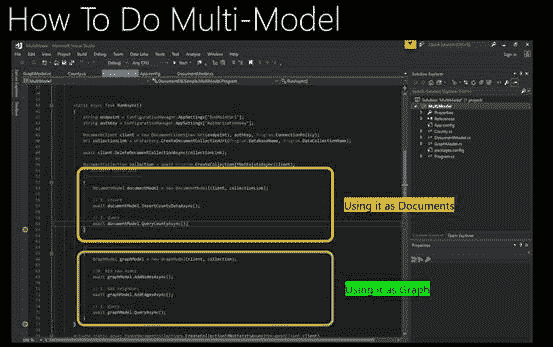
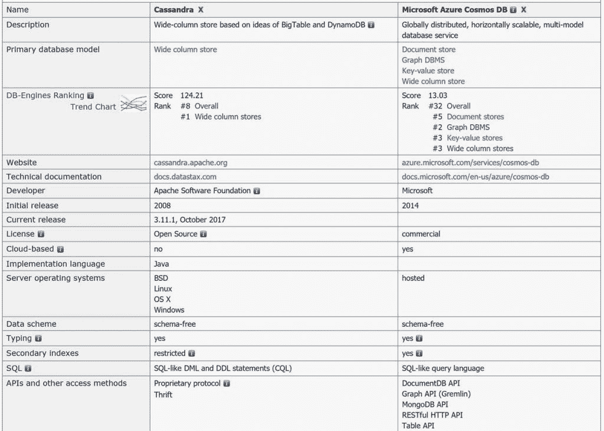

# 微软的 Cosmos DB 获得了 Cassandra 兼容的 API

> 原文：<https://thenewstack.io/microsofts-cosmos-db-adds-apis-become-compatible-cassandra/>

微软已经扩展了其 Azure 托管的宇宙数据库，作为 T2 阿帕奇卡珊德拉数据存储的替代物。

微软[公司今年早些时候推出了](https://thenewstack.io/microsoft-introduces-cosmo-db-globally-distributed-multi-mode-azure-database-service/) Cosmos DB 作为托管的 JSON 文档数据库，尽管该架构一直被设计为支持多种 API 和数据模型，使其能够模仿其他数据存储的接口。现在，Cassandra 正在加入 MongoDB、Gremlin、标准 SQL 和 Azure 表，作为 Cosmos DB 本机支持的数据库系统。

该公司于周三在纽约举行的 [Connect() 2017](https://www.microsoft.com/en-us/connectevent/default.aspx) 活动中宣布了这一更新。

微软负责 Cosmos DB 和 Azure HDInsight 的产品经理 Rimma Nehme 表示，今天在 preview 中发布的新 API 支持为开发人员提供了“由 Cosmos DB 支持的 Cassandra-as-a-service”。“你可以熟悉你最喜欢的 Cassandra IDEs 和工具，你可以通过改变 URI 并指向我们的平台，让你现有的应用程序成为行星级的应用程序。”

她告诉 New Stack，对 Cassandra 的支持是客户的最大要求之一。他们中的一些人想要托管服务的简单性，以及云服务的安全性和合规性。“Cassandra 开发人员经常构建大规模分布式系统，这带来了很多负担和复杂性。通过拥有这个 API，Cassandra 开发人员可以获得一个完全托管的 Cassandra 即服务，一个利用 Azure 的真正的 PaaS 服务。”

其他人已经建立了他们自己的 Cassandra 系统，他们需要超越他们自己的数据中心的资源来增长，但不想重写他们已经创建的应用程序。“通常，这些客户都为规模问题感到苦恼，无论他们是拥有大规模数据集，还是特别需要全球分布，”她说。

Cosmos DB 的一大优势是，它提供了比通常的一致性模型范围更广的一致性模型，包括有界陈旧性、会话一致性和一致前缀的中间一致性模型，这些模型有明确的权衡。“这是在性能、延迟和可用性之间的一个基本选择，但也包括美元成本。你拥有的一致性越强，你必须运行的处理就越多，分布式算法就越多，它会消耗你更多的吞吐量，所以你将不得不为此付出更多，”Nehme 说。

她指出，超过 93%的 Cosmos DB 客户选择了一种中间一致性模型，通常是较便宜的会话一致性模型。

## 兼容性承诺

Cosmos DB 提供了 Nehme 所说的与现有 Cassandra SDKs 和工具的“有线协议级兼容性”。因此，当将后端切换到 Cosmos DB 时，开发人员可能不必重写他们的应用程序。

这不是使用现有的开源 Cassandra 数据库代码；相反，微软在 Cosmos DB[atom-record-sequence](https://azure.microsoft.com/en-us/blog/a-technical-overview-of-azure-cosmos-db/)(ARS)数据模型上实现了 API 和 wire 协议作为模块。在预览版中，并没有包含所有的 Cassandra APIsNehme 说他们中的大多数都被覆盖了，但是支持还没有 MongoDB 覆盖的那么广泛。

“Cassandra 的典型使用模式实际上更多的是 CRUD[创建、读取、更新和删除]工作负载，而不是查询。所有的 CRUD 功能都在工作，查询功能也在工作。我们已经在 Cassandra 上处理了一些典型的第一层工作负载，并确保我们已经涵盖了所有内容，我们将监控客户工作负载并解决最后一英里的问题，以将其推向全面可用。”

这种支持非常好，私有预览版的一些早期客户已经在生产中运行工作负载了。Jet.com 已经在 Cosmos DB 上用 Cassandra APIs 运行了 Nehme 所说的“几个关键任务用例”。

Nehme 预计一些客户将继续在他们自己的数据中心使用 Cassandra，同时在 Cosmos DB 上运行相同的数据库应用程序，这已经发生在 MongoDB 开发人员身上。有时这是分阶段向云迁移的一部分；“你可能不会一夜之间切断脐带，你可能会让它并行运行一段时间。”其他人将保留开源的 NoSQL 数据库作为本地开发工具。

【T2

## 多个型号–一次完成

现在支持这么多 API，Cosmos DB 为开发人员提供了在同一数据上使用多种数据模型和查询 API 的选择。Nehme 说:“如果你看看正在云中构建的应用程序，我们经常看到的一种模式是后端非常分散的多语言应用程序。”一个数据库可能运行事务性工作负载，而一个键值存储可能捕获物联网遥测数据。文档数据库存储库存或用户简档管理，图形数据库用于客户和供应商以及业务中涉及的其他方之间的连接。

“通过一个数据库为您提供这种多模型支持，这可以无缝地适用于所有这些数据模型，”她说。

即使没有代码需要重写，迁移到 Cosmos DB 也意味着翻译 Cassandra 设置。为了帮助迁移，微软正在编写文档，将 Cassandra 开发人员熟悉的设置映射到 Cosmos DB 中可用的五个一致性模型。它还计划帮助所有开发人员为他们的工作负载选择正确的一致性模型，方法是在他们的数据库指标中添加一个图表，显示您的数据变得一致的可能性，使用[概率有限过时](http://pbs.cs.berkeley.edu/)模型，该模型试图回答“最终的一致性有多最终？”的问题

“如果你正在使用 Cosmos DB 为 web 评论或更多探索性工作负载构建一个应用程序，如果你的数据不完全一致也没关系；如果你正在构建你的购物车，你要确保数据立即以一种非常一致的方式反映出来，”Nehme 解释道。

除了 Cassandra 支持，Cosmos DB 还在其他方面得到了增强。Cosmos DB 对 MongoDB 的支持也在改进，推出了聚合框架支持和唯一索引的新的公开预览版。“唯一索引允许您在已经自动索引的文档上的任何文档字段上引入唯一性约束，这是 Cosmos DB 的核心功能，聚合管道允许您使用 MongoDB 本机 API 在数据上运行更复杂的聚合。”

[Table API](https://docs.microsoft.com/en-us/azure/cosmos-db/table-introduction) 正从预览版走向正式版，Gremlin API 也将紧随其后，对性能、导入和备份进行了改进，加上 Python 客户端支持和更多使用由 [Apache Tinkerpop](https://tinkerpop.apache.org/gremlin.html) 推荐的开源框架的选项。Nehme 还承诺了简化从 Neo4J 和 Datastax 的 TitanDB 迁移的方法。有了 TitanDB，Cosmos DB 可以作为一个替代品，而不是被 Datastax 收购后的图形数据库的[分支](https://www.datanami.com/2017/01/13/janusgraph-picks-titandb-left-off/) [JanusGraph](http://janusgraph.org/) 。

下一个添加到 Cosmos DB 中的 API 可能是 Hbase，它适合现有的 Spark 连接器。这甚至可能消除当数据库系统无法处理同时运行两者时引入的运营和分析数据库之间的一些人为划分。

微软是这一新技术的赞助商。

专题图片:微软技术架构师[劳拉·鲁贝尔基](https://twitter.com/SQLGal)，在微软的 Connect 2017 大会上介绍 Cosmos DB 的改进。

<svg xmlns:xlink="http://www.w3.org/1999/xlink" viewBox="0 0 68 31" version="1.1"><title>Group</title> <desc>Created with Sketch.</desc></svg>