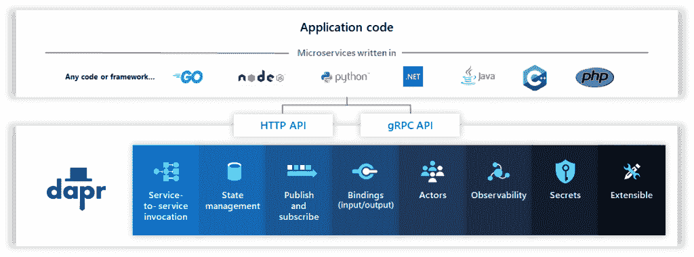
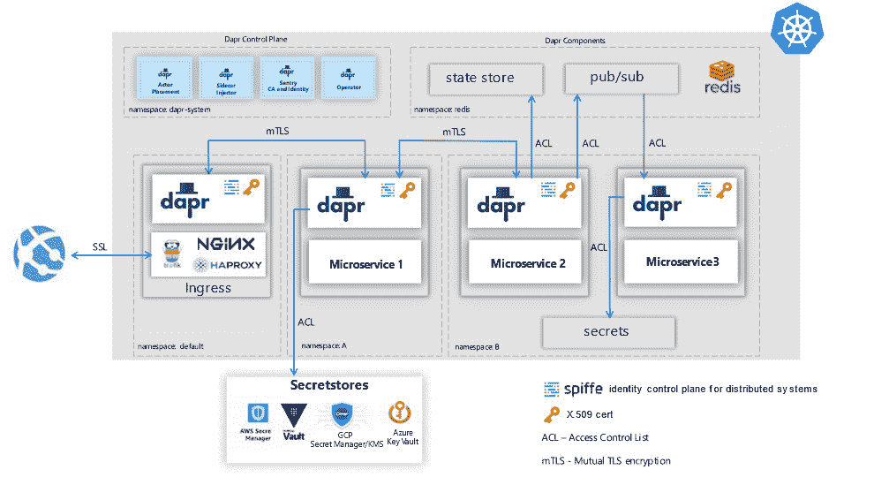
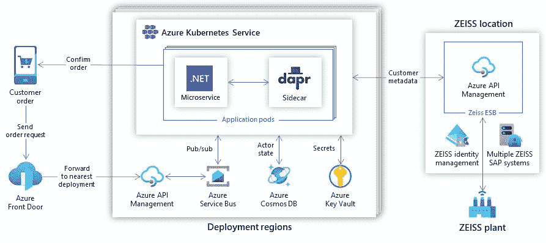

# 微软的 Dapr 将云原生开发引入企业

> 原文：<https://thenewstack.io/microsofts-dapr-introduces-cloud-native-development-to-the-enterprise/>

Kubernetes 是管理分布式工作负载的一个很好的工具，但是它给开发人员带来了一系列障碍，他们可能会发现它的好处。

为 K8s 编码时，开发人员不得不考虑为他们的应用程序使用哪种入口控制器，或者部署什么特定的自动缩放技术。这类问题传统上是运营团队的工作。“当你部署你的 Kubernetes 应用程序时，作为一名开发者，你基本上负责处理所有这些，一直到基础设施，并将其描述为你的应用程序描述的一部分，”微软 Azure 首席技术官[马克·鲁斯诺维奇](https://azure.microsoft.com/en-us/blog/author/markruss/)、[解释道。](https://azure.microsoft.com/)

这种额外的责任会减缓开发，甚至阻碍组织向更健壮的分布式、[微服务架构](https://thenewstack.io/primer-microservices-explained/)的转移。

微软的分布式应用运行时(Dapr)背后的想法是为了减轻开发人员将分布式系统结合在一起的通常困难的管道工作。Dapr [为企业范围的服务提供了一组接口](https://thenewstack.io/the-dapr-distributed-runtime-nears-production-readiness/)，或者说“构建块”，使得构建可移植的应用程序变得更加容易，这些应用程序可以跨云和本地环境进行迁移。它还允许企业定义一组可以跨所有应用程序使用的公共服务，这肯定会帮助组织简化和标准化其基础架构。

Dapr 于 2019 年 10 月首次发布，本周随着[1.0 版本](https://blog.dapr.io/posts/2021/02/17/announcing-dapr-v1.0/)的发布，微软宣布这款可移植、事件驱动的运行时可供专业人士使用。Russinovich 告诉 New Stack:“(Dapr)的主要目标是使企业的云原生开发民主化。

它可以用于边缘或云计算环境中的无状态和有状态应用程序，也可以跨多个云(“多云”)。Dapr 使用 Kubernetes 作为运行生产应用程序的主要托管环境，尽管 Dapr 的最终用户并不依赖于使用 Kubernetes。

与[服务网格软件](https://thenewstack.io/tetrate-a-service-mesh-can-be-the-security-kernel-for-distributed-systems/)非常相似，Dapr 建立在边柜或小型应用程序上，它们与应用程序一起控制所有的输入和输出。然后，开发人员从 Dapr 本身调用所需的功能，而不是从每个单独的服务调用。

Russinovich 说，虽然服务网格主要关注消息的路由(以及相关的监控和安全需求)，但 Dapr 专注于解决开发人员的需求，或“应用程序级结构”。为了管理状态，或者订阅发布/订阅消息传递系统，开发人员可以编写 Dapr 结构。也就是说，服务网格和 Dapr 之间有一些重叠。例如，Dapr 可以在微服务之间进行[基于 TLS 的相互加密，以及监控和记录。](https://thenewstack.io/mutual-tls-microservices-encryption-for-service-mesh/)

Dapr 既可以运行在现有的应用程序上，也可以运行在那些现在被认为是整体设计的应用程序上。在这些情况下，Dapr sidecar 可以安装在与应用程序相同的服务器上。为了最大限度地提高微服务效率，Dapr 可以安装在 Kubernetes 集群上，因此在该集群上运行的所有具有 Dapr 注释的应用程序都将自动选择 sidecar。

微软已经在其 Visual Studio 开发者平台中为 Dapr 构建了一个[扩展，并且有几个 Azure 服务的挂钩，包括](https://marketplace.visualstudio.com/items?itemName=ms-azuretools.vscode-dapr) [Azure 函数](https://azure.microsoft.com/en-us/blog/introducing-azure-functions/)和 [Azure 逻辑应用](https://azure.microsoft.com/en-us/services/logic-apps/)。首先，微软希望将 Dapr 与更广泛的开源社区整合在一起:Dapr 是受 MIT 许可证保护的开源软件。Russinovich 说:“我们从企业中听到的一个响亮而清晰的信息是，‘嘿，我们希望在开源技术基础上构建我们的应用程序，以便它可以移植，我们可以利用开源生态系统。’”。

让 Kubernetes 为开发人员所接受的问题已经在许多其他开源工作中得到解决，主要围绕着一个通用控制平面的想法，这将为企业为他们的开发人员构建他们自己的基于 Kubernetes 的自助式平台即服务奠定基础。 [Crossplane](https://crossplane.io/) ，一个由 Upbound 构建的开源控制平面，支持从 Kubernetes 和[推出自己的基于 Kubernetes 的 PaaS](https://thenewstack.io/crossplane-a-kubernetes-control-plane-to-roll-your-own-paas/) 提供云服务。 [KubeVela](https://github.com/oam-dev/kubevela) 是一个可扩展的“平台引擎”[位于 Crossplane](https://kubevela.io/#/en/platform-engineers/cloud-services) 和 Kubernetes 之上，开发人员无需担心底层基础设施。

然而，这些努力都没有像微软那样深入企业。据微软报道，许多公司已经在生产环境中使用 Dapr。自主系统平台提供商 [Roadwork](https://roadwork.io/) 将 Dapr 与 [KEDA](https://keda.sh/) Kubernetes 事件驱动自动缩放器[相结合，创建了一个数据分析系统](https://blog.dapr.io/posts/2021/02/09/running-dapr-in-production-at-roadwork/)，该系统可根据传入流量自动缩放应用和底层集群。光电[蔡司](https://www.zeiss.com/corporate/us/home.html)使用 Azure 上的 Dapr[重新设计了之前几十年的单片验证和订购系统](https://customers.microsoft.com/en-us/story/1336089737047375040-zeiss-accelerates-cloud-first-development-on-azure-and-streamlines-order-processing)以便用户可以更容易地更新、重新路由或跟踪订单，而无需重新配置表格。总部位于南非的科技企业[点火集团](https://www.ignitiongroup.com/)开发了[订单处理软件](https://customers.microsoft.com/en-us/story/1335733425802443016-ignition-group-speeds-development-and-payment-processing-using-dapr-and-azure)使用 Dapr 和. Net 来跟踪产品、管理订阅和处理支付

<svg xmlns:xlink="http://www.w3.org/1999/xlink" viewBox="0 0 68 31" version="1.1"><title>Group</title> <desc>Created with Sketch.</desc></svg>