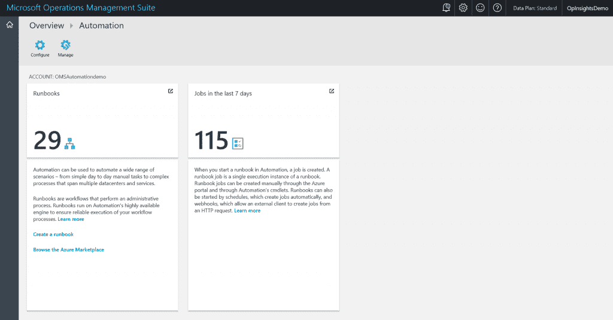
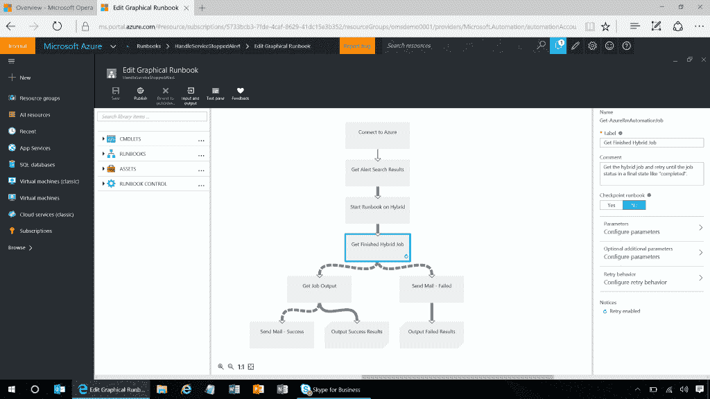
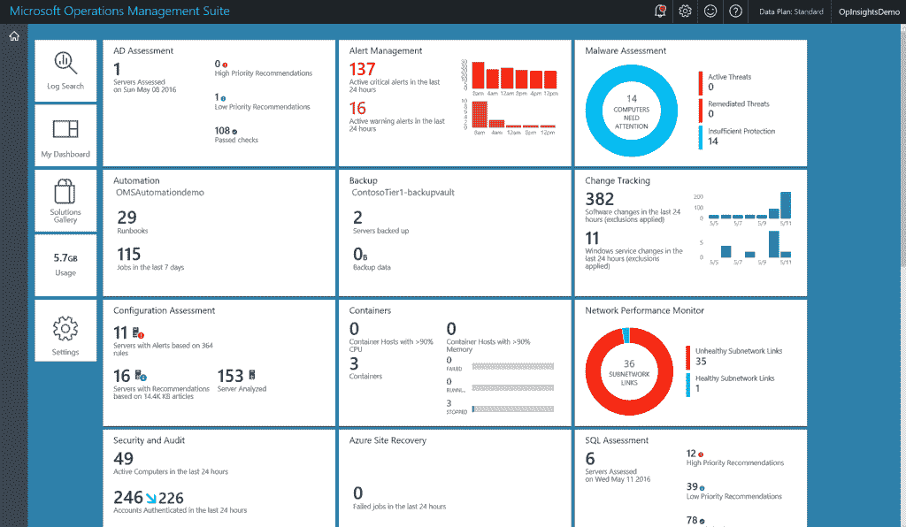
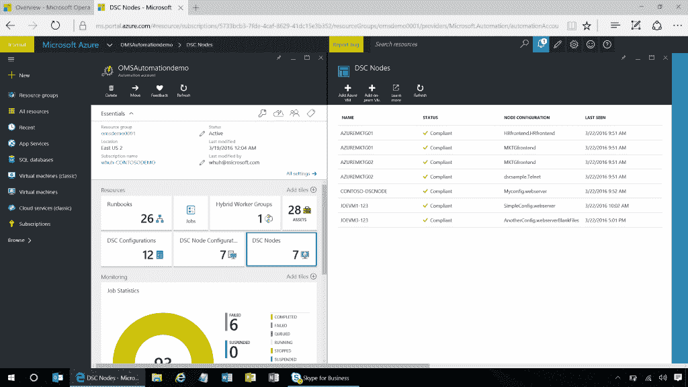

# 微软的 Jeremy Winter 的问答:自动化是新的可视化

> 原文：<https://thenewstack.io/microsofts-jeremy-winter-qa-automation-new-visualization/>

我们涵盖了许多帮助组织大规模开发和部署软件的开源技术。但是在企业微软商店中正在发生什么呢？Redmond 巨头提供了什么来帮助其最大的客户构建基于云的横向扩展环境？

我们采访了微软运营管理套件 (OMS)的项目管理合作伙伴总监 Jeremy Winter，了解这项服务为云好奇者和云原生者提供了什么。OMS [于 2015 年推出，是一个管理工具](http://windowsitpro.com/operations-management-suite/whats-included-microsoft-operations-management-suite)的集合，涵盖许多不同的产品类别，包括工作流引擎、日志分析和备份与恢复功能、[，所有这些都在便捷的云服务](https://www.youtube.com/watch?v=X-NKtpXxX-s)中提供。

虽然 OMS 对容器的支持仍处于萌芽状态，但微软显然正在雄心勃勃地计划着什么，希望将 OMS 建成一个监控和管理所有计算资源的中心枢纽，而不仅仅是微软的。它将通过各种方式不知疲倦地摄取日志数据来做到这一点，包括 [Fluentd](http://www.fluentd.org/) 开源数据共享协议。OMS 可以用于分析来自任何应用程序或硬件的日志数据，更重要的是，可以自动执行使用日志数据条件作为触发器的操作。

OMS 能做什么？

**冬季**:对于微软 Azure 客户，我们为他们提供跨所有 Azure 实例的企业级管理。您可以在每个虚拟机实例上处理它们，也可以在整个环境中管理它们。因此，如果我只想备份其中一个虚拟机实例，我会将其备份到云中。或者，我可以拍摄虚拟机的快照，以确保获得恢复的历史视图。

OMS 的自动化

如果我想运行一个自动化作业，关闭在一天或晚上的某个时间段内空闲运行的所有机器，也是同样的过程。

OMS 还可以帮助您思考如何处理 AWS 中的 Windows 和 Linux 虚拟机。我们可以管理运行在 AWS 上的实例。我们可以管理在 AWS 上运行的 Ubuntu。我们可以从中提取系统日志。我可以用 AWS[cloud trail](https://aws.amazon.com/cloudtrail/)；我可以看看 AWS CloudWatch。

它将采用多种云、多种技术。我们的许多现有客户已经使用 Microsoft System Center 功能进行了大量管理。我们支持 Linux，主要是 Windows。我需要帮助他们使用一套集中的策略管理和自动化工具，迁移到他们使用的任何云技术和任何操作系统。

我们利用了很多来自 Solr 和 Lucene 的技术，并且我们一直在倾听基于 Linux 的客户的需求。

这样分析就可以免费使用。我们可以摄入 500MB，保持七天。

**TNS** :什么 500MB？

**冬天**:摄入的原始数据。因此，我可以发送我的日志，我可以发送系统日志，我可以发送自定义日志。

它能对日志做什么？

温特:我们有一个解决方案库，里面有企业经理需要的各种管理细节。因此，我需要了解我的应用程序的依赖关系。我可能要将一个工作负载转移到云中，我想知道它依赖于什么。如果我在服务中运行它，我会想知道它需要哪些组件。网络怎么样？存储连接如何？

因此，我可能想让它每 15 分钟运行一次，以查找一种情况，也许是报告没有打补丁的机器。您可能需要备份虚拟机。这些可能是 Azure 虚拟机。它可以利用我们的云存储或云从您自己的场所备份数据。您可能需要警报，并且可能需要将您的警报发送到寻呼机。我们使用 Webhooks 连接到您使用的任何系统。

OMS 图解手册

客户获得了他们在其环境中关心的某种核心范例的控制面板。例如，如果我想查看我的系统更新，我只需选择系统更新。现在，它让我可以看到我所有系统更新的状态。

**TNS** :所以我可以把它用于 AWS、Azure 或者运行在虚拟机上的服务器或者我的裸机服务器，只要我把日志运送到 OMS。

**冬天**:没错，在你自己的前提下。如果您有运行在 OpenStack 基础设施上的 Red Hat Linux 机器，并且您关心所有这些实例，您可以直接将它们引入。

这对人们来说是一种心理扭曲。您可以导入自己的自定义数据，创建自己的自定义字段。因此，我们的制造或零售客户在环境中拥有设备。他们不再将日志数据发送到内部监控系统，而是将这些数据运送到 OMS，现在他们可以全面了解这些系统的运行情况。

我们上周刚刚发布了自定义日志，现在你可以从你定义的任何地方引入自定义日志。创建自定义字段，以便您可以像在我们的搜索语言中一样进行查询和搜索，然后您可以创建这些易于使用的解决方案。因此，您可以有一个仪表板，询问“我的制造设备运行情况如何？”你可以看到那种景色。

你的传统企业 IT 需要知道这些方面，甚至你的新 DevOps 世界也需要知道这些，我称之为企业级管理。

OMS 已经在云端了。因此，如果有人说，“我不想要这种旧的基础设施。我不想继续考虑所有这些硬件和设备，也不想花钱雇人来管理管理解决方案。我只想利用云。”我们只用一个普通的 SaaS 解就可以做到。

因此，按照传统的微软方式，你会想，“嘿，你要给我 Windows 或 System Center 2016，这是在你交付 System Center 2012 几年后，我已经习惯了这些每三年一次的节奏。”但我们是实时的。我们把它当作一个创业公司。我们直接与客户合作，当我们觉得功能准备好了，我们就发布，所以这是实时的。

> 我们已经看到…正在创造的工作数量和它们现在运行的分钟数出现了巨大的峰值。它们去年翻了一番，最近三个月又翻了一番。

客户会说，“嘿，我需要日志搜索 API，我想让它与 API 对话。”45 天后，我们交付了它。在六个月的时间里，我们对该服务进行了 350 多次部署，带来了新的功能或特性调整。这些都是以管理事物为中心的现成的解决方案或现成的智能。

**TNS** :系统更新是 OS 更新，还是 app 更新？

**温特**:现在，我们专注于操作系统的更新，因为我们听到客户最头疼的地方就在那里。很多时候，应用程序，用户有他们自己的解决方案，他们正在使用，木偶，厨师，Ansible。

我们也有安全措施。这是我们开始看到的一个大领域。安全性现在不仅仅是一个安全团队的问题，而是每个人的问题。您可能是在这些云中管理您自己的系统的开发人员，但您仍然需要了解您在安全性、补丁程序和变更方面的进展。

我可以直接查询我的关键更新。OMS 为您提供了一个正在发生的事情的视觉视角，但在它下面是一个完整的分析堆栈。无论你使用的是[麋鹿](https://thenewstack.io/comparison-cloud-based-elasticsearch-elk-solutions/)、 [Splunk](https://thenewstack.io/splunk-machine-data-isnt-just-for-it-anymore/) 、 [Loggly](https://thenewstack.io/loggly-wants-press-start-log-management-gdc-2016/) 还是[sumo logical](https://thenewstack.io/sumo-logic-funding-shows-demand-for-predictive-analytics-with-data-streaming/)，你都拥有任何分析系统所应有的搜索能力。

OMS 仪表板

TNS:查询语言是什么？

**Winter** :这是我们从 [PowerShell](https://msdn.microsoft.com/en-us/powershell/mt173057.aspx) 和 Solr 中融合出来的衍生产品。因此，当 Lucene 和 Solr 开始支持 Joins 时，我们在我们的环境中展开，Joins 出现了。

我希望能够有一些简化的方法，我们已经看到，这对客户来说非常容易，因为如果他们想添加新的数据类型，他们只需添加即可。“好的，我想看看安全事件以及事件 ID 是什么。”我不必去考虑这个查询。我只要选择它，它就会出现。但是您不必一开始就学习查询语言。您仍然有一个可视化视图。

TNS :优秀。是啊。我们并不是对可视化不感兴趣，但是我们听到了很多关于自动化的事情。现在，您可以根据收到的日志数据采取任何措施吗？

**冬天**:对。与许多其他系统相比，这是非常强大的。我们在幕后实现了自动化。

假设一家 IT 商店的网络中有一个恶意 IP，这个 IP 的环境中有一个僵尸网络。我可以带着我的有线数据，通过网络传输的东西。我们可以识别它并告诉他们。

例如，如果有人想要安排虚拟机关闭，他们可以在这里构建。这不仅仅是，“嘿，我要去停止机器。”您需要实际连接到 Azure，查看您将要接触的虚拟机，查看这些虚拟机的逻辑和运行状况，然后开始关闭它们或执行其他特定操作。

和你一样，我们也看到了正在创造的工作岗位数量和它们现在运行的分钟数的巨大峰值。它们去年翻了一番，最近三个月又翻了一番。

现在，我们不仅实现了自动化，而且能够通过 PowerShell 或您想要的任何脚本语言来强制执行配置，您可以确定您想要的策略或配置，我们可以强制执行。从 IT 的角度来看，开发人员或管理员可能希望定义一个金主，然后判断是否有任何部署偏离了这一点。

您可以分辨出哪些是兼容的，哪些是不兼容的。我们甚至可以深入到这样一个层次:“好吧，为什么它不符合？”

当我了解它不合规的原因时，我可以看到它不合规已经有一段时间了。让我看看这是怎么回事。当您进一步深入查看时，它会显示这一个文件是不兼容的文件。您可以选择设置策略，让系统在 15 分钟内取回该文件并强制执行。

**TNS** :所以重新安装兼容文件？

**冬天**:没错。因此，当我们开始看到环境中的更新和变化时，我们将看到变化跟踪、自动化和配置策略一起出现，这确实有助于为迁移到云的工作负载提供一致的策略方法。

同样，在底层，所有这些数据都被整合到这个真正强大的分析系统中。

**TNS** :当 OMS 运行自动化作业时，它是从哪里运行的？

**冬天**:你从云端运行。这是一个基于云的解决方案。当我有作业时，我可以选择在哪里执行该作业。因此，我们有一个混合工作者的概念，这意味着如果我想在我的本地运行它，我可以关闭混合工作者，我仍然可以控制和查看我所有作业的状态，但它是在本地执行的。因此，您正在推动来自云的自动化。

> 集装箱是早期的，但他们真的起飞了。

我们一直在构建的核心是确保它可以在任何云以及内部运行。因为我听到的是，“伙计，我们处在一个复杂的世界。我们有很多不同的工具。我试图获得所有这些工具的可见性，现在我开始进行繁重的开发工作，或者向这些不同的云基础架构进行繁重的迁移。我只需要一个更简单的工具就能做到。”这就是我们一直在建造的。

因此，当客户开始转向云时，我希望确保我们有一个经过企业验证的系统为他们服务。它面向 Azure 客户，也面向 Azure 外部。因此，它实际上是将所有数据集中到一个地方。

TNS: 集装箱呢？

**冬天**:所以我们一直在关注集装箱空间。我有一个小组正在孵化集装箱。我们和多克相处了一段时间。我们已经花了一些时间研究中间层和中间层。从我们在 IT 部门听到的情况来看，他们依赖其他团队来完成构建。很多时候，他们甚至允许开发者直接部署应用。

OMS 的自动化

但通常情况下，IT 可能正在进行这些部署，或者他们只是需要了解微服务领域正在发生的事情。无论它们是长期存在还是短期存在，它们仍然需要知道有多少这样的容器，这些容器内发生了什么，里面的日志说了什么。

我们正在和一群顾客一起工作。我们正在尝试做的是，确保我们可以使用 Docker Swarm APIs 和其他 API 来提取数据，就像我们使用自定义日志一样，从中提取数据，以查看您的环境中有多少容器，这些容器上运行的主机是什么，以及这些容器是如何运行的。那么，有多少在运行，有多少停止了，有多少失败了？

TNS :那么，当它完成时，这个容器服务能为开发者提供什么呢？

**温特**:我认为我们看待这个问题的方式是，首先，我们可以保证开发者可以自由地用容器做他们需要的事情，同时它有他们需要的可见性和洞察力。这是一个。

第二，它为您提供了该环境中发生的事情的历史报告，因为最终您可能出于合规性或安全性原因需要它。所以你有数据的历史摄取。

第三个优点是，您可以选择验证它定义的策略。您可能拥有由选择的容器解决方案设置的策略。您现在也有一种方法来执行该策略。

容器有它们自己的自动化，但是如果我需要开始在这些容器之外做更多协调的自动化，我也可以开始利用它。

集装箱是早期的，但他们真的起飞了。目前，我们在 OMS 的方法是允许人们灵活地继续使用他们真正想要的工具，并帮助 IT 开始更好地处理这些多云环境和多工具环境。

**TNS** :所以从某种意义上来说，MOMs 对新技术是不可知的，只要你有日志进来，你就可以把它们用于自动化和报告机制。

**冬天**:对。该定制解决方案是一个关键部分，因为我们也想让客户能够灵活地构建他们需要的东西，因此这是您应该能够做到的。因此，您可以保存搜索并创建这些自定义视图，这是我们经常看到的。

这为我们利用 Fluentd 和 Fluentd 周围的社区奠定了基础。Fluentd 是一个新的模型，在我们思考如何将数据表面化时，Linux 社区推动我们朝着这个模型前进。这为许多联系打开了大门。许多已经支持 Fluentd 的系统也开始很容易地流经 OMS。

事情发生在开源社区；这是一个模式市场。如果我选择了某项技术，就会有其他技术围绕着它。一年后，可能是一种技术，四年后，可能是另一种技术。

因此，我们已经看到了这种模式，在这种模式下，我们正在进行实验，而且这种模式是正确的，我们对此非常肯定。我们认为他们已经得到了那些真正想要得到的东西，所以我们正在关注它。我们参与其中，是的，这就是我们正在采取的方法。如果我们看到社区转向一种新的模式，我们也会转向一种新的模式。

翻译:玛拉·克鲁克

<svg viewBox="0 0 68 31" version="1.1" xmlns:xlink="http://www.w3.org/1999/xlink"><title>Group</title> <desc>Created with Sketch.</desc></svg>