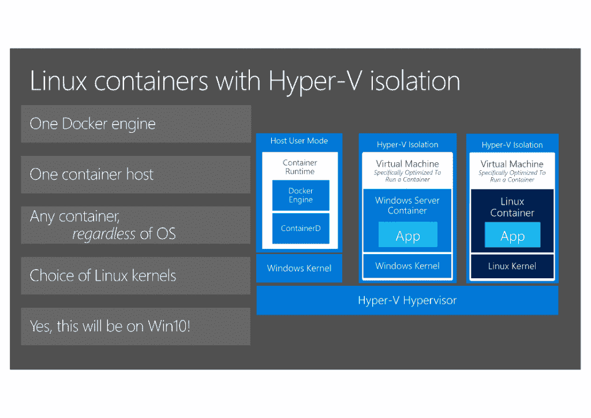

# Microsoft’s Lightweight Linux Runtime Environment Comes to Windows Server

> 原文：<https://thenewstack.io/microsofts-lightweight-linux-runtime-environment-comes-windows-server-brings-distros/>

The [Windows Subsystem for Linux](https://thenewstack.io/windows-10-creators-update-means-windows-subsystem-linux/) — the way that Windows 10 is able to run command line Linux binaries directly, without a virtual machine — is now out of beta. The company is also introducing WSL into the Windows Server environment as well.

“We’re adding WSL to Windows Server in response to the many requests we’ve received since launching WSL on Windows client,” Microsoft’s [Rich Turner](https://github.com/bitcrazed) told the New Stack. “Many DevOps engineers — systems engineers, administrators, and developers — want and need to deploy, manage, monitor, and maintain apps and systems that incorporate tools that run best, or only, on GNU/Linux platforms. They want to run local services to host, for example, databases and websites for local development and debugging. Being able to run one’s preferred Linux distros and tools atop WSL on Windows Server will enable dev-ops engineers to get more done on Windows Server.”

Turner describes “a very lightweight Linux runtime environment for local interactive user scenarios.” As part of the Fall Creators Update (1709) of Windows 10, WSL will be fully supported, so you can file issues through your standard Microsoft support channels (and use the Windows 10 Feedback Hub as well as the [WSL issues GitHub repo](https://github.com/Microsoft/BashOnWindows)).

The process for installing a Linux distro changes as well; distros for WSL now come from the Windows Store. Ubuntu, [openSUSE Leap 42](https://www.microsoft.com/en-us/store/p/opensuse-leap-42/9njvjts82tjx) and [SUSE Linux Enterprise Server 12](https://www.microsoft.com/en-us/store/p/suse-linux-enterprise-server-12/9p32mwbh6cns) are already available and Fedora is coming soon. Moving the distros to the Store simplifies installation and speeds up downloads (by using the Store’s content distribution network). It also means that you can run different distros simultaneously on the same machine, without reinstalling or rebooting.

Use the Windows **wslconfig** command to manage which distro you’re working with. The **/l** flag lists your installed distributions; use **/setdefault <DistributionName>** to choose the default distro that starts when you type bash at the command prompt. You can also type **ubuntu** or **fedora** to launch the distro you want (or use their tiles on the Start menu) — and you can use those commands in scripts to run tests across multiple distros automatically.

如果你已经用 WSL 安装了 Ubuntu，它不会停止工作，但是你仍然会想切换到商店发行版，因为发行版更新现在将通过商店发布，在某个时候，直接安装的版本将被否决。为此，备份您想要保留的任何文件和配置信息(例如，在/mnt/c/tmp/WSL-backup/或您的用户目录(即/mnt/c/Users/ <username>/Desktop/)中创建一个 WSL-backup 文件夹)；如果您要移动大量文件，请先对它们进行焦油处理。从 Windows 命令提示符或 PowerShell 使用 lxrun /uninstall 命令卸载现有的 Ubuntu，然后从存储安装 Ubuntu，并将文件复制或解压缩到新的 Ubuntu 实例中。</username>

“如果你在同一个发行版家族的实例之间移动设置，移动应该相对简单，”特纳指出，但是他建议如果你使用不同的发行版要非常小心，因为配置系统和文件位置并不总是相同的；最好是从头开始创建你的设置，而不是通过将它们复制到多个发行版来节省时间。

WSL 也将进入 Windows Server，作为 [Windows Server Insider 计划](https://www.microsoft.com/en-us/software-download/windowsinsiderpreviewserver)的一部分。这并没有改变 WSL 在 Windows 中的原因；它仍然面向使用命令行工具和工具链集成的开发人员，而不是运行生产工作负载或服务器应用程序，如 Redis(即使它们可能工作)。它也不打算取代 PowerShell，PowerShell 仍然是管理服务器工作负载和 Windows Server 本身的方式。

尽管如此，Turner 也警告说“WSL 只用于用户发起的交互式任务，而不用于生产服务工作负载。WSL 是专门为用户运行工具、本地构建、部署和调试软件、修改配置、监控工作负载等而构建的，但不应用于托管生产守护程序/作业或服务器工作负载，如 Apache、Nginx、MySQL、PostgreSQL 或 MongoDB。”

出于性能和支持方面的原因，不要尝试将 WSL 用于服务器工作负载。最近的一组独立基准[www.phoronix.com/scan.php？page = article & item = windows 10-wsl-scaling & num = 1]表明，虽然总体性能与直接在相同硬件上运行 Linux 相差不远，但 I/O 性能仍然滞后(这是微软仍承诺改进的领域)。

## 在 Windows Server 上设置 WSL

要在 [Windows 服务器](https://msdn.microsoft.com/commandline/wsl/install-on-server)上开始使用 WSL，请确保您使用的是 Windows Insider 预览版，并以管理员身份从 PowerShell 运行以下 PowerShell 命令:

```
Enable-WindowsOptionalFeature  -Online  -FeatureName Microsoft-Windows-Subsystem-Linux

```

你可以在 Windows 10 上使用的相同的 WSL 发行版将在 Windows Server 上运行，它们仍然来自 Windows Server 上的 Windows Store，但你必须用 Invoke-WebRequest [cmdlet](https://msdn.microsoft.com/powershell/reference/5.1/microsoft.powershell.utility/invoke-webrequest) 从 Store CDN 手动下载它们。Ubuntu 在[https://aka.ms/wsl-ubuntu-1604](https://aka.ms/wsl-ubuntu-1604)，OpenSUSE 在[https://aka.ms/wsl-opensuse-42](https://aka.ms/wsl-opensuse-42)，SLES 在[https://aka.ms/wsl-sles-12](https://aka.ms/wsl-sles-12)，Fedora 也快到了。下载 Ubuntu，PowerShell 命令是:

```
Invoke-WebRequest  -Uri https://aka.ms/wsl-ubuntu-1604 -OutFile ~/Ubuntu.zip -UseBasicParsing

```

将发行版解压到系统驱动器上的目标目录。例如:

```
  Expand-Archive  ~/Ubuntu.zip  ~/Ubuntu

```

现在运行以发行版命名的安装程序(ubunte.exe，fedora.exe 等等)，创建你的 UNIX 用户，并按照你在 Windows 10 上为 WSL 做的一样设置用户名和密码。



Hyper-V Linux 容器为您提供了 Hyper-V 的隔离和 Docker 容器的灵活性，您可以使用 Linux 工具来管理它们，因为 WSL 即将进入 Windows Server(归功于微软)。

如果你一直在 Windows 10 上使用 WSL，并且你想通过将你的设置复制到 Windows Server 上来节省时间，你可以像在 Windows 10 上那样做——但是再次强调，坚持从同一个发行版复制你的配置以避免问题。

## 混合容器

如果您使用 Hyper-V 容器在 Windows Server 上运行 Linux 容器，WSL 将是 Windows Server 特别感兴趣的。把它们想象成容器和 VM 之间的中间物；它们运行在具有最少服务的轻量级虚拟机中，因此它们有自己的操作系统和内核，但您不必管理虚拟机，您只需管理 Docker 容器。

正如微软的 [Taylor Brown](https://github.com/taylorb-microsoft) 向我们解释的那样，“WSL for Windows Server 是一种很好的方式，可以将您现有的部署脚本和工具与我们为服务器带来的容器技术结合使用。如果您想运行 Linux 容器，有一种方法可以运行您的 Bash 脚本，在 Windows Server 上使用 Linux 容器来构建、启动、调试、部署和执行 Linux 本机操作。”

这是对 Windows Server 2016 和 Windows 10 中 Windows 格式 Docker 容器的补充，因为微软客户同时使用这两种容器。Brown 鼓励开发者尝试跨平台。“我们一直在集思广益，看看你能用它做些什么。既然我可以在 WSL 中运行 Docker client(如果我想的话),并且所有相关的工具都可以使用，既然我已经有了多阶段构建，那么我是否可以使用 Linux 容器来构建我的 Windows 映像，或者使用 Windows 容器来构建我的 Linux 映像呢？答案大概是肯定的。”

<svg xmlns:xlink="http://www.w3.org/1999/xlink" viewBox="0 0 68 31" version="1.1"><title>Group</title> <desc>Created with Sketch.</desc></svg>