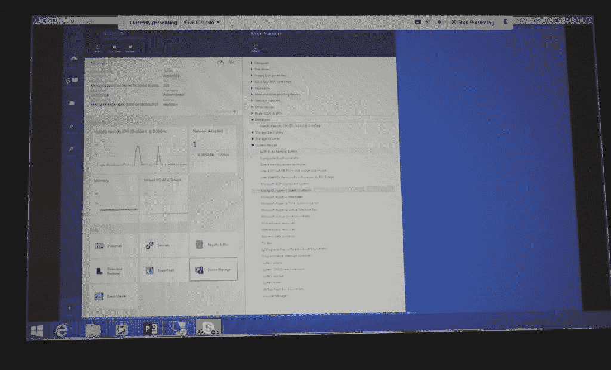

# 微软的轻量级操作系统及其深度 Linux 连接

> 原文：<https://thenewstack.io/microsofts-lightweight-os-and-its-deep-linux-connection/>

九年前，当一位杰出的微软工程师向他的公司介绍一种全新的脚本语言 PowerShell 时，他的许多上司甚至不知道它是什么或意味着什么。这是一个漫长的启示的开始:庞大、单一的操作系统在现代数据中心中无法很好地扩展。

PowerShell 引发了对微软来说是 Windows Server 的替代命令行版本的创建，称为服务器核心。微软希望我们在整个数据中心部署的 Windows 服务器植根于驱动 Windows 客户端的相同图形服务。在一个需要灵活性的世界里，这个负担对 Windows 来说太重了。

因此，现在微软正在模仿 ChromeOS 浏览器开发自己的 CoreOS，这是一个开发了轻量级操作系统的初创公司。像 Chrome 一样，CoreOS 会自动更新，这意味着开发者拥有一个不需要手动升级的操作系统。该公司将其描述为大规模部署 Linux 服务器的操作系统。

微软称其技术为纳米服务器。它面向微服务和便携式过程容器的世界。在芝加哥举行的 Ignite 2015 大会上，公司工程师展示了一个跨平台的编排平台——操作管理套件——它不是 Windows Server 传统上绑定的系统中心，而是一个监管者和分析引擎的门户，该引擎实时扫描日志并生成图形仪表盘。

它正在为 Windows Server 开发一个名为 Azure Stack 的扩展，它不是将本地存储、计算和网络混合到公共云上，而是通过在本地扩展来混合基于 Azure 的公共资源。Azure Stack 允许组织使用与异地相同的工具同时管理本地服务。

这是什么公司来着？

## 婴儿学步

PowerShell 的创造者杰弗里·斯诺弗现在发现自己是 Windows Server 的首席架构师，他在周二上午的 Ignite 2015 上向媒体成员解释 Nano Server，其中一些人可能是第一次接触微服务架构的概念。

斯诺弗解释说，目前，Nano Server 将面向两个服务配置文件:一个处理云操作系统基础设施，如集群管理程序和集群存储，第二个处理云原生应用程序。虽然 Azure 是首批将应用部署到云的 PaaS 服务之一，但斯诺弗在这里指的是一类新的应用(针对微软)，它们将在 Azure 上开发和部署，在一个新的基于 Azure 的开发环境中——在传统的基于客户端的 Visual Studio 之外。

这些新应用将成为 Windows 开发者进入容器世界的入口，这也是斯诺弗必须从一开始就解释的事情。

 “容器是一种能够运行事物的新方式，”他解释道，用一个电视气象学家的横扫手势，这使他在微软大会上如此受欢迎。“今后，服务器应用将被写入两个配置文件:Nano 服务器配置文件，它针对云进行了优化；然后是侧重于最大兼容性的服务器配置文件。”

为 Nano Server profile 编写的开发人员将保证与预先存在的 Windows Server 安装兼容，因为 Nano Server 实际上是 Windows Server 的一个子集。在开发者更加习惯微服务的概念之前，可能会有一个明显的调整期。Windows 开发人员习惯于在全局范围内为他们的代码提供预先存在的功能库，并且库和调用它们的客户端代码之间的关系是紧密耦合的。对于微服务，没有全局范围。

“如果你写一个应用程序到 Nano Server 或‘全服务器’，问题是，你在哪里运行它？你可以在物理主机、虚拟主机或容器中运行它，”斯诺弗解释道。将有两种类型的容器[用于 Windows Server 和 Nano Server:为 Linux 开发的相同 Docker 容器，以及由微软为其自己的 hypervisor 平台开发的一种类型，称为 Hyper-V 容器。](https://thenewstack.io/docker-for-windows-is-on-its-way/)

“这些提供了额外的隔离，”斯诺弗解释道，“它们真的用于多租户服务或多租户平台即服务之类的事情，在那里你将运行可能是你不信任的恶意代码。”这个概念基于一种技术，这种技术是过去十年微软研究实验的主题，称为“Drawbridge”——一种容器化(现在我们知道该怎么称呼它了)，主要用于进程隔离，将可能导致系统崩溃的不受信任的应用程序置于沙箱中。

## 漫长的脱钩之路

最初，Nano Server 被设计为从 PowerShell 的远程实例进行管理，使用动词-对象语法斯诺弗称为“cmdlet”(command-lets)。周二，斯诺弗展示了一个可视化门户，让浏览器用户直接监控和操作纳米服务器实例。

 我问斯诺弗和他的微软同事，Windows Server 总经理迈克·尼尔，他们是否计划在某个时候调整他们的 Nano Server 配置文件，以更加面向微服务的方式运行进程，就像 Linux 上的 CoreOS for Docker 一样。

“我们拥有的模型非常像 Linux 世界中的容器，”Neil 回答说，“我们在那里进行操作系统级虚拟化。在那台物理机器上，所有的共享容器都有一个共享内核基础设施。”

Neil 说，对于 Linux，当你升级内核时，你随后升级容器来匹配，这可能导致兼容性问题。他们*会*给为 Windows Server 编写的进程带来问题，这肯定会带来潜在的依赖性问题。虽然 Windows 服务器容器(Docker 容器)将在共享的基础设施上运行，但 Hyper-V 容器将允许每个容器有不同的基础映像。

“因此，通过提供这两种模型，我们实际上比 Linux 社区在这方面领先了一点点，”Neil 评论道。他对 Canonical 最近通过其 LXD 系统为实现同样目标所做的努力表示认可。

对此，杰弗里·斯诺弗补充道，“我认为容器是一项极具颠覆性的技术。对于一项颠覆性技术，社区需要一段时间来找出它的优势和劣势。我想你会看到很多人，最初，试图把他们当作轻量级虚拟机。我认为，随着时间的推移，你会看到更多的人采用微服务的模式，其中容器更像一个流程，而不像一个虚拟机，而且你有很多这样的容器。”

斯诺弗接着强调了将微服务与其运行环境分离的重要性——仅仅几年前，这个概念在微软的会议上公开讨论似乎是一个亵渎神明的话题。

<svg xmlns:xlink="http://www.w3.org/1999/xlink" viewBox="0 0 68 31" version="1.1"><title>Group</title> <desc>Created with Sketch.</desc></svg>