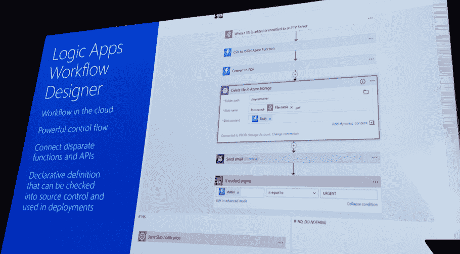

# 微软的 Logic Apps 旨在为非编码人员带来无服务器功能

> 原文：<https://thenewstack.io/microsofts-logic-apps-aims-bring-serverless-functionality-non-coders/>

一系列新的工具正在被创建，以允许非编码人员通过可视化界面访问[无服务器架构](/category/serverless/)的优势。微软 Azure Logic Apps 项目经理[杰夫·霍兰](https://github.com/jeffhollan)说，开发者也可以从这些工具中受益，加快开发时间，标准化他们的工作流模式，并自动生成代码。

虽然无服务器设计模式[仍在兴起](https://thenewstack.io/serverless-architecture-five-design-patterns/)，但它们主要分为三大类:

1.  提供整体无栈服务的无服务器应用程序:如 Joe Emison 的商业地产网站、CommercialSearch 和 business 的在线杂志网站。
2.  混合堆栈中的触发事件流程，在返回有状态环境之前完成无服务器中的某些功能，例如，图像处理任务或在计算中运行算法，以及…
3.  幕后业务工作流可能不需要像可视化或任何其他显示那样的终端界面，而是在一个工作流程触发另一个工作流程完成时通过一系列事件。

对于设计模式的最后一部分，工作流工具正在成为越来越受欢迎的选择，它可以帮助编码人员和非技术人员将无服务器引入到他们的业务逻辑中。

这就是微软去年推出的 Azure Logic Apps(T10)被企业用来管理数据处理任务的地方。

Hollan 负责引领 Azure Logic Apps 工作流工具。在今年早些时候的 Serverlessconf 上，微软 Azure 的架构师 John Gossman 将 Logic Apps 描述为“云中的工作流编排引擎”

霍兰举了一个例子:“在挪威，有一个城市法律要求教师必须向家长发送一份书面通知，这使得教师要花大约 30 分钟准备每封信。现在，他们已经在 Logic Apps 中建立了一个无服务器的工作流，它可以调用大约十几个函数，并根据工作流可能经过的不同路线添加数据。”

这种数据转换是 Hollan 在逻辑应用中看到的最常见的用例之一。在某些情况下，工作流程中的步骤之间甚至可能会等待几天，Logic Apps 能够保持状态，直到能够将任务传递到链中的下一个步骤。

“一个最常见的例子是一个订购和发票系统，当有一个新的同步时，可能需要发生一堆事情，但也可能在流程的第三步和第四步之间等待几天，”他说。

## 低代码应用程序开发

像 Logic Apps 这样的产品对于非程序员来说是一个切入点，可能最终会让梦寐以求的“公民开发者”的想法成为现实。多年来，人们一直期望“公民开发者”——非编码人员和非技术人员——能够利用 API 的力量，特别是通过一系列可视化设计工具和拖放连接器。

例如，Blockspring 是一项旨在通过电子表格访问 API 来支持这一不断增长的受众的服务，而一些 API 提供商，如 [Clearbit](https://clearbit.com/) ，提供插件，让非开发者通过 Google Sheets 访问 API 数据。到目前为止，虽然这是一个越来越明确的客户群，但它并不是过去几年许多人预期的快速增长市场，因为 API 已经成为商业和企业的核心。

将 API 数据放入电子表格是一回事，但在真正有用之前，仍然需要使用业务逻辑和规则对数据进行过滤和转换。这可能阻止了非技术用户的使用爆炸，许多人一直在期待，新的无服务器工作流工具可能开始启用。

霍兰说，这种改进的切入点可以在进入 Logic 应用程序的微软客户中看到。大多数情况下，非编码人员通过微软内置于 Office 365 的[流产品](https://flow.microsoft.com/en-us/)进入。Flow 允许非技术人员直接在办公室内创建概念证明(PoC)业务流程，一旦得到业务决策者的认可，这些人员就会转移到 Logic Apps，将该工作流转变为生产稳健的流程。

Serverlessconf 主题演讲人[Austen Collins](https://twitter.com/austencollins),[无服务器框架平台](https://serverless.com/)的创始人，分享了他从用户调查中获得的数据，该数据表明 10%的社区用户是使用该框架开发 POC 的高管。Collins 的调查还发现，AWS 的工作流服务——[AWS 步骤功能](https://aws.amazon.com/step-functions/)——是该社区中最受欢迎的产品或功能。

就像 AWS Step 函数一样，不只是非编码人员在使用 Logic 应用程序。

“我们的最终目标是希望开发人员尽可能高效，云解决方案尽可能快，”Hollan 说。越来越多的贡献者已经生成了可以在 Logic Apps 工作流中使用的预制连接器。Hollan 表示，Logic Apps 已经足够成熟，可以基于场景，确保现有 API(如 SendGrid、Zendesk、GitHub 和 Dropbox)和常用功能(如情感分析算法或连接数据存储)的新连接器定期添加到 Logic Apps 库中。“新的连接器是基于开发人员的客户旅程优先考虑的，”霍兰说。

像所有集成和功能的目录和库一样，在某个时候，当不断增加更多选项降低了发现的容易性时，就会产生困惑。即使一个库被过滤成常用功能集的类别，在某些时候，点击“电子邮件”或“认证”类别仍然会带来一个长列表，开发人员需要浏览该列表才能找到他们想要的内容。

根据业务案例，在某些情况下，他们可能需要更精细、更准确的功能(例如，这可能会在计算能力或交易量方面花费更多)，而在其他情况下，核心较少的流程可能会喜欢更便宜、更不准确的功能。Hollan 说，最终，根据开发者的兴趣，这个想法将是逻辑应用程序能够在流程设计中显示那些潜在的选项。

“我们有一个功能，所以你可以做一个 switch 语句，”Hollan 说，这将允许开发人员根据工作流完美执行或在支出限制内的业务关键程度，更改流程中的下一个功能或 API。

Hollan 说，这是一个更长的路线图的一部分，在这个路线图中，Logic Apps 是改善开发者体验的一个选项。“你有无服务器组件，但你仍然需要使用存储、数据和 API，以及一大堆东西。我们帮助开发人员尽可能地进行模板化。我们努力让开发人员的体验更加顺畅，拥有更好的文档，以及跨整个堆栈监控和跟踪工作流的能力，”他说。

<svg xmlns:xlink="http://www.w3.org/1999/xlink" viewBox="0 0 68 31" version="1.1"><title>Group</title> <desc>Created with Sketch.</desc></svg>