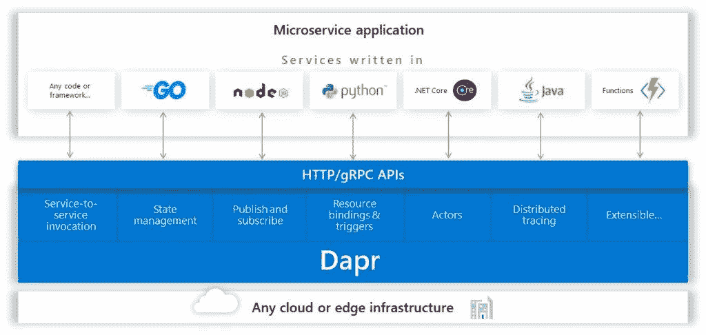

# 微软的开源 Dapr 可以帮助开发者构建不可知的微服务应用

> 原文：<https://thenewstack.io/microsofts-open-source-dapr-could-help-developers-build-agnostic-microservice-applications/>

第一次读到微软本周发布的新开源项目Dapr 时，你可能会认为它是另一个服务网。相反，Dapr 在一篇[博客文章](https://cloudblogs.microsoft.com/opensource/2019/10/16/announcing-dapr-open-source-project-build-microservice-applications/)中被描述为“一个开源的、可移植的、事件驱动的运行时，它使开发者能够轻松构建弹性的、微服务的无状态和有状态的应用，这些应用运行在云和边缘上。”

虽然该项目使用了 Envoy proxy 在其 Istio 服务网格实现中使用的熟悉的 sidecar 架构，但 Azure 项目管理总监 [Gabe Monroy](https://github.com/gabrtv) 在一次电子邮件采访中解释说，Dapr 作为 sidecar 运行，但提供了与服务网格完全不同的功能。

Dapr 不严格地解释为分布式应用程序运行时。Monroy 写道:“与专注于网络问题的服务网格不同，Dapr 专注于提供构建模块，使开发人员更容易构建微服务。Dapr 是以开发者为中心，而不是以基础设施为中心。”

在启动时，这些构建块包括服务调用、状态管理、服务间的发布和订阅消息传递、事件驱动的资源绑定、虚拟角色和服务间的分布式跟踪。

借助这些构建模块，开发人员无需更改代码即可构建微服务应用，既可以构建新的应用，也可以将现有代码转换到微服务架构。

“Dapr 使用的这种侧车模式类似于您在服务网状架构中看到的模式，其中使用本地代理来路由请求。然而，在 Dapr 的情况下，侧车用于在运行时与编译时支持微服务构建模块的集成。这使得 Dapr 可以通过标准的 HTTP/gRPC 接口与现有和遗留代码一起使用，”Monroy 写道。“Dapr 被设计为通过使用 sidecar 容器和标准 HTTP APIs 来轻松地与现有和遗留代码集成，这些容器和 API 可以集成到现有的代码库中。这使得企业开发者可以体验微服务开发的好处，而不必重写他们的应用程序。”

在解释其构建块功能时，博客文章提供了一个开发人员使用 [Azure Functions runtime](https://docs.microsoft.com/azure/azure-functions/functions-run-local) 构建应用程序的例子，并希望使用 pub/sub 模式在服务之间发送消息——Azure Functions 目前没有提供这一功能。这正是 Dapr 不仅提供该功能，而且使开发人员能够“在不改变任何代码的情况下，为如何发送消息动态地选择不同的实现。”

Dapr 的一个关键特性是它完全不受平台和语言的限制，这意味着它可以在任何平台、任何 Kubernetes 部署、云中或内部甚至任何物联网设备上运行。所有这些意味着开发者可以使用语言、平台、框架等。在构建微服务应用时，他们可以自由选择，同时无需处理线程、并发控制、分区和扩展等底层原语。

为此，Dapr 为 [Go](https://github.com/dapr/go-sdk) 、 [Java](https://github.com/dapr/java-sdk) 、 [JavaScript](https://github.com/dapr/js-sdk) 、[提供了语言特定的 SDK。NET](https://github.com/dapr/dotnet-sdk) 和 [Python](https://github.com/dapr/python-sdk) ，它们“通过类型化的语言 API 而不是调用 http/gRPC API 来公开 Dapr 构建块中的功能，如保存状态、发布事件或创建参与者”，使开发人员能够“用他们选择的语言编写无状态和有状态函数和参与者的组合”。

由于微软为 Dapr 的 alpha 版本贡献了代码，Monroy 写道“我们希望这将由开发人员社区作为一个开源项目来推动。我们欢迎开发人员社区来塑造和强化这项技术，并帮助扩展我们在初始版本中交付的构建模块集。”

根据[项目路线图](https://github.com/dapr/dapr/wiki/Roadmap)，TypeScript、C#、Scala、Ruby 和 Rust 将在不久的将来用于 SDK 开发，分布式锁、领导者选举、重试和断路机制以及服务注册都在考虑之中。Dapr 的 [GitHub 库目前强调该项目处于 alpha 阶段，因此预计在其 1.0 稳定版发布之前不会用于生产工作负载。](https://github.com/dapr/dapr)

本周，该公司还发布了[开放应用模型](https://cloudblogs.microsoft.com/opensource/2019/10/16/announcing-open-application-model/)，这是一套在 Kubernetes 上运行应用的规范。

<svg xmlns:xlink="http://www.w3.org/1999/xlink" viewBox="0 0 68 31" version="1.1"><title>Group</title> <desc>Created with Sketch.</desc></svg>