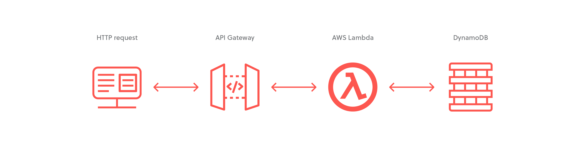
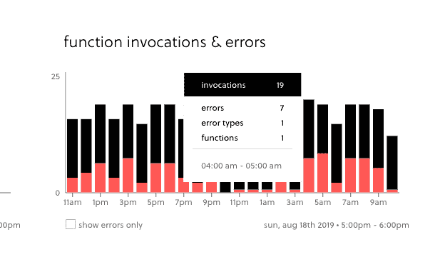
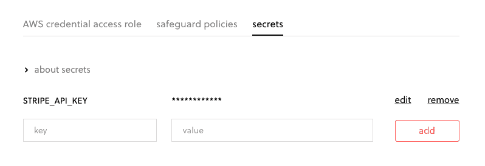
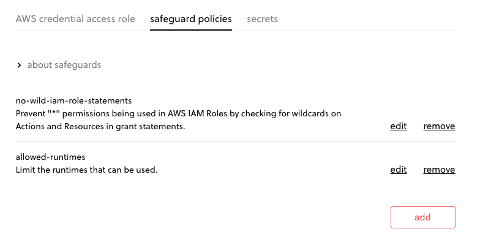
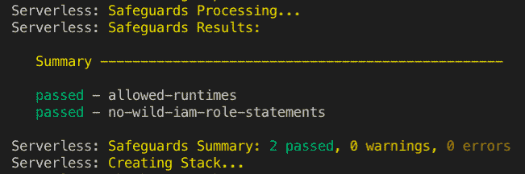

# 将简单的 SAM 应用程序迁移到无服务器框架

> 原文：<https://thenewstack.io/migrate-a-simple-sam-application-to-the-serverless-framework/>

[](https://www.linkedin.com/in/fmc-sea/)

[Fernando Medina Corey](https://www.linkedin.com/in/fmc-sea/)

[Fernando Medina Corey 目前专注于 Amazon Web Services 等公共云提供商的技术，为了开发 Web 应用程序、管理数据管道和构建云基础架构，他使用了各种不同的技术。](https://www.linkedin.com/in/fmc-sea/)

[](https://www.linkedin.com/in/fmc-sea/)[](https://www.linkedin.com/in/fmc-sea/)

当你试图在 Amazon Web Services 上构建自己的[无服务器应用](https://thenewstack.io/category/serverless/)时，你很可能偶然发现了[AWS 无服务器应用模型](https://aws.amazon.com/serverless/sam/) (SAM)。AWS 提供了这个工具，试图使 AWS Lambda、API Gateway 和其他无服务器服务的开发变得更加容易。当您刚刚开始使用 AWS 并需要部署简单的[微服务](https://thenewstack.io/category/microservices/)时，SAM 可以成为简化开发过程的有用工具。

对于许多开发人员来说，SAM 是他们在 AWS 上构建的第一个框架，他们开始用它构建自己的应用程序。但是，当您花一些时间使用 SAM 应用程序，并意识到您实际上可以从一些附加功能中受益时，会发生什么呢？也许你想在不同的服务之间分享秘密？或者，您可能希望部署到不同的环境，如试运行和生产环境？在寻找这些特性时，您可能偶然发现了[无服务器框架](https://serverless.com)，并意识到它检查了您正在寻找的一些框。

只有一个问题。您已经花了那么多时间来启动和运行您的 SAM 应用程序，如果不从头开始，您应该如何移动它呢？好吧，让我们来看看！

## 我们的示例环境

为了向您展示如何将 SAM 应用程序的最常见部分迁移到无服务器框架，我将使用一个演示应用程序，如下所示:



这是一个常见的 AWS 架构模式，包含一个简单的微服务。它首先通过 API 网关端点接收 HTTP 请求，然后在 DynamoDB 表中读取或写入数据之前用 AWS Lambda 处理这些请求，并通过 API 网关返回结果。

当使用 SAM 来部署这个微服务时，我们的代码可能如下所示:

```
sam-app
├──  create.js
├──  package.json
└──  template.yml

```

我们有一个用于 Lambda 处理程序的 **create.js** 文件，一个用于安装任何依赖项的 **package.json** ，还有一个 **template.yml** 帮助我们将一切联系在一起并提供基础设施。您可以在这里看到 SAM 应用程序[的所有文件。无服务器框架版本的最终文件是](https://gist.github.com/fernando-mc/51a59ee47c97e5cf5b4f1b32a5ded948)[这里是](https://gist.github.com/fernando-mc/39fb22af0b5bc1a3825b4472ad3e0d0d)，但是我们将一点一点地介绍如何将您的应用程序转换到无服务器框架。

作为提醒，这篇文章将假设你已经安装了无服务器框架，并且对它有些熟悉。如果你不是，看看[入门文档](https://serverless.com/framework/docs/providers/aws/guide/quick-start/)指南和[无服务器博客](https://serverless.com/blog/)。

### 将 SAM 代码迁移到无服务器框架代码

为了将我们的应用程序从 SAM 迁移到 Serverless 框架，我们应该从一点一点地拆分 [SAM template.yml](https://gist.github.com/fernando-mc/51a59ee47c97e5cf5b4f1b32a5ded948#file-template-yml) 文件并构建一个等价的 **serverless.yml** 开始。

### 模板元数据

template.yml 的前几行看起来是这样的(使用#符号的注释只是为了让你知道我们在文件中的位置):

```
# template.yml
# metadata

AWSTemplateFormatVersion:  '2010-09-09'
Transform:  'AWS::Serverless-2016-10-31'  
Description:  A  microservice using AWS SAM,  API Gateway,  Lambda,  and DynamoDB

```

在 **serverless.yml** 文件中，不需要任何 SAM 元数据，因此我们可以根据自己的喜好将其全部省略或作为注释包含。然而，我们将希望包括关于应用程序本身的元数据，以便我们可以将我们的应用程序与无服务器仪表板集成。为此，我们可以在新的 **serverless.yml** 文件的顶部添加几行代码:

```
# serverless.yml
# metadata

org:  fernando   # Replace this with your organization
app:  customers-demo
service:  api
frameworkVersion:  '&gt;=1.50.0 &lt;2.0.0'

```

前三行指定该服务所属的组织和应用程序，并为您的服务命名(api ),以便您可以在无服务器仪表板中找到它。如果你还没有机会使用仪表板，你可以注册看一下文档并免费试用。最后， **frameworkVersion** 行只是说明您使用的是具有该功能的无服务器框架版本。

### SAM 功能

接下来，我们需要从 SAM 模板中提取任何函数，并将它们迁移到 **serverless.yml** 。在这一步中，我们需要在 **template.yml** 中寻找任何类型为**AWS::server less::Function**的资源，并将它们分开一点。以 **newCustomer** 函数为例:

```
# template.yml
# metadata
# . . . 

Resources:
# function resource
   newCustomer:
     Type:  'AWS::Serverless::Function'
     Properties:
       Handler:  create.create
       Runtime:  nodejs8.10
       CodeUri:  .
       Description:  Used to create  a  new customer in the database
       MemorySize:  512
       Timeout:  10
       Policies:
         -  Version:  '2012-10-17'
           Statement:
             -  Effect:  Allow
               Action:
                 -  'dynamodb:PutItem'
               Resource:
                 'Fn::Join':
                   -  ''
                   -  -  'arn:aws:dynamodb:'
                     -  Ref:  'AWS::Region'
                     -  ':'
                     -  Ref:  'AWS::AccountId'
                      -  ':table/customerTable'

       Events:
         Api1:
           Type:  Api
           Properties:
             Path:  /create
            Method:  POST

```

这里发生了很多事情，包括:

*   为函数设置代码的位置
*   配置超时和内存
*   设置 IAM 策略以供函数使用
*   配置将触发该功能的事件(API 网关的 POST 端点)

我们可以将所有这些配置转换成 **serverless.yml** 并直接应用到一个函数中。然而，一个更好的想法可能是预期服务将会发展到包括更多的功能和不同的开发阶段。为此，我们可以利用无服务器框架的提供者部分。

### 无服务器框架提供程序部分

为了简化具有多种功能的服务的开发，拥有一组自动应用于所有功能的共享配置是非常有用的。这就是 **serverless.yml** 文件的提供者部分的用途。SAM 中最接近的对等部分是 **Globals** 部分，它也允许跨应用程序的多个部分进行默认设置。

```
# serverless.yml
# metadata
# . . .
# provider
provider:
   name:  aws
   runtime:  nodejs8.10
   memorySize:  512
   timeout:  10
   environment:
     TABLE_NAME:  customerTable-${opt:stage,  'dev'}
   iamRoleStatements:
     -  Effect:  Allow
       Action:
         -  dynamodb:PutItem
      Resource:  "arn:aws:dynamodb:us-east-1:*:table/customerTable-${opt:stage, 'dev'}"

```

在上面的提供者部分，我们将 **aws** 指定为提供者(而不是 Azure、Google Cloud 或其他提供者),然后设置服务级别配置，以便所有函数都有 node.js 8.10 运行时、指定的内存大小和超时长度、DynamoDB 表名的特定于阶段的环境变量以及具有有限 DynamoDB 权限的 IAM 角色。

### 无服务器框架功能

因为我们已经在提供者部分做了大量的配置，所以创建我们的函数和触发它的事件是相当简单的。

```
# serverless.yml
# metadata
# . . .
# provider
# . . .
# functions

functions:
   newCustomer:
     handler:  create.create
     events:
       -  http:
           path:  /create
          method:  post

```

我们首先需要包含我们正在创建的函数资源的名称，在本例中，它是 **newCustomer** 。之后，我们将需要指定无服务器框架应该在哪里寻找处理程序文件，以及该文件中的处理程序函数被调用。这假设我们的无服务器框架项目文件是这样构造的:

```
serverless-framework-app
├──  create.js
└──  serverless.yml

```

这个项目是平的 **serverless.yml** 就在 **create.js** 旁边。因此，我们使用“create.create”来引用同一个目录中的 **create.js** 文件以及该文件中的 **create** 函数。我们也可以在子目录中引用处理程序。例如，如果我们的文件结构看起来像这样:

```
├──  functions
│     └──  create.js
└──  serverless.yml

```

我们可以使用**functions/create . create**的处理程序来达到同样的结果。

最后，function 部分下面的代码块设置 API Gateway API，以便在向 **/create** 端点发出 POST 请求时触发 Lambda 函数:

```
     events:
       -  http:
           path:  /create
          method:  post

```

处理完函数后，让我们看看如何转移 SAM 模板中描述的其他资源。

### 其他资源

我们先来看看“template.yml”中的 DynamoDB 表资源。

```
# template.yml
# metadata
# . . . 

Resources:

# function resource
# ...
# resources continued

   customerTable:
    Type:  'AWS::DynamoDB::Table'

     Properties:
       TableName:  customerTable
       AttributeDefinitions:
         -  AttributeName:  customer_id
           AttributeType:  S
       KeySchema:
         -  AttributeName:  customer_id
           KeyType:  HASH
       ProvisionedThroughput:
         ReadCapacityUnits:  1
        WriteCapacityUnits:  1

```

在 **template.yml** 中，所有附加资源都放在**资源**部分下。当将资源从 SAM 迁移到无服务器框架时，您必须采取更详细的迁移方法。您可能无法简单地通过等效的无服务器框架转换 SAM 代码并进行部署。

如果这样做，您可能会遇到各种问题，从部署时的命名冲突，到仍然需要从遗留资源迁移的重要数据，或者仍然引用旧资源的功能代码。让我们看看如何解决其中的一些问题。

### 命名冲突

首先，让我们解决将 DynamoDB 资源转移到 **serverless.yml** 时的命名冲突问题。

```
# serverless.yml
# metadata
# . . .
# provider
# . . .

# functions
# . . .
# dynamodb

resources:
Resources:
customerTable:
Type:  'AWS::DynamoDB::Table'

Properties:
TableName:  customerTable-${opt:stage,  'dev'}
AttributeDefinitions:
-  AttributeName:  customer_id
AttributeType:  S
KeySchema:
-  AttributeName:  customer_id
KeyType:  HASH
ProvisionedThroughput:
ReadCapacityUnits:  1
WriteCapacityUnits:  1

```

将资源移动到 **serverless.yml** 的第一个变化是 DynamoDB **customerTable** 资源现在嵌套在 **Resources** 下的 **resources** 部分中。如果这似乎是多余的，只需知道 **serverless.yml** 中的“资源”部分也允许我们配置“输出”和“资源”以传递给其他 CloudFormation 堆栈。

接下来，我们不再像在 SAM 应用程序中那样简单地调用 DynamoDB 表 **customerTable** ，而是将名称改为使用 **customerTable-${opt:stage，' dev'}** 来引用部署服务的阶段。因此，如果我们稍后使用**无服务器部署-阶段某个阶段**来部署服务，该表将变成**客户可定制-某个阶段**。否则，它只是假设您正在部署到开发，并使用名称 **customerTable-dev** 进行部署。这也有额外的好处，避免了与现有的**客户表**的命名冲突。

### 从旧应用程序迁移数据

根据您使用的其他服务资源，可能会有不同的数据迁移选项。不幸的是，目前还没有将现有的 CloudFormation 资源迁移到另一个堆栈的方法。因此，您需要创建一个新的 DynamoDB 表，并将数据迁移到该表中。

最简单的方法是创建现有表的备份，然后在新表的位置加载该备份。为了利用云形成的特性实现这一点，你需要:

1.  从旧表创建备份
2.  部署包含新表的服务
3.  删除新表(不使用 CloudFormation！)
4.  使用与您刚刚删除的表相同的名称恢复备份

您可以在 AWS 控制台的 DynamoDB 部分或者通过使用类似于[this](https://gist.github.com/fernando-mc/c27b2043d8cbf0478b223a03fada030e)的脚本来实现这一点。

现在我们已经介绍了如何用数据加载新的 DynamoDB 表，让我们看看可以对 Lambda 函数进行哪些改进。

### 更新 create.js 中的功能代码

当迁移到无服务器框架时，我们通常可以使用与 SAM 应用程序中相同的处理程序文件。然而，在我们的新服务中，我们使用动态命名约定来引用像 DynamoDB 这样的资源，因为它们在不同的应用程序阶段被命名。因为 SAM 应用程序中的 **create.js** 的 DynamoDB 表名为 **customerTable** ，所以我们需要更新这个硬编码的名称。对于 node.js，这意味着使用 **process.env.TABLE_NAME** 而不是 **customerTable** 来引用我们之前在 **serverles.yml** 的 **provider** 部分设置的环境变量。

### 我们迁移的总体优势

迁移了该应用程序后，让我们来看看我们从旧的 SAM 应用程序中获得的一些好处。

首先，我们能够使用单个**无服务器部署**命令和**–stage**等选项来指定部署阶段，从而更高效、更动态地进行部署。当我们创建特定于每个环境的资源时，这些阶段也会自动反映在我们的基础架构中。为此，我们的函数现在指向特定于环境的 DynamoDB 表。

我们还能够使用无服务器框架提供的[多种选项](https://serverless.com/framework/docs/providers/aws/guide/serverless.yml/)轻松扩展基础设施和部署的配置。

但这只是无服务器框架现在提供的一个子集。

### 监控和警报

在设置了[无服务器仪表板](http://dashboard.serverless.com)之后，我们现在可以监控我们部署的应用程序，快速发现错误的根本原因，并评估性能以进行潜在的改进。【T2

这使我们能够继续快速迭代我们的应用程序，而不需要深入研究不同的 AWS 工具。我们还可以使用控制面板来设置关于错误或其他可能问题的智能警报。

### 秘密管理

因为 SAM 主要是一个部署工具，随着应用程序的增长，我们将不得不自己想办法管理机密。但是在无服务器仪表板中，您可以跨服务存储秘密，并将它们作为环境变量加载到您的应用程序中。你所需要做的就是在仪表板上设置这个秘密:

[](https://cdn.thenewstack.io/media/2019/08/c6cb0cb6-serverless-03.png)

然后在您的环境部分下包含这样一行:

```
environment:
    API_KEY:  ${secrets:STRIPE_API_KEY}

```

### 成长团队的安全和保障

随着您的无服务器应用程序的发展，您将需要适应不断增长的团队，这可能会受益于一些护栏。您可以使用无服务器安全措施来运行一系列可定制的部署前检查,以阻止开发人员犯错误，如部署到错误的区域或在 serverless.yml 中包含明文机密。

[](https://cdn.thenewstack.io/media/2019/08/426de467-serverless-04.png)

[](https://cdn.thenewstack.io/media/2019/08/7437180f-serverless-05.png)

总的来说，您将可以访问一个更大的无服务器开发工具和最佳实践的生态系统，以及一个支持您的开发社区。每次迁移都是独特的，但是希望这个例子可以帮助您开始思考从 SAM 迁移到无服务器框架的过程。有更多问题吗？跳进[无服务器论坛](https://forum.serverless.com/)或 [Slack](https://serverless.com/slack) 并提问吧！

<svg xmlns:xlink="http://www.w3.org/1999/xlink" viewBox="0 0 68 31" version="1.1"><title>Group</title> <desc>Created with Sketch.</desc></svg>