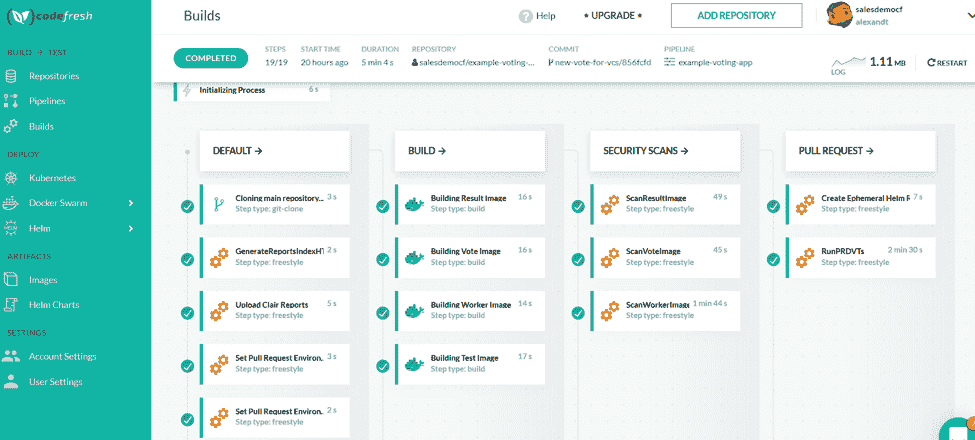

# 从 TravisCI 迁移到 Codefresh

> 原文：<https://thenewstack.io/migrate-from-travisci-to-codefresh/>

[](https://codefresh.io/)

[Kostis Kapelonis](https://codefresh.io/)

[Kostis Kapelonis 是 Codefresh 的开发人员，code fresh 是一个为 Kubernetes 和 containers 构建的连续交付平台。Kostis 以前是一名软件工程师，在应用程序容器化、构建 CI/CD 管道和开发 Java 应用程序方面有多年的经验。他住在希腊，喜欢轮滑。](https://codefresh.io/)

[](https://codefresh.io/)[](https://codefresh.io/)

TravisCI 最近被 Idera 收购。这次收购，加上报道的裁员，似乎在鼓励人们寻找替代方案。

我永远不会忘记我第一次使用 TravisCI。我真的被打动了。我终于可以在公共互联网上打包和编译代码了。这是在云成为事物之前很久的事，但过了一段时间后，它开始变得有意义了。如果你的代码已经存在于互联网上，那么在互联网上编译不是很有意义吗？

我非常钦佩特拉维斯奇团队。向大众提供编译权限最初是一个非常有争议的举措。我一直担心这种努力会带来安全隐患。在大多数安全指南都反对在服务器上使用开发工具的时代，TravisCI 实际上提供了专门为编译设计的公共机器。

当然，经过这么多年，我们知道云上的持续集成是 TravisCI 开创的一个惊人的成功。开源项目拥有公共版本的好处是不可低估的。在互联网上获得源代码是一回事，但是在合并之前看到公共拉取请求的效果也让一些开源项目蓬勃发展，并降低了新合作者的门槛。

我们非常感谢 TravisCI 在公共互联网上推广 CI 的理念。

## 集装箱格局改变了 CI/CD

有一段时间，TravisCI 几乎是云 CI 的代名词。然而，这种情况在过去几年迅速改变，因为:

*   集装箱进入现场，码头使用爆炸式增长
*   公司开始将工作负载转移到云中
*   Kubernetes 作为事实上的集群解决方案出现。

这导致了几个包含容器和 Kubernetes/Helm 的新 CI/CD 解决方案的产生。我们自己的软件， [Codefresh](https://codefresh.io/) 就是其中之一。我们支持 TravisCI 支持的一切，甚至更多。特别是，虽然 TravisCI(顾名思义)只覆盖了应用程序的 CI 需求，但 Codefresh 也扩展了 CD 空间(持续交付)，同时还为 Kubernetes 和 Helm 部署提供了[原生支持](https://codefresh.io/features/)。



TravisCI 在 CI 领域拥有先行者优势，但从未真正尝试拥抱容器及其带来的范例。TravisCI 中的 Docker 支持是后来才想到的，因为主平台仍然是基于 VM 的。我们已经写了很多关于[容器](https://thenewstack.io/docker-based-dynamic-tooling-a-frequently-overlooked-best-practice/)相对于传统构建解决方案的好处。

## 从 TravisCI 迁移到 Codefresh

迁移到 Codefresh 非常简单。Codefresh 的 CI 部分在 YAML 也以声明性管道的形式提供。以下是开始 Codefresh 之旅的便捷指南:

需要记住的一件重要事情是 Codefresh 是完全基于 Docker 的。每个管道步骤都在 Docker 映像中运行。这是所有 [Codefresh 管道](https://codefresh.io/docs/docs/configure-ci-cd-pipeline/introduction-to-codefresh-pipelines/)的核心设计。这与 TravisCI 对虚拟机的做法形成了鲜明对比。

因此，下面的特拉维斯管道:

```
language:  ruby

script:

-  bundle exec rake test

```

Codefresh 中的
变成了

```
version:  '1.0'

steps:
   RunningUnitTests:
             title:  Running Unit Tests
             image:  ruby:2.5.3
             commands:
              -  bundle exec rake test

```

这也意味着在同一管道中使用同一语言的多个版本非常容易:

```
version:  '1.0'
stages:
steps:

   PackageMyNode1App:
             title:  Packaging Node application  1
             image:  node:11.1
             commands:
              -  echo  "My Node version is"
              -  node  --version

   PackageMyNode2App:
             title:  Packaging Node application  2
             image:  node:9.3.0-slim
             commands:
              -  echo  "My Node version is"
              -  node  --version

```

使用 Codefresh，可以非常容易地为用不同编程语言和版本开发的微服务创建管道。

当然，一旦你进行了迁移，你也将获得所有的 CD 好处，例如[集成 Docker 注册表](https://codefresh.io/docs/docs/docker-registries/codefresh-registry/)、 [Kubernetes 仪表板](https://codefresh.io/docs/docs/deploy-to-kubernetes/manage-kubernetes/)、[掌舵仪表板](https://codefresh.io/docs/docs/new-helm/helm-releases-management/)、[环境仪表板](https://codefresh.io/docs/docs/new-helm/helm-environment-promotion/)、[本地部署步骤](https://codefresh.io/docs/docs/deploy-to-kubernetes/deployment-options-to-kubernetes/)、、等等。

立即开始您的迁移[，开通免费账户](https://codefresh.io/codefresh-signup/)！

## 联系#TravisAlums

顺便说一下，如果你在 TravisCI 工作，并且正在积极寻找新的职位， [Codefresh 正在招聘](https://codefresh.io/careers/)，我们将非常乐意与对 CI/CD 充满热情的人一起工作。

通过 Pixabay 的特征图像。

<svg xmlns:xlink="http://www.w3.org/1999/xlink" viewBox="0 0 68 31" version="1.1"><title>Group</title> <desc>Created with Sketch.</desc></svg>