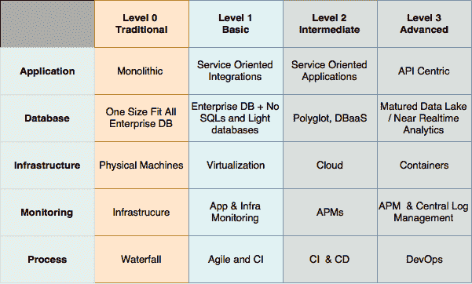

# 迁移到微服务

> 原文：<https://thenewstack.io/migrating-to-microservices/>

这篇文章是探索微服务基础的系列文章的第三篇。请每周一回来查看更多的分期付款。

通往[微服务](https://thenewstack.io/microservices-101/)的道路漫长而曲折，并且包含许多通往令人困惑的立交的匝道。[这样的旅程](https://thenewstack.io/path-microservices-getting-ready-asking-questions/)通常始于团队朝着被称为“基础设施整合”和“运营成本降低”的闪亮而遥远的城市前进但在现实中，很容易发现自己突然迷失在服务发现的丛林或 Qemu 丑陋的后巷中。

将企业应用和服务迁移到云是许多 IT 待办事项中的头等大事，但是这个想法涵盖了很大的领域。迁移服务是现代的还是传统的？他们是如何相互交流的？或许最重要的是，数据将存放在哪里？

对于传统和遗留的企业应用程序，单体数据库是标准。一个高度优化的 Oracle、DB2 实例，甚至一个小型 MySQL 集群都可以处理用户和应用程序数据的长期存储，而大量应用程序可以访问内部并完成所需的工作，甚至可能使用存储过程。

云打破了这种模式。存储过程应该被做成微服务，数据库必须是高度可伸缩的，包含关系信息的大型数据存储应该被放到像“数据湖”存储这样的工作中，远离秒对秒事务的常规路径。

 [谁在使用微服务？

大约四分之三的开发人员至少在考虑一些工作负载的微服务架构。然而，当更具体地询问它们在生产应用中的用途时，数字下降了:在 Lightbend 调查中为 34 %,在 DZone 调查中为 26%。微服务的采用与 DevOps、CI/CD 和容器的使用密切相关。无服务器同上。——*劳伦斯·赫特*。](https://thenewstack.io/week-numbers-microservices-data-perfect-together/) 

曾经有一块巨石连接到另一块巨石，微服务需要对这些系统进行活体解剖，并在公共云上展示它们的内部结构，就像一些数字占卜者在阿兹特克金字塔顶上预测未来一样。解构一个整体的行为可能需要密集的基础设施重构，以及大量的实际软件开发工作；没有开发人员想处理的那种。

然而，有一些方法可以解决这个问题。许多公司提供旨在帮助将现有应用程序引入混合云模型的解决方案。平台 9 的首席执行官 Sirish Raghuram 说，他的公司提供了一种让 Kubernetes 在这种系统上发挥作用的方法。

“它的工作方式是，你可以从 SaaS 平台下载一个小代理，然后放到这些服务器上。该代理将服务器基础设施与您的云平台集成和配对，并对其进行管理。您可以设置策略，说明“这 10 台服务器将运行带有虚拟机管理程序的虚拟机。这另外十台服务器将成为我们所说的容器管理器，换句话说，它将运行 Docker 容器。那边的这五个节点将成为我的存储节点。他们将运行块存储服务。如果你只有容器，Platform9 将去做所有幕后的艰苦工作，配置 Kubernetes 将这些节点投入运行，”Raghuram 说。

对于某些服务来说，Platform9 和 VMware 所青睐的这个中间点是一个很好的垫脚石，可以将成本高昂的单一应用转变为微服务。提供了从同一个控制台管理传统应用程序的虚拟机和现代应用程序的容器的灵活性，这意味着至少抽象出了一层迁移复杂性。

然而，归根结底，真正的目标是为过去和未来的服务提供一条路径，以便轻松集成到您的云架构中。全力以赴需要广泛的基础设施，特别是围绕服务发现、负载平衡和自动扩展。像 [Mesosphere](https://mesosphere.com/) 、 [Cloudbolt.io](https://www.cloudbolt.io/) 、Spi.ne 和 [Platform9](https://platform9.com/) 这样的服务都提供了处理这种基础设施的模型，这一切的背后都是一个基本原则:基于云的应用程序最好没有状态。

有状态应用程序不像无状态应用程序那样容易扩展。这是一个基本的事实:如果一台机器上的内存充满了重要的信息，而这台机器关闭了，那种状态就永远消失了。复杂的内存镜像方案也不适合高度可伸缩的应用程序，因为它们会消耗带宽并降低系统速度。

相反，迁移到微服务最容易的起点是抽象状态。无论这种状态是什么，都必须首先将其公开，并以另一种方式处理。在某种程度上，这种模型反映了函数式编程的模式:我们不是将变量设置为值，而是通过函数传递值，在另一端产生一个独特的新结果。我们不会覆盖原始变量的值。

微服务成熟度模型，来自 Rajesh R V (O'Reilly)的“Spring 5.0 微服务，第二版”

无状态微服务也是如此:我们不是在内部设置变量来表示外部来源的数据，而是简单地通过应用程序传递这些数据，就好像这是一个制造过程一样。应用程序根据输入输出一个值，但输入应该还在某个地方:在消息队列中，在像 [Flink](https://flink.apache.org/) 或 [Kafka](https://kafka.apache.org/) 这样的流数据服务器中，甚至在网络边缘托管的某个缓存层中。

这可能是流媒体平台最近越来越受欢迎的原因之一:它们允许从所有应用程序中抽象出状态，同时在队列的另一端仍然支持快速的用户体验。

在 2016 年 11 月[举行的 AWS re:Invent](https://www.youtube.com/watch?v=oRIYtOsAlzk)，[时尚电商网站 Gilt 的高级软件工程师艾默生·洛雷罗](https://www.linkedin.com/in/emersonloureiro/)，布局了一条从 monolith 到 microservice 的绝佳路径。洛雷罗后来加入了亚马逊网络服务公司，成为一名软件开发员。

在他的演讲中，他展示了 Gilt 的软件历史。2007 年，该公司开发了一个单片 Ruby on Rails 应用程序。到 2011 年，Ruby 应用已经被分解成一系列的 Java 服务。“我们确实意识到，许多 Java 服务本身就成了一个整体。我们将这些进一步细分为真正的微服务，现在用 Scala 编写。我们还编写了大量的新服务。洛雷罗说:“我们将我们的前端应用程序分解成许多更小的组件。

今天，吉尔特运行在微服务架构上，洛雷罗补充道。在这一过程中，微服务之旅也带来了向亚马逊云的迁移；Gilt 团队独立于其向云的迁移而转向微服务。

当进行云迁移时，团队将遗留应用打包成虚拟机。一旦 Gilt 的所有应用程序打包完毕，它们就会被分配给 Gilt IT 团队内部的五个部门，每个部门都有自己的亚马逊账户。每个团队负责运行其特定的服务，这些服务可以快速迁移，因为它们已经被打包并准备好由中央 IT 部门提供。

Gilt 团队围绕特定的业务计划组织了这些微服务。这意味着每个业务组负责运行和维护其特定的微服务集。这也意味着，比如说，对会计团队的控制，是在这个团队内部进行的。不需要外部开发人员或 IT 人员来解决内部帐户问题，加快了问题的响应时间，并使团队能够提高其创新速度。

然而，这也可能需要对这些团队进行一些重组。每个团队都需要自己的前端、后端和网络开发人员，尽管每个团队的人数可能会有所不同。洛雷罗主张团队规模在三到五人之间。

然而，每个团队并不专门消费自己的服务。微服务的理念就是让企业中的每个人都能随时访问他们需要的业务功能。因此，虽然单个团队控制着他们自己的应用程序和服务，但是他们确实需要相互交互，以便在外部消费和提供这些服务。

现任亚马逊网络服务全球技术领导团队高级经理的 Derek Chiles 在接受洛雷罗采访时，提出了一些关于发现的最佳实践，以帮助这种类型的服务共享。保持发现合理的一种方法是使用传统的命名方案来标识服务。他说，这是最简单、最灵活的方法，因为它使用 DNS。

动态发现是处理这个问题的另一种方法，但是它确实给体系结构增加了另一层复杂性。像 [etcd](https://coreos.com/etcd/) 、 [HashiCorp](https://www.hashicorp.com/) 的[consult](https://www.consul.io/)和 [Eureka](https://github.com/Netflix/eureka) 这样的系统，都允许服务发现在架构内动态执行。这确实为您的架构增加了另一项服务和一个故障点。

接下来要做的事情是 API 管理。虽然像 [Apigee](https://apigee.com/api-management/) (现在的谷歌) [Mulesoft](https://www.mulesoft.com/) 和 [Oracle](https://www.oracle.com/middleware/identity-management/api-gateway/index.html) 这样的公司都会向你出售 API 网关，但这个领域的复杂性和细微差别远不止是简单地安装一个网关。然而，由于一些服务不可避免地会根据使用情况赚钱，API 网关是通过这些商业系统捕获的复杂指标实现计费和使用情况跟踪的好地方。SLA 实施自然也是其中的一部分。

> 微服务的真正吸引力在于提高企业软件开发速度，同时降低成本和复杂性。

然而对于大多数团队来说，从更简单的 API 管理方法开始可能是最好的方法。列表上要管理的第一件事是流量计量和节流。API 管理的核心是利用更复杂的规则进行负载平衡。为此，团队可以使用开源解决方案，如 [NGINX](https://www.nginx.com/) 来处理最基本的 API 管理功能。

当迁移进行得更深入时，可能实际上需要通过商业网关实现 API 的货币化，但是许多团队发现现有的解决方案能够以低得多的成本完成任务。我们已经看到的一般经验法则是，如果 API 通过使用直接产生收入，这就是商业解决方案应该进入画面的点。对于不产生商业收入的内部和外部 API 流量，非商业解决方案通常可以处理这些问题。网关可能很快变得昂贵，因为许多公司根据流量收费，所以它们应该是最后的手段。

微服务的真正吸引力在于提高企业软件开发速度，同时降低成本和复杂性。这些都是非常艰巨的任务，因此在将遗留应用程序迁移到云的同时获得所有这三个好处可能是一个让 IT 部门窒息的“沸腾的海洋”项目。

最后，每一个好处都可以在这个过程中单独获得:它们不必一下子全部到来。就像您的所有服务不必一次迁移一样。微服务最好的一点是它们是松散耦合的、自包含的，并且它们的最终目标始终是完全静态的代码。如果做得好，微服务可以被完善并无限期搁置，永远不需要更新或维护。然而，说起来容易做起来难。

尽管如此，任何团队都可以在微服务环境中构建他们想要的任何东西。新的语言和软件可以集成到服务中，并且不会干扰其他地方的维护。你的团队可以尝试 Go、Rust、Scala 或其他十几种有趣的新语言。他们可以在单个微服务中测试一个新的库、服务器软件，甚至是一个全新的数据库，慢慢推出它以确保它运行良好。

的确，微服务的承诺很大。达到这些目标只需要一个稳定的计划和多样化的团队。

*TNS 分析师[劳伦斯·赫克特](https://thenewstack.io/developers-ethical-not-responsible/)对本文有贡献。*

<svg xmlns:xlink="http://www.w3.org/1999/xlink" viewBox="0 0 68 31" version="1.1"><title>Group</title> <desc>Created with Sketch.</desc></svg>