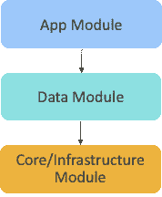
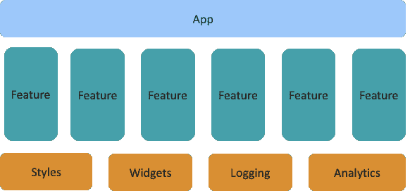
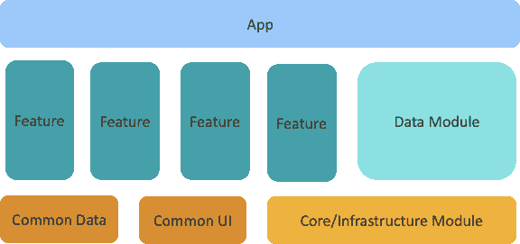

# 从整体到特征模块的迁移

> 原文：<https://thenewstack.io/migration-from-monolith-to-feature-module/>

 [桑吉塔·拉奥

Sangeetha 是易贝移动架构团队的一名 Android 架构师，负责定义应用程序设计模式并构建支持易贝 Android 应用程序的基础代码。](https://www.linkedin.com/in/sangeetha-rao-4773921a/) 

易贝的 Android 应用程序已经有十年的历史了，在单块模块中包含了数百个特性和活动类。随着近年来应用程序的增长，代码变得越来越难以维护。

为了在功能和开发方面进行扩展，我们必须将我们的应用程序进一步模块化为更小的功能模块。如此复杂的应用程序不可能从头开始重建。相反，我们踏上了从单一模块逐步迁移的旅程，同时继续构建新功能并定期发布应用。在这篇文章中，我们分享了我们模块化应用的旅程。

## 整体模块

代码的当前状态反映了 Android 框架随着时间的推移不断发展的能力。随着生态系统的变化，该应用程序进行了部分更新，尽管它仍然留下了未更改的代码，这使得维护和扩展越来越困难。

例如，旧的单一 Dalvik 可执行文件(DEX)限制引入了全局静态方法的使用。现代 Jetpack 库的缺乏导致了复杂的定制数据管理框架。不断发展的测试工具带来了最少测试的代码，不断发展的开发和构建工具带来了应用程序中的整体模块。

易贝 Android 应用模块化的第一个版本是在近五年前，当时应用被重构为水平分层的模块。

*   App 模块由所有特性的表示层(UI)组成(包括共享的 UI 类)。
*   领域模块由所有特性(包括共享数据类)的数据层组成。
*   核心/基础设施模块由所有支持代码组成(包括网络、缓存、日志等等)。

随着开发的继续，这些整体模块的尺寸和复杂性都在增加。每个模块都有一个定义良好的包结构，但是类跨越了包的边界，导致了一个模块中类的不期望的紧密耦合。

这些单体模块的逐渐增长也导致了我们持续集成和持续交付(CI/CD)工作的构建时间的稳步增长。对于给定的代码变更，没有办法识别受影响特性的分离。即使合并了一个特性中的颜色变化这样的小事，也必须执行整个测试套件。

随着新功能添加到应用程序中，我们看到下载量增加。通过让 Google Play 商店决定特定设备需要哪些资源，Android 应用捆绑包的引入有助于最小化下载量。我们更进一步，确定了只被一部分消费者使用的特性。这些功能将很快使用现代应用交付机制按需部署，如 Android 的[动态功能](https://developer.android.com/guide/app-bundle/play-feature-delivery)，允许在不增加应用初始下载大小的情况下添加新功能。

为了扩大开发规模并能够部署动态特性，我们首先必须将我们的应用模块化为更小的特性模块。

## 模块化应用程序

我们对模块化应用的愿景是拥有垂直切片的功能模块以及水平层的共享支持模块。顶部是 app 模块，包含主应用程序类和一个用于应用程序的 [Dagger](https://dagger.dev/dev-guide/android.html) 组件。底部的支持模块是跨特性共享的常用类。一个特性模块粗略地映射到一个特定领域的特性。所有功能模块都是对等的。

我们的模块结构不使用集中式导航模块。每个功能都在单独的 API 模块中声明公共接口，而不是使用一个中心位置进行导航。对等功能依赖于这个公共 API 模块来导航到该功能。该功能实现位于嵌套模块中，不能从其他对等功能模块中访问。与使用集中式导航模块相比，这种分离提供了对导航依赖的清晰性，并实现了更好的构建优化。

## 旅程

EBay 的本地开发人员分散在几个拥有不同功能领域的领域团队中。我们希望授权这些团队中的每一个模块化他们自己的代码，这样小型移动架构团队就不会被期望自己模块化整个代码库。

首先，我们在新功能模块中启用了功能开发，以阻止现有功能模块的增长。新特性所需的大多数公共共享类仍然在整体模块中。对将整个共享代码库转换成更小的支持模块的工作范围进行的一项分析显示，这将持续数月。相反，我们决定采用增量方法。我们从上到下开始，首先从更大的应用程序模块提取公共代码到它自己的支持模块。

例如，BaseActivity、BaseFragments、Styles 和 Themes 被从 app 模块中取出，放到一个新的 UI 支持模块中。这允许开发人员创建新的功能模块，这些模块只包含用于演示的代码。这些功能模块仍然依赖于数据层现有的单片数据模块，但现在可以在使用最新 Android 功能架构的模块中开发新功能。通过这种方法，我们稳步减缓了 monolith 应用模块的增长。

随着领域团队现在能够在新模块中实现特性，我们沿着堆栈向下工作。然后，我们分析了 monolith 数据模块，并开始将公共数据类提取到它们自己的共享数据模块中。这一步使功能模块现在可以在同一个功能模块中包括演示、业务和数据类。

为了避免变动并支持更简单的代码审查过程，大多数模块化将在多次提交和多次拉取请求中执行。这个过程通常遵循一个模式，解开，移动和现代化。

*   解开:打破整体中跨包的依赖性——跨包相互引用的类被更新为使用新的接口。这种隔离也支持更好的测试。
*   移动:将类移动到新的包和模块中。将代码移动到新位置可能会影响引用旧代码的许多其他位置。这一步可能会导致数百个文件的微小变化。
*   现代化:在这个过程中，现代化意味着采用移动架构团队的最新建议，比如采用 Kotlin 和使用最新的支持模块和组件。

我们简单地重复这个过程，直到不再有公共类需要移动。领域团队将相同的过程应用到他们自己的代码中，将功能代码移动到新的功能模块中。monolith 中的特性使用了现在无法从特性测试代码中获得的通用测试类。在提取公共代码的同时，相关的测试支持代码也被提取到一种新型的嵌套模块 test support 中。例如，共享 UI 模块也有一个包含测试存根、视图匹配器、测试规则等的`uiTestSupport`模块。功能模块现在对这个新的测试支持模块有测试依赖性。

然而，事情并不总是那么简单。模块化不仅仅是打破依赖关系和创建更小的模块。为了使功能模块并行正确工作，功能模块必须提供附加信息。

*   资源冲突:为了避免模块间资源名称的冲突，每个特性模块必须提供一个前缀，用于安全地命名资源。
*   消费者 Proguard 规则:Android 编译器使用 Proguard 规则来发布进程代码，并通过删除未使用的代码来收缩它。旧的 monolith 模块缺少消费者程序定义，而是在 app 模块的总括规则中定义。功能模块现在自己定义消费者程序规则，给每个模块的开发者更多的控制。

## 结果呢

在撰写本文时，模块化倡议已经进行了一年多。移动架构优先考虑领域团队模块化他们自己的代码的能力。在这段时间里，我们的团队已经能够模块化大约 30%的应用程序。这种模块化与新特性的开发并行发生，其中大部分是在新模块中。所有这些工作都没有打乱我们常规的发布节奏。

新模块结构中的代码更易于维护，具有良好定义的边界，并且始终具有更高的测试覆盖率。让代码发展到这一步为优化我们的持续集成管道打开了新的机会。这是我们下一步要探索的领域，计划已经很有希望了。

然而，我们确实重新审视了我们早期的一个决定。将现有代码转移到新的独立功能模块的进展缓慢。我们最初建议移到新模块的代码也应该用 Koltin 重写，并使用 Google 的现代应用程序开发原则来实现。具体来说，我们的建议是 Java 和 Kotlin 不应该共存于同一个模块中，以避免重复编译。然而，领域团队并不总是有时间一次处理所有这些任务。因此，该建议被放宽了，从而使模块化与现代化脱钩。这使得团队能够以更小的步伐取得进展。我们很高兴地告诉大家，他们选择了冒险，并取得了进展。

我们的工作仍在继续，但最终目标不仅会增加开发人员的信心和代码质量，还会允许在构建过程中进行优化。因此，随着易贝寻找新的方法来取悦我们的客户，团队将能够按需部署功能。

有兴趣在易贝发展事业吗？我们在招人！要查看我们当前的职位空缺，请访问:

 *### 参考

通过 Pixabay 的特征图像。

<svg xmlns:xlink="http://www.w3.org/1999/xlink" viewBox="0 0 68 31" version="1.1"><title>Group</title> <desc>Created with Sketch.</desc></svg>*