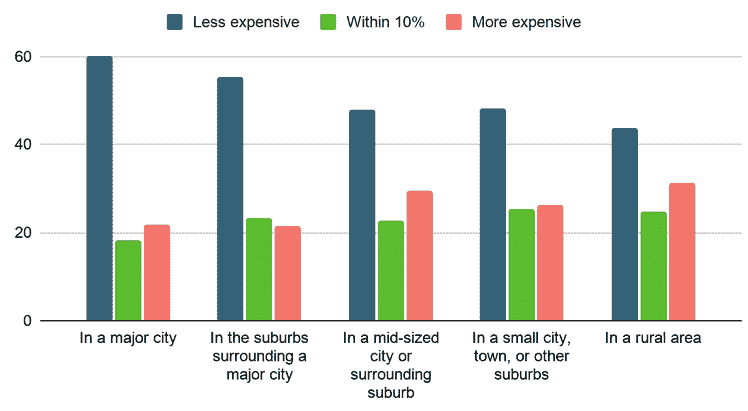

# 数百万远程工作人员正在考虑搬家

> 原文：<https://thenewstack.io/millions-of-remote-workers-are-now-thinking-about-moving/>

今年，脸书宣布一半的员工现在可以永久在家工作。在湾区的其他地方，当地报纸甚至报道说，一个地区政府机构在 9 月投票“推进”一项提案，要求大型办公室公司在 2035 年前让员工每周至少 60%的时间在家工作。尽管这个提议很快引起了其他地方官员的批评，但它指出了一些新的东西:对远程工作可能性的广泛重新评估。

事实上，根据自由职业平台 Upwork 的一项新调查，由于远程工作，数百万远程工作者正在考虑搬家。他们认为这可能是“自第二次世界大战动员以来，T4 劳动力市场最大、最快的转变”

## 新机遇

根据美国劳工统计局的数据，美国的平民劳动力超过 1 . 6 亿。然而，Upwork 计算出，由于远程工作创造的新机会，现在有惊人的大比例计划搬迁:1400 万到 2300 万美国人。这占所有美国家庭的 6.9%到 11.5%——但这可能只是个开始。“加上那些不考虑远程工作而迁移的人，近期的迁移率可能是平时的三到四倍。”

他们的结果是基于在 10 月的前 15 天使用谷歌消费者调查对 2 万人进行的调查。(结果的范围反映了在不同版本的调查中问题的措辞略有不同。)

BLS 不是唯一发现这一趋势的人。NPR 还引用了联合货车运输公司(United Van Lines)的研究(从 3 月到 8 月进行)，该研究发现今年美国人对搬家的兴趣比去年增加了 32%。这些统计数据似乎会受到疫情的影响。一个常见的原因是对个人健康的担忧——该调查还发现，人们希望离开纽约州的比例高于平均水平。但是它也发现想要离开旧金山的人数是全国平均水平的两倍多——尽管旧金山仍然是整个疫情最健康的城市之一。

这暗示了另一个可能的原因:房价。根据《旧金山纪事报》援引房地产网站 Zumper [的统计，旧金山的租赁市场仍然是全美最贵的。事实上，Upwork 的调查发现，超过一半的受访者(52.5%)特别计划搬进比他们目前的房子“更实惠”(至少便宜 10%)的房子，而只有 25%的人表示他们会搬进更贵的房子。那些计划搬出大城市的人对廉价住房的渴望最为明显。](https://www.sfchronicle.com/bayarea/article/Rent-prices-drop-again-in-S-F-and-other-Bay-Area-15692584.php)

引用来自 Apartments.com 的数据，Upwork 也认为这种迁移反映在租金价格上。“最昂贵的地方需求下降幅度最大，而生活成本较低的地方需求更强劲。”

Upwork 首席经济学家亚当·奥兹梅克(Adam Ozimek)向 NPR 总结了他们调查的关键观点:“许多人将远程工作视为一个机会，可以搬到他们想去的地方，搬到他们负担得起的地方。”

## 重新评估什么是重要的

据 NPR 报道，联合货车运输公司还发现了其他起作用的因素。“客户告诉搬家公司，疫情让他们重新评估什么对他们的家庭来说是重要的，这意味着更接近大家庭和朋友。其他客户表示，他们不得不将求职范围扩大到其他州。

Upwork 的受访者表示，他们搬到人口密度较低的地方的可能性是搬到人口密度较高的地方的两倍。事实上，在调查中，20.6%的城市居民表示他们正在计划搬家，相比之下，居住在中等城市或其周边郊区的人只有 8.6%(另有 12.2%居住在郊区)。

但不管原因是什么，Upwork 发现，超过一半的受访者显然在利用远程办公的机会:“54.7%的人正在从他们目前的位置搬到两个小时或更远的地方，这超出了大多数人每天甚至每周的通勤距离。”大约 41.5%的人实际上搬家的时间超过 4 小时，而 13.2%的人搬家的时间在 2 到 4 小时之内。Upwork 认为，这些统计数据“进一步支持了人们工作和居住地点日益分离的观点。”

Upwork 认为这些趋势可能会重新分配美国的劳动力。“在过去的几十年里，工作机会越来越集中在少数超级大城市。与此同时，这些城市缺乏新的住房供应和高建筑法规，大幅提高了生活成本。”报告指出，在圣何塞和旧金山等硅谷城市，房价中值“远高于 100 万美元……”

然而，“远程工作提供了一种替代方案，它允许我们将工作地点和居住地点分开。”

Upwork 指出，这让企业有机会从更大的人才库中招聘人才——尽管 Upwork 可能与其中一些决策有利害关系。该公司为寻找工作的自由职业者提供工作清单，成立于 2013 年自由职业者平台 oDesk 和 Elance 合并时，然后[在 2015 年](https://www.forbes.com/sites/elainepofeldt/2015/05/05/elance-odesk-becomes-upwork-today-odesk-brand-gets-phased-out/?sh=403a8eef51f5)更名。该公司的网页现在宣称每年有数以百万计的工作岗位发布在网站上[，并且密切关注着这个行业。9 月，该公司计算出](https://www.upwork.com/about/)[在过去的 12 个月里，有 5900 万美国人从事自由职业](https://www.upwork.com/press/releases/new-upwork-study-finds-36-of-the-us-workforce-freelance-amid-the-covid-19-pandemic)，“占美国劳动力的 36%，自 2019 年以来增加了 200 万自由职业者”，并“为经济贡献了 1.2 万亿美元”(10%的劳动力暂停了他们的自由职业，12%的人已经开始自由职业。)

## 走向全球

这种趋势会走多远？它会在国际上传播吗？去年，芬兰赫尔辛基的科技公司开始宣传“[城市即服务](https://www.prnewswire.com/news-releases/helsinki-worlds-first-city-as-a-service-is-not-just-a-joke---attracts-over-6500-applications-from-100-cities-300960656.html)”——一项“人才吸引活动”，向成功的申请人提供 90 天的免费搬迁套餐，以鼓励他们搬到自己的国家。现在宣布[计划的另一个季节](https://www.helsinkibusinesshub.fi/90-day-finn/)——它不是唯一一个试图吸引新人才的城市。

《福布斯》最近报道了爱沙尼亚、德国、葡萄牙和捷克共和国提供的“数字游牧签证”的变体[。但它也指出，阿拉巴马州的偏远浅滩项目在搬迁的第一年就支付了 1 万美元的额外费用。](https://www.forbes.com/sites/suzannerowankelleher/2020/06/08/estonia-woos-remote-workers-with-a-digital-nomad-visa/)

有更多的迹象表明，美国的小城市希望吸引想要搬迁的偏远地区的工人。房地产新闻网站 Millionacres 本周指出，俄克拉荷马州的塔尔萨市为 250 名将搬迁到该市一年的远程员工提供 10，000 美元——而堪萨斯州的托皮卡市将为在该市购买房屋的合格远程员工提供 10，000 美元(或为租房的搬迁者提供 5000 美元)。它还指出，佐治亚州的萨凡纳也有一个项目，为搬迁到该市的远程技术工人提供高达 2000 美元的资助。

“每个人都想付钱让你离开湾区，”六月份《the Hustle》的一个标题打趣道。

接下来会发生什么谁也说不准。但 Upwork 宣布他们的调查结果似乎是以呼吁采取行动，或者至少提出不可避免的后续问题而告终。“支付高昂的住房成本不再是进入高薪劳动力市场的必要条件，人们可以居住的地理范围大大扩大。

"但是，专业人士会抓住这个机会重新部署吗？"

* * *

# WebReduce

专题图片:“搬进船里”，查尔斯-弗朗索瓦·多比尼，1872 年，[纽约大都会艺术博物馆](https://www.metmuseum.org/art/collection/search/336997)。

<svg xmlns:xlink="http://www.w3.org/1999/xlink" viewBox="0 0 68 31" version="1.1"><title>Group</title> <desc>Created with Sketch.</desc></svg>