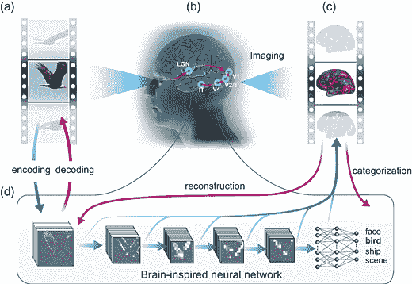
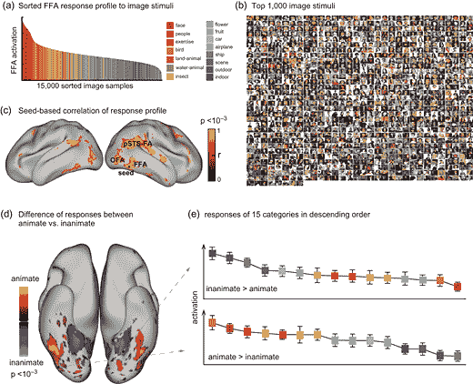
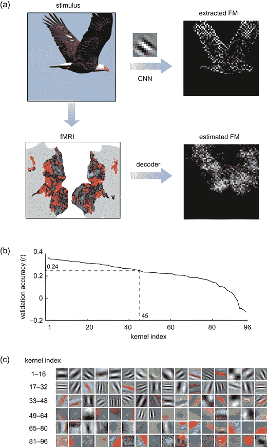
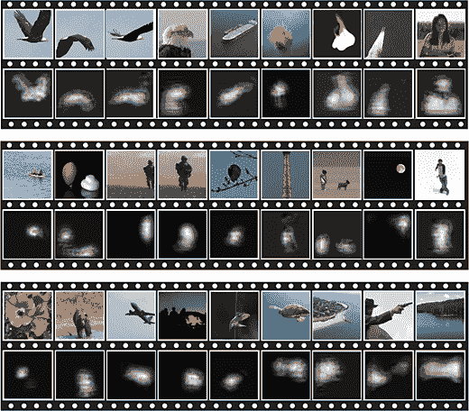
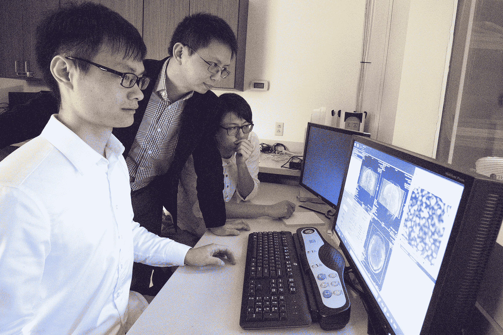

# 读心术人工智能可以利用你的脑电波重建视频

> 原文：<https://thenewstack.io/mind-reading-ai-can-reconstruct-videos-using-brain-waves/>

即时读取你的想法的技术似乎是一个遥远的想法，最好留给一些尖端的科幻电影。但是普渡大学最近的发现表明，在人工智能的帮助下，结合现有的 fMRI(功能磁共振成像)技术，现在可以实时解码观看视频时发生的大脑活动。

在最近发表在 [*大脑皮层*](https://academic.oup.com/cercor/advance-article/doi/10.1093/cercor/bhx268/4560155) 的一篇论文中，研究人员描述了这些新发现如何扩展了之前的工作，这些工作试图理解大脑如何编码从环境中看到的复杂和动态的视觉信息。先前的工作将人工智能(AI)与 fMRI 技术结合起来，以破译源于观看静止图像的大脑活动，或由语义构建“块”组成的更多[复杂思想](https://thenewstack.io/mind-reading-technology-uses-machine-learning-decode-complex-thoughts/)，以及[重建对面孔的记忆](https://thenewstack.io/researchers-use-ai-read-reconstruct-memories/)。

[https://www.youtube.com/embed/Qh5_uMGXl1g?feature=oembed](https://www.youtube.com/embed/Qh5_uMGXl1g?feature=oembed)

视频

## 预测和解码自然视觉

该团队的目的是找出哪种计算可能是人工自然视觉的基础，并更好地理解大脑如何“编码”和“解码”基于视觉的刺激背后的更深层工作。特别是，该团队的研究集中在一种被称为[卷积神经网络](https://en.wikipedia.org/wiki/Convolutional_neural_network) (CNN)的人工神经网络上，它由一个深层结构组成，可以前馈信息，只需最少的预处理。这些 CNN 的灵感来自视觉皮层中生物神经元建立连接的方式，并已被用于广泛的应用中，从图像和视频识别到推荐系统和自然语言处理。

“这种类型的网络近年来在计算机视觉领域产生了巨大的影响”，[的生物医学、电子和计算机工程助理教授刘](https://engineering.purdue.edu/Engr/People/NewFaculty/New_Faculty_2013/Liu.html)在[的帖子](https://www.purdue.edu/newsroom/releases/2017/Q4/researchers-demonstrate-mind-reading-brain-decoding-tech-----.html)中说。“我们的技术使用神经网络来理解你所看到的东西。”

该小组的实验使用了来自三个测试对象的近十几个小时的 fMRI 数据，这些数据是在他们观看数百个视频剪辑时收集的。其中许多展示了运动中的人或动物或自然景观。为了模拟生物大脑对视觉信息进行编码的行为，这些数据随后被输入到 CNN 模型中进行训练，以便它可以预测受试者在观看各种类型的视频镜头时大脑中可能出现的活动。

为了模仿大脑在处理视觉刺激时的解码功能，另一个 CNN 模型被用来解释受试者的新 fMRI 数据，以重建模型从未见过的视频。这是一个模糊的传真，但它几乎就像软件“读取”受试者的思想，在另一个屏幕上显示图像。这些重建也被分类，这几乎是实时完成的，研究人员在参与者观看视频时每两秒钟扫描一次他们的大脑，然后模型几乎立即推断出解码的图像。

除了表明读心术技术在未来并不遥远，该团队的发现还有助于澄清大脑在面对动态视觉图像时发生了什么，确定当大脑在同一场景中观看不同事物时大脑的哪个区域会发光。

“神经科学正在试图绘制大脑中负责特定功能的部分，”博士生和论文的第一作者广海·文说。“我认为我们在本文中报告的内容使我们更接近实现这一目标。一辆汽车在建筑物前行驶的场景被大脑解剖成一条条信息:大脑中的一个位置可能代表汽车；另一个位置可能代表建筑物。使用我们的技术，你可以将大脑任何位置代表的特定信息可视化，并筛选大脑视觉皮层中的所有位置。通过这样做，你可以看到大脑如何将一个视觉场景分成片段，并将这些片段重新组合成对视觉场景的完整理解。”

最重要的是，该团队发现这些模型可以应用于初始测试对象以外的更多人，这意味着这种模型有可能在某一天被用来更好地理解自然视觉背后的机制，或帮助有视觉障碍的人。

“我们认为我们正在进入一个机器智能和神经科学的新时代，研究正集中在这两个重要领域的交叉点上，”刘说。“总的来说，我们的任务是利用大脑启发的概念推进人工智能。反过来，我们想用人工智能来帮助我们理解大脑。因此，我们认为这是一个很好的战略，有助于推动这两个领域的发展，否则，如果我们分别处理这两个领域，将无法实现这一目标。”

图片:普渡大学。

<svg xmlns:xlink="http://www.w3.org/1999/xlink" viewBox="0 0 68 31" version="1.1"><title>Group</title> <desc>Created with Sketch.</desc></svg>