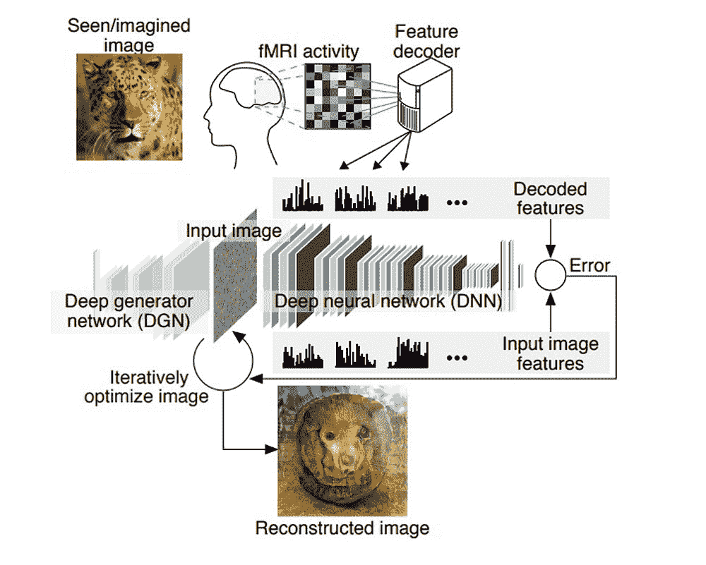
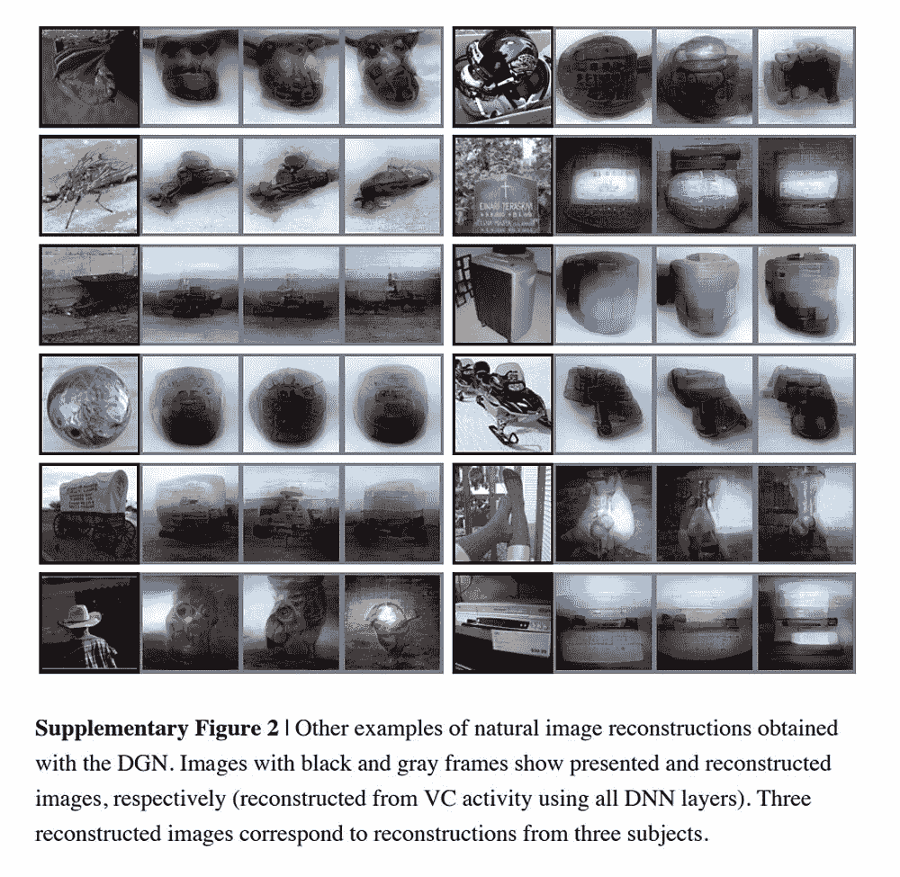
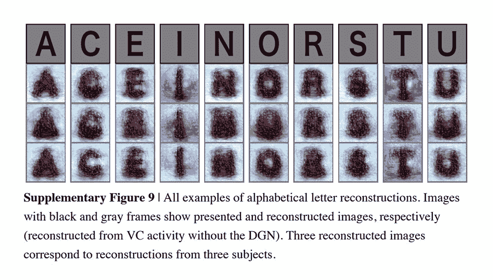
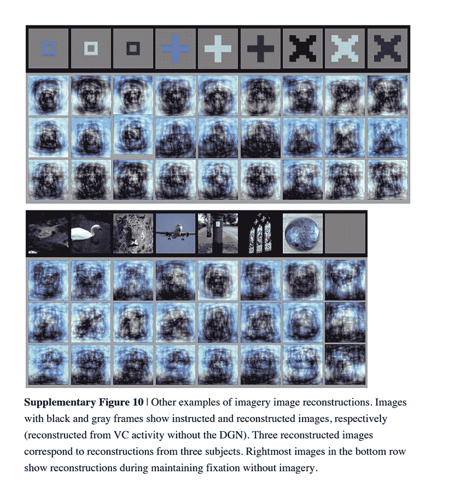

# 读心术人工智能优化从你的脑电波重建的图像

> 原文：<https://thenewstack.io/mind-reading-ai-optimizes-images-reconstructed-brain-waves/>

几十年来，读心术机器的迷因一直是科幻小说中反复出现的主题。然而，由于人工智能、“深度”神经网络开发的最新进展，这种未来幻想似乎比以往任何时候都更接近现实。最近的研究展示了机器如何被用来解码复杂思想的“块”，[重建记忆](https://thenewstack.io/researchers-use-ai-read-reconstruct-memories/)，甚至是实时观看的[视频](https://thenewstack.io/mind-reading-ai-can-reconstruct-videos-using-brain-waves/)。但这些重建往往有局限性:这些人工智能模型再现的图像可能与原始物体几乎没有相似之处，或者系统可能会被限制在一组预先确定的物体上进行识别。

但是这些思想解码技术正在进步。日本京都大学的一个科学家小组现在开发了一种称为“深度图像重建”的新方法，该方法使用的重建算法能够从人类大脑活动中“解码”复杂视觉信息的“层次”，如颜色和形状。该团队的算法还优化了解码图像的像素，使其更接近实际物体，并结合多层深度神经网络(DNN)来模拟人脑感知图像时发生的相同过程。观看这段简短的视频，了解一些实验结果:

[https://www.youtube.com/embed/jsp1KaM-avU?feature=oembed](https://www.youtube.com/embed/jsp1KaM-avU?feature=oembed)

视频

在他们发表在 [Biorxiv](https://www.biorxiv.org/content/biorxiv/early/2017/12/30/240317.full.pdf) 上的论文中，研究人员解释了他们这种人工智能辅助翻译感知内容的方法如何更好地模仿人类自然视觉系统中构建的复杂、分层的神经表示。

“我们一直在研究通过观察一个人的大脑活动来重建或再现这个人正在看的图像的方法，”神经科学家和论文高级作者[神谷幸康](http://www.cns.atr.jp/dni/en/members/kamitani_e/)告诉[美国消费者新闻与商业频道](https://www.cnbc.com/2018/01/08/japanese-scientists-use-artificial-intelligence-to-decode-thoughts.html)。“我们以前的方法是假设图像由像素或简单的形状组成。但众所周知，我们的大脑分层次地处理视觉信息，提取不同层次的特征或不同复杂程度的成分。这些神经网络或 AI 模型可以作为人脑层级结构的代理。”

该团队使用 [fMRI](https://en.wikipedia.org/wiki/Functional_magnetic_resonance_imaging) (功能性磁共振成像)技术，在受试者观看动物和其他物体的真实图像以及几何形状和字母的图像时，收集他们的大脑活动数据。这些原始数据然后通过深度神经网络进行过滤，以便解码过程以更接近人类大脑感知事物时发生的方式发生。

“我们认为深度神经网络是大脑分级处理的良好代理，”Kamitani 说。"通过使用 DNN，我们可以从大脑视觉系统的不同层次提取信息."

过滤后的数据充当排序的模板。为了识别某人看到的是什么图像，该团队随后使用了一个“解码器”——它是在受试者观看自然图像时拍摄的 fMRI 数据上训练的——在数百次计算的过程中反复提炼解码的信息(如上文视频所示)，以便图像逐像素地更接近原始图像。

为了创建更逼真的图像，结果通过深度生成器网络(DGN)得到了进一步增强，这是一种能够更好地捕捉常见主导特征(如眼睛、面部和纹理图案)的算法，然后将提供特定对象可能是什么的视觉线索。在 DGN 的帮助下提高图像输出，研究小组发现一个中立的人类评估者可以在 99%的情况下将解码图像与原始图像匹配。

该团队还测试了他们的系统翻译几何形状和字母上的感知数据，这是一个挑战，因为该系统最初只在自然图像上进行训练。然而，该系统能够产生可识别地接近初始形状或字母的图像。

接下来，研究小组试图解码仅仅想象相同图像集的受试者的脑电波，从记忆中回忆它们。生成的图像并不那么清晰，尤其是自然图像，因为很难准确回忆起图像的细节。“大脑不太活跃，”Kamitani 解释说，所以那些定义图像的视觉线索不太明显。然而，研究小组发现，对于形状和字母，深度网络生成器会在 83%的情况下产生可辨别的图像。

虽然这种读心术技术仍处于早期发展阶段，但这些发现为一系列未来可能性提供了一个迷人的窗口。例如，当与搜索算法配对时，有一天可能只需在你的脑海中回忆起完全相同的图像，就可以在网上或你的计算机上搜索特定的图像。这也是语言障碍患者与周围人交流的一种方式。读心机也可能成为开发脑机接口的无价之宝，这种接口允许用户仅仅通过思考一个想法来交流——这确实是一个令人印象深刻的前景。

<svg xmlns:xlink="http://www.w3.org/1999/xlink" viewBox="0 0 68 31" version="1.1"><title>Group</title> <desc>Created with Sketch.</desc></svg>