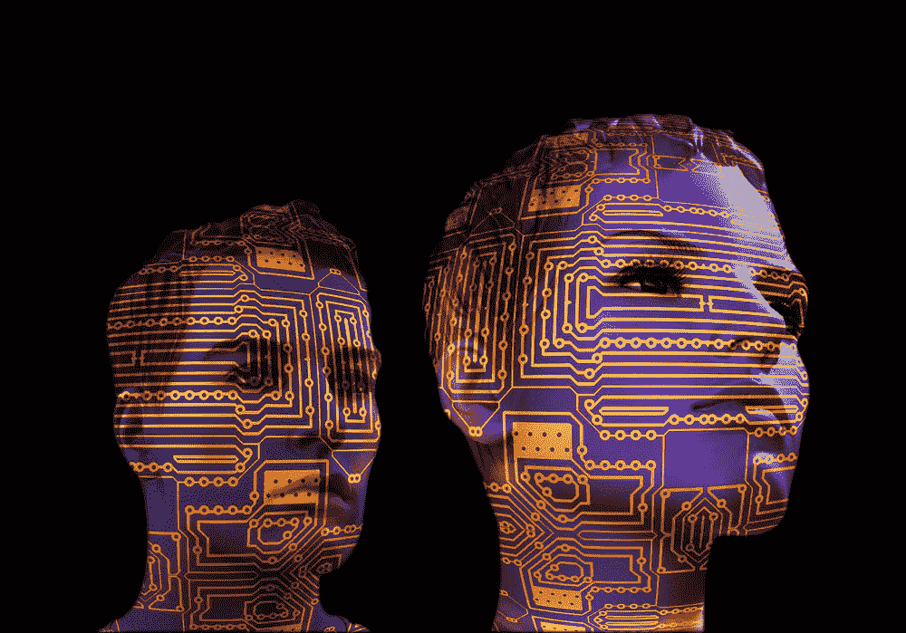

# 读心术，自我复制:回顾年度最佳人工智能故事

> 原文：<https://thenewstack.io/mind-reading-self-replicating-a-look-back-at-the-years-best-ai-stories/>

毫无疑问，人工智能正在以极快的速度发展，2019 年可能会带来更多新的、意想不到的飞跃，进一步开发具有真正的、类似人类的通用人工智能的机器。我们知道我们还没有到那一步，但随着大量与人工智能相关的故事的出现，为了知道我们未来的发展方向，很难跟踪我们过去一年的进展。尽管如此，在不断发展的人工智能和机器学习领域，这里有一些过去一年的亮点。

## 1.读心术人工智能

在过去的一年中，一个更有趣的发展是有一天人工智能可能会被用来“阅读”你的思想。虽然乍一看这可能是一个令人不安的想法，但另一方面是，这种技术可能有助于残疾人更好地交流或观看，甚至有助于改善图像搜索(想象一下仅仅通过可视化来找到特定的图像)。为了展示这种可能性，日本京都大学的一个团队开发了一种重建算法，能够“解码”和优化来自某人看着特定物体的脑电波的复杂视觉信息——让我们离能够准确读取你的思想的机器更近了一步。

*查看更多:[读心术人工智能优化从你的脑电波重建的图像](https://thenewstack.io/mind-reading-ai-optimizes-images-reconstructed-brain-waves/)*

## 2.具有“视觉预见”的机器

深度学习是机器学习的一个特殊子领域，它受到生物大脑结构和功能的启发，旨在开发更好的人工神经网络，这些网络将成为适应性强的机器的基础，这些机器可以像人类一样学习和思考。今年早些时候，加州大学柏克莱分校人工智能研究实验室(BAIR)的研究人员创造了一台机器，它能够使用他们所谓的“视觉预见”来可视化其近期的未来人类婴儿倾向于实验和操纵他们的环境，以便学习，然后将这些经验应用到新的未知情况，这是人类认为理所当然的事情，但实际上机器很难掌握。这种研究可以为机器的一种“视觉想象”铺平道路，使它们能够自主地与周围环境互动。

*阅读更多:[这个机器人可以通过深度学习](https://thenewstack.io/robot-can-visualize-immediate-future-deep-learning/)* 来可视化自己即将到来的未来

## 3.具有社交技能的合作机器

人们可能会认为合作和其他社交技能是人类的专属领域，但正如最近的实验所示，机器也可以被赋予一套人工社交技能，使它们能够与其他类型的机器以及人类合作。在为这组人工合作社交技能创建这样一种算法时，一个国际团队的一名研究人员指出:“最终目标是我们理解与人合作背后的数学，以及人工智能需要什么属性来发展社交技能。人工智能需要能够对我们做出反应，并清楚地表达它在做什么。它必须能够与其他人互动。”

*阅读更多:[具有‘社交技能’的人工智能算法比人类配合得更好](https://thenewstack.io/ai-algorithm-social-skills-cooperates-better-humans/)*

## 4.从错误中学习的人工智能

没有什么比从错误中学习的能力更能让我们变得更有人情味。在所谓的[强化学习](https://thenewstack.io/reinforcement-learning-ready-real-world/)中，人们可能会在机器中发现类似的东西，但正如 OpenAI 的研究人员指出的那样，设计强化学习模型背后的奖励系统可能会变得非常复杂，实际上可能会阻止机器探索任务目标之外的可能性。相反，这个团队提出了一个开源的替代方案，他们称之为[后见之明体验回放](https://arxiv.org/pdf/1707.01495.pdf)(她)。

*阅读更多: [OpenAI 算法允许 AI 从错误中学习](https://thenewstack.io/openai-algorithm-allows-ai-to-learn-from-its-mistakes/)*

## 5.自我复制人工智能

传递成功特征的能力是生物有机体的一个决定性特征。今年早些时候，来自哥伦比亚大学的两名研究人员发现了一种将这一原理应用于人工智能系统的方法——创建名为“ [quines](https://en.wikipedia.org/wiki/Quine_(computing)) 的自我复制神经网络自我复制、自我进化的人工智能可以自动继承前代最成功的特征，这是一个非常诱人的想法，有很多潜在的有用应用。

*阅读更多: [AI 研究人员创造自我复制神经网络](https://thenewstack.io/ai-researchers-create-self-replicating-neural-network/)*

## 6.人工智能中的文化偏见

冷静机器的绝对可靠性是一个容易被接受的谬误。但是正如该领域的专家所显示的那样，在我们的算法中存在大量[隐藏的文化和性别偏见](https://thenewstack.io/when-ai-is-biased/)，当这些算法用于自动决策系统时，可能会影响人们的一生，例如人力资源部门或刑事司法系统中使用的那些算法。随着我们在 2019 年推进人工智能，我们找到解决这种[算法偏见](https://en.wikipedia.org/wiki/Algorithmic_bias)现象的方法将是至关重要的，这样长期存在的偏见和社会不公正就不会通过我们的机器进一步延续。

*多听:[人工智能中的文化偏见](https://thenewstack.io/cultural-bias-in-artificial-intelligence/)*

## 7.人工智能辅助自动化

当然，任何关于人工智能的讨论都无法回避一个不可回避的事实，即人工智能正在帮助各种行业和职业进一步自动化，无论是在[制造业](https://thenewstack.io/robot-tamer-reprograms-industrial-robot-curious-living-creatures/)、[分销业](https://thenewstack.io/amazons-amazing-army-robots/)还是像[金融业](https://thenewstack.io/ai-investors-taking-wall-street/)这样的白领领域。虽然人类工人因越来越智能的人工智能系统而失业的前景似乎很黯淡，但也有一些积极的因素值得期待，例如使用人工智能来帮助自动预测新的和危险的药物相互作用，或自动设计游戏——拯救生命，并可能使其更具娱乐性。

*阅读更多: [Decagon AI 预测新的和危险的药物相互作用](https://thenewstack.io/decagon-ai-predicts-new-and-dangerous-drug-interactions/)和 [AI 通过“概念扩展”自动化视频游戏设计](https://thenewstack.io/ai-automates-video-game-design-with-conceptual-expansion/)*

图片:Franck V. on Unsplash

<svg xmlns:xlink="http://www.w3.org/1999/xlink" viewBox="0 0 68 31" version="1.1"><title>Group</title> <desc>Created with Sketch.</desc></svg>