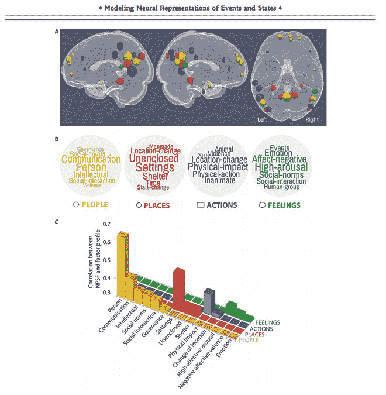
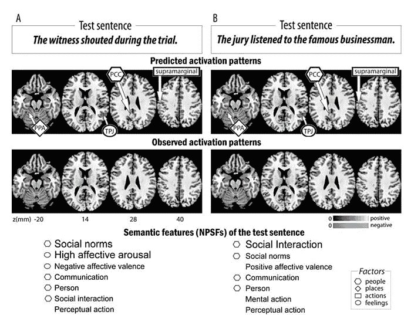
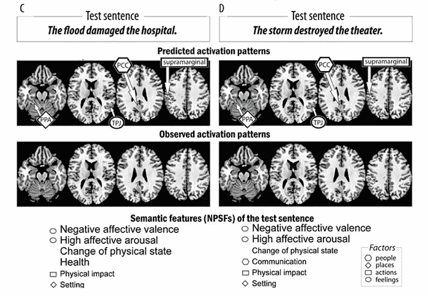

# 读心术使用机器学习来解码复杂的思想

> 原文：<https://thenewstack.io/mind-reading-technology-uses-machine-learning-decode-complex-thoughts/>

阅读人们思想的技术可能看起来像是直接取自科幻小说或秘密政府机构的机密文件，但它可能很快就会成为现实并进入大众市场。新的神经成像技术有助于在人脑中非侵入性识别思想的最新进展，但通常仅限于确定更简单的概念，如单一图像、单词或数字，或者是或否的选择。

现在，来自卡耐基梅隆大学的一组研究人员展示了识别更复杂的思想的可能性，这些思想可能被封装在一个句子中——或者换句话说，由一系列语义“模块”组成——使用 [fMRI](https://en.wikipedia.org/wiki/Functional_magnetic_resonance_imaging) (功能性磁共振成像)技术和机器学习来建模相关的大脑激活模式。

“人类大脑的一大进步是能够将单个概念结合成复杂的想法，不仅想到‘香蕉’，还想到‘我喜欢晚上和朋友一起吃香蕉’，”项目主管、CMU 心理学教授[马塞尔·贾斯特](https://www.cmu.edu/dietrich/psychology/people/core-training-faculty/just-marcel.html)，在[的一个 CMU 宣传故事](https://www.cmu.edu/dietrich/news/news-stories/2017/june/brain-decoding-complex-thoughts.html)中说道。“我们终于开发出一种方法，可以在功能性核磁共振成像信号中看到这种复杂性的想法。思想和大脑激活模式之间的这种对应关系的发现告诉我们思想是由什么构成的。”

## 描绘复杂的思想

该团队的研究结果发表在《人类大脑映射》杂志上，并得到了智能高级研究项目活动的资助，描述了该团队如何使用功能磁共振成像技术来数字化绘制 240 个“事件”的大脑编码，这些“事件”以“刺激句”的形式出现，如“证人在审判期间大喊”，“记者采访了法官”和“快乐的孩子找到了一角硬币”。

这些句子是由 42 个“意义成分”组成的，或者如研究人员所称的，“神经似是而非的语义特征”(NPSFs)，这些特征利用了不同的特征，如人、环境、大小和身体动作。研究人员指出，每种类型的信息都是在大脑的不同部分和系统中处理的，当这项研究的七名参与者中的每一个人读完一个句子时，就会绘制出整体的神经图像。

通过训练与每个语义特征相关联的神经激活模式的回归模型，该软件能够预测带有新单词的全新句子背后的神经签名。此外，当显示一个新句子的神经特征时，计算机模型也能够预测其潜在的语义内容，准确率为 87%。

最大的挑战之一是避开 fMRI 混淆大脑信号的倾向。为了解决这个问题，该团队使用了一种有趣的方法:他们通过“平均化”出现在不同句子中的同一目标概念的大脑图像来获得单个单词概念的神经签名的“估计值”(假设其他单词的签名被“平均化”)。正如该团队在他们的论文中解释的那样:“由此产生的对概念的神经表示的估计为开发语义表示和大脑激活模式之间的映射提供了坚实的基础。”

Just 说:“我们的方法克服了 fMRI 的不幸特性，即把时间上接近的大脑事件发出的信号混在一起，就像阅读一个句子中两个连续的单词一样。”“这一进步使得第一次有可能解码包含几个概念的思想。人类的大部分思想都是由这个组成的。”

该团队现在计划继续绘制大脑地图，因为它在思考更复杂的概念。“下一步可能是解码一个人正在思考的主题的一般类型，如地质或滑板，”Just 说。“我们正在绘制大脑中所有知识类型的地图。”

因此，尽管这项技术还有一些路要走，以解释更复杂的思想，但它无疑会在许多领域有用，如改进的脑机接口，安全认证，执法，甚至是 T2 的神经营销，正如脸书 T4 计划做的 T5。

但也有许多人对这种技术保持合理的谨慎，因为任何工具都可以被用来做好事或制造烦恼，比如脸书可能会利用你的思想向你出售广告——或者用于更邪恶的目的，比如政府可能会侵犯人们的隐私并监控他们的想法。这将建立一个未来的奥威尔式的场景，我们可能不得不小心自己的想法，因为害怕因所谓的[思想罪](https://en.wikipedia.org/wiki/Thoughtcrime)而受到惩罚。当然，阻止新技术的发展是不现实的，但确保围绕这些问题的健康的伦理辩论仍然处于前沿也是一个好主意。

图片:卡内基梅隆大学。

<svg xmlns:xlink="http://www.w3.org/1999/xlink" viewBox="0 0 68 31" version="1.1"><title>Group</title> <desc>Created with Sketch.</desc></svg>