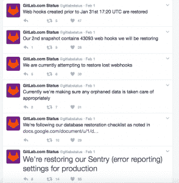

# GitLab 数据丢失事件促使对其恢复流程进行审查

> 原文：<https://thenewstack.io/minimal-data-loss-gitlab-leads-major-review-restore-processes/>

本周 GitLab 托管代码服务的短暂中断让整个技术社区既恐惧又同情，并提醒人们一次又一次测试备份的重要性。

周二，一名 GitLab 管理员在一次例行数据库复制中意外删除了一个目录中的实时生产数据。在从六个小时前的最后一次备份进行恢复的过程中，该公司发现其五个备份例程中没有一个完全正常工作。GitLab 在网上发布的事故报告指出，擦除会影响问题和合并请求，但不会影响 git 存储库本身。

根据 GitLab 临时市场副总裁[蒂姆·安格雷德](https://www.linkedin.com/in/timanglade)的说法，GitLab.com[的在线服务中断 6 小时只影响了不到百分之一的用户，最终没有影响到任何企业客户。他说，人们使用 GitLab 的面包和黄油没有受到影响。没有文件、数据丢失，只有特定类型的元数据，包括注释、存储数据问题、注释片段和用户的项目数据。根据事故报告，多达 707 名用户可能丢失了元数据。](https://gitlab.com/)

安格雷德解释说，有两个问题:一个是直接的底层数据库问题，GitLab 离线解决了这个问题；另一个是数据日志问题，暴露了 GitLab 恢复过程中的一个问题。在这种情况下，GitLab 使用 PostgreSQL 开源数据库。

@gitlabstatus 发了一系列更新

为了与公司政策保持一致，他们将日志问题变得非常透明，通过 tweets、[blog](https://gitlab.com/gitlab-com/infrastructure/issues/1110)甚至一个生活流 YouTube 频道(现已离线)与 GitLab 社区沟通，分享问题解决的进展。

超过 2000 人关注了 YouTube 上的直播，并提供了安格雷德所说的大部分有用的建议，耶鲁安·尼霍夫正在引导第 1110 号问题解决。

在周三的一次采访中，安格拉德承认，开放政策带来了比预期更多的担忧和恐惧，但恢复团队仍然致力于让社区知道每一步都发生了什么。标题称之为“崩溃”可能也没多大帮助。

但是，当系统管理员讲述他们自己失败的恢复并承认备份过程可能有多复杂时，开发社区的回应更多的是同情而不是阴影。

[在博客文章](http://blog.2ndquadrant.com/dataloss-at-gitlab/)、[中，PostgreSQL 企业支持提供商](https://www.linkedin.com/in/simonat2ndquadrantdotcom/)[第二象限](https://2ndquadrant.com/en/)的首席技术官 Simon Riggs 称赞了 GitLab 对事件的处理:“感谢您公开发布此事，让我们对您的事后分析做出评论。”

“我们经历过，”网络开发者 Leonid Mamchenkov 在他的博客上补充道。“我没有(也没有)任何关于 [GitLab](https://gitlab.com/) 的数据，所以我没有丢失任何东西。但是作为一名多年的系统管理员(和备份管理员)，我可以想象团队的身体和心理状态。”

尽管实际影响很小，但结果却是对 GitLab 恢复过程的一次完整回顾。

引用一句古老的管理格言“没有成功的备份，只有失败的备份或成功的恢复”，Anglade 说，现在数据库恢复在线，他们的运营团队将在整个公司范围内审查端到端恢复流程。

虽然这看起来有点像马儿跑了之后关上谷仓的门，但这是公司应该采取的积极措施。本周的错误影响了不到 1%的用户群。下次他们可能就没这么幸运了。

安格雷德解释说，这不仅仅是人为错误，尽管本周人们对此有很多关注。这是为了确保所有的东西都能协同工作。“我们可能需要投资于我们的基础设施，包括技术和人力，我们将深入研究如何解决这个问题。也是技术中间的人类系统使这一过程成为可能。”

让这成为各地公司的警示故事。正如 Mamchenkov 所说，“我想我今天会通宵进行测试恢复，以确保我所有的东西都被覆盖了……”

通过 Pixabay 的特征图像。

<svg xmlns:xlink="http://www.w3.org/1999/xlink" viewBox="0 0 68 31" version="1.1"><title>Group</title> <desc>Created with Sketch.</desc></svg>