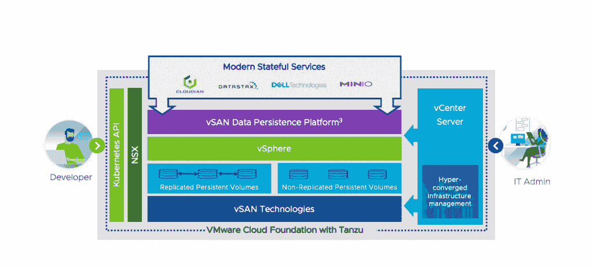

# MinIO 将云本机应用程序引入 VMware 的 vSAN

> 原文：<https://thenewstack.io/minio-brings-cloud-native-applications-into-vmwares-vsan/>

云原生对象存储提供商 MinIO】被选为帮助 VMware 创建其[新发布的](https://www.vmware.com/company/news/releases/vmw-newsfeed.VMware-Unlocks-the-Power-of-Kubernetes-for-70-Million-Plus-Workloads-Running-on-vSphere.ab5f2e85-0dd7-40e2-a92c-aa3e41eb6f1b.html) vSAN 数据持久性平台的四家存储公司之一。VMware 的平台旨在提供一种在 VMware 基础架构上运行“有状态”云本机应用程序的方法。

合作背后的理念是直接从 vSphere 配置对象存储，并且可以在 vSAN 数据持久化平台上运行，[未修改](https://blog.min.io/high-performance-object-storage-for-vmware-cloud-foundation-with-vmware-tanzu/)。MinIO 联合创始人兼首席执行官 [AB Periasamy](https://www.linkedin.com/in/abperiasamy) 解释说，它解决了行业中的一个脱节问题，即应用程序团队选择使用 Kubernetes，但他们的 It 支持仍然控制着基础设施。许多开发人员“在生产中使用 MinIO 已经有一段时间了，现在 VMware 正在通过将 Kubernetes 纳入其手中来弥合这一差距，因此它们可以共存而不是争斗。”

合作伙伴中的其他公司是 Cloudian、DataStax 和戴尔。 

在 VMware 去年收购 Pivotal 并随后推出其 Tanzu 平台之后，VMware 稳步前进，将运行在虚拟机上的工作负载与使用容器和 Kubernetes 的工作负载结合在一起。本周，该公司[继续这一努力](https://thenewstack.io/vmware-provides-a-kubernetes-on-ramp-for-vsphere-workloads/)，将其 [vSphere 虚拟化平台](https://www.vmware.com/products/vsphere.html)与其 [Tanzu 产品组合](https://tanzu.vmware.com/tanzu)相结合，以帮助将已经在 vSphere 上运行的数百万工作负载扩展到 Kubernetes 生态系统中。

西蒙兹说，在部署的 [MinIO](https://min.io/) 对象存储软件中，61%的实例是容器化的，26%的 MinIO 部署和 42%的容器化实例是通过 Kubernetes 管理的。

虽然 MinIO 对象存储服务器是 Kubernetes 原生的，但 Periasamy 解释说，它不是为了依赖 Kubernetes 进行扩展而构建的，而是 Kubernetes 成为管理整个 DevOps 生命周期的有用工具。Periasamy 解释说，Kubernetes 提供的 API 框架不仅可以部署应用程序，还可以处理第二天的操作，并使团队能够自动处理这些操作。

Periasamy 说，有了 VMware，“IT 管理员实际上可以构建一个私有云存储基础架构，这也是多租户的，他们只需几分钟就可以完成，而无需学习拼写 Kubernetes。

DataStax 和 VMware 是新堆栈的赞助商。

来自 Pexels 的 Van L 的特写图像。

<svg xmlns:xlink="http://www.w3.org/1999/xlink" viewBox="0 0 68 31" version="1.1"><title>Group</title> <desc>Created with Sketch.</desc></svg>