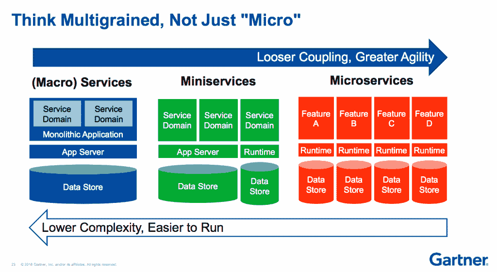

# 微型服务是微型服务的现实替代方案

> 原文：<https://thenewstack.io/miniservices-a-realistic-alternative-to-microservices/>

毫无疑问，微服务是现代软件开发中最热门的趋势之一。每个人都喜欢吹嘘他们正在使用它，但是他们真的在使用吗？进一步回顾，对事件驱动架构的缺乏理解可能会使更多的团队使用更新创造的“微型服务”来满足业务需求。

## 你真的在使用微服务吗？

Martin Fowler 对 **[微服务架构](https://www.martinfowler.com/articles/microservices.html#CharacteristicsOfAMicroserviceArchitecture)** 的流行定义应该满足以下标准:

*   可独立部署和扩展执行
*   有单一的责任
*   松散耦合

[Cloud Elements](https://twitter.com/gssor?lang=en)的营销副总裁 Ross Garrett 告诉新堆栈，大多数团队都在尽可能地分散，但他们并没有使用他们认为的那么多微服务。

他说，微服务架构通常有一个基于消息的系统，在这个系统中，微服务可以彼此异步通信，现在许多现代开发人员都不熟悉这个通信层。这让他们又回到了使用 HTTP。

“HTTP 作为一个简单的请求-响应 Web API 是简单的，它很容易理解，每个人都知道如何使用 RESTful 方式进行通信，”Garrett 说，但“这违背了 Martin Fowler 所说的松散耦合”，因为“在 HTTP 中，服务必须知道彼此，所以你必须围绕每个服务编写接口。”

福勒那本声名狼藉的书认为这些服务应该完全独立存在。一个 HTTP-build 服务必须知道更多关于它周围发生的事情才能进行通信，并且它需要知道比定义为微服务更多的东西。

“在一个真正的微服务架构中，每个服务应该对其周围的服务一无所知，为了实现这一点，必须存在一种非常特殊的发布-订阅通信模式，发布在消息队列中，以便其他人可以检索它们，这是一种最松散的耦合，”Garrett 解释道。

“然而，在应用程序开发中，没有多少开发人员熟悉发布-订阅、消息队列集成模式，因此他们回归到 REST APIs，作为让这些服务进行通信的一种方式。然后因为他们使用 REST，他们必须知道你周围的所有服务，你就失去了松散耦合，”他继续说道。

加勒特说，开发人员然后将这些应用程序分解成最小的独立功能组件，这些组件仍然允许你进行通信，但如果他们使用 HTTP，他们就不能完全独立。

加勒特说没关系。是时候拥抱“迷你服务”了，不管怎样，大多数公司都在使用它。他说，范围或规模并不重要，因为微型服务根本不符合纯粹主义者对微型服务的看法。

> “[微服务]就像一组微服务以一种小模式聚集在一起。”
> —罗斯·加勒特

“这几乎就像一群微服务以一种小模式聚集在一起，因为他们必须相互了解，”加勒特说。

来源:Gartner

自称 API 勤杂工的阿诺·劳雷特这样区分了这两者:“微服务似乎是一种更简单、更实用的微服务或其他密切相关的方式。例如，每个微服务必须处理自己的数据，微服务可能会共享数据。”

> “每个微服务必须处理自己的数据，微服务可以共享数据。” —阿诺·劳雷

这都属于事件驱动架构的范畴，用请求-响应模式对他们关心的事件做出反应。Garrett 解释说，这些服务就像“我必须告诉你一些事情，我不能只是接收一个随机事件，”这就偏离了微服务架构真正看起来的意图。

他说，如果你问一个组织他们是否在使用微服务，答案总是“当然”

“这更多的是关于开发者对集成模式和技术的理解，而不是人们想要建立一个迷你服务，”加勒特说。我会说，除非你已经超越了 HTTP 作为这些服务通信的方式，否则你就是在做迷你服务。"

## 架构之前的用例

最后，无论您是在做微型、迷你，甚至是整体，都没有关系，重要的是您的架构决策的业务影响。如果你能得到你需要的解决方案，而不必达到纯粹主义者对微服务的看法，那就没关系了。

> “不要把架构完善和商业价值混为一谈。” —罗斯·盖瑞特

加勒特说，这一切都是关于做出正确的商业决策，理解你为什么试图做出改变，以及理解你试图解决的问题。

IT 分析公司 [Gartner](https://www.gartner.com/) 的研究开发人员 Gary Olliffe 最近发表了一篇题为:“[你不是网飞](https://www.gartner.com/webinar/3437517)的演讲:如何以及何时在企业中使用微服务。”顾名思义，网飞作为世界上在架构上最具前瞻性的公司之一，有着大多数微服务都可以解决的特定挑战，但是，仅仅因为它为他们工作，并不意味着它也为你工作。网飞必须了解他们需要公开服务的不同端点，以及公开服务时面临不同约束的各种不同设备。往往微服务是正确的选择，但很多时候还是在用 HTTP。

Garrett 说这“不是纯粹主义者对微服务的看法，但它在功能上提供了正确的目标。对我来说，决策点部分是我如何解决这个特殊的问题，以及我有什么技能来解决它。”

数字化转型咨询公司的创始人詹姆斯·希金波坦认为微服务的认可是朝着正确方向迈出的一步，他称之为“模块化整体”。

“很高兴看到模块化思维——以及松散耦合和高内聚——重新进入我们的软件设计。微服务是一个适合少数人的极端。从中得到的教训适合许多人。”

“组织可以选择:构建模块化整体架构或构建微服务。团队可以在两者之间有效地分配工作，但微服务架构的原则有助于管理复杂解决方案带来的挑战，”他说。“微服务的缺点是，它们将复杂性推到了边缘。诀窍在于找到恰当的平衡点，利用复杂性来提高组织的效率。”

## 何时使用微服务还是微服务还是整体服务

微服务工具提供商 KintoHub 的创始人兼首席执行官 Joseph Cooper 分享了他 15 年来为游戏行业编写后端解决方案的经验，他说，游戏行业有一系列独特的问题，可以通过微服务、微服务和 monolith 的架构大杂烩来解决。

对于 Cooper 来说，miniservices 就是将一项功能作为一项服务来执行。“微型服务是一种单一的服务功能，”他说。他举了一个例子，“当你有 lambda 和 Google 功能，你想确保最大的成本效率，你不想启动一个完整的功能，而只是你感兴趣的功能。”

他说，当你有更高的复杂性时，迷你服务是可靠的解决方案，比如图像处理，他说这是“一个非常简单的程序，不需要其他服务之间的任何通信。”

另一方面，“对于微服务来说，好处是产品中有更多的代码。与迷你服务相比，它们的成本效率较低，因为你必须实时加载多个功能，或者让它们一直运行。”

他继续说道，“有时它们并不是无服务器的，而是一直在运行。虽然失去了成本效益，但好处是在单个项目中增加了更多功能，使它们更容易使用和理解。”

如果你的项目在多个代码库中有一个功能，微服务是一个合理的解决方案。另一方面，库珀说，如果你正在运行一个电子商务网站或游戏，其中你可以在一个存储库中有十个或更多的功能，有时一个功能有更多的功能要完成，而迷你服务更适合这种需求。

不要忘记，不仅仅是趋势微服务和新兴(或实现)的微服务才是解决方案。例如，钓鱼游戏 EatMe.io 会在一个房间里有多达 100 名全球并发玩家，游戏在 12 个不同的亚马逊网络服务区域运行，这使得扩展成为他们最大的挑战。此外，在制作的 15 款游戏中，只有 7 款活了过来。为了快速试验和迭代，他们将在一个整体上构建原型，然后分解成小型服务或微服务。

“更好的做法是[在整体平台上构建]概念验证，因为这样更易于管理。然后，在你的概念验证之后，你对你的 MVP(最低价值产品)有了一个概念，然后你可以重新开始，用微服务来构建它，”库珀解释道。“有时你不知道你的产品会是什么样子，如果你在微服务上构建它，你会在概念验证上投入太多时间。”

他还表示，如果一款游戏的新版本不再推出，但他们希望保持当前版本，他们将利用迷你服务在游戏退出市场之前最大限度地节省成本。

<svg xmlns:xlink="http://www.w3.org/1999/xlink" viewBox="0 0 68 31" version="1.1"><title>Group</title> <desc>Created with Sketch.</desc></svg>