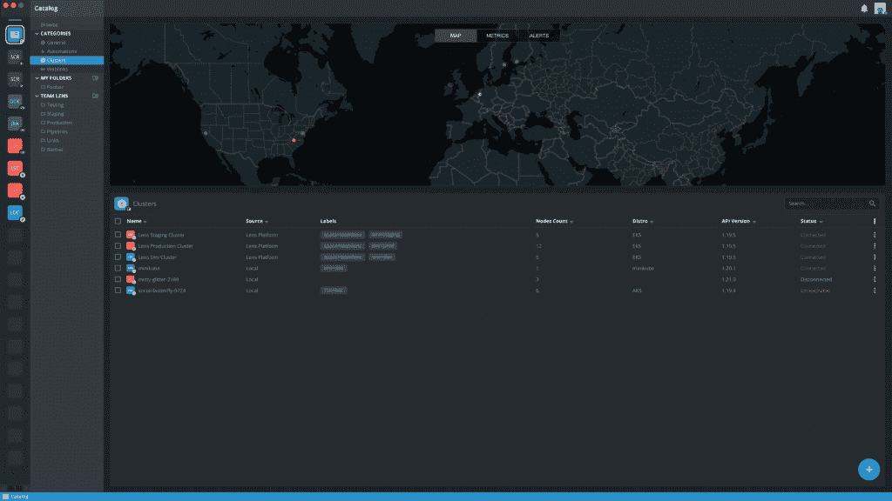
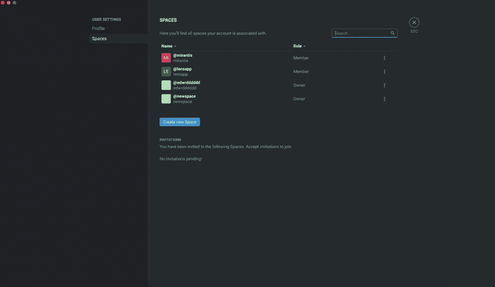

# Mirantis 的 Kubernetes IDE 镜头记录了完整的云原生堆栈

> 原文：<https://thenewstack.io/mirantis-kubernetes-ide-lens-catalogs-the-full-cloud-native-stack/>

开源企业软件提供商 Mirantis 在本周的[kube con+CloudNativeCon Europe](https://events.linuxfoundation.org/kubecon-cloudnativecon-europe/)上发布了最新版本的 [Lens](https://www.mirantis.com/blog/lens-3-6-released/) 的测试版，这是其针对 Kubernetes 的集成开发环境(IDE)，这次的重点是使 IDE 更易于新用户使用，并查看 Kubernetes 集群内外的所有可用资源。

Lens 5 的测试版引入了三个新功能，特别是使访问集群、服务、工具、管道、自动化和资源变得更加容易，无论它们在哪里或如何运行。它们旨在增强协作，并更容易地执行经常重复的任务。

其中第一个功能“目录”不仅可以让您轻松访问您的 Kube 集群，而且基本上可以访问您的整个云原生技术堆栈，无论我们谈论的是集群本身还是任何服务、工作负载、工具、自动化、管道等。这可能与你目前正在进行的项目有关，”Lens IDE 的负责人、 [Mirantis](https://www.mirantis.com/) 的高级工程总监[米斯卡·凯皮艾宁](https://fi.linkedin.com/in/miskakaipiainen)解释道。

Kaipiainen 强调目录是 beta 版的核心，Lens Spaces 不仅提供了一种方便新用户加入的方式，还提供了访问目录的途径。Lens Spaces 提供了一个集成的团队环境，管理员可以在其中组织、访问集群，并与其他团队成员共享集群，无论是在本地还是在云中，同时还为管理员提供了一种简单的方法来邀请新的团队成员，其过程类似于邀请某人参加 Zoom 会议。

“我们从用户那里了解到，对于大型团队来说，加入 Lens 并不一定那么容易。到目前为止，Lens 一直是一个单一的用户体验，每个用户都可以下载软件，并根据自己的使用情况进行配置，”Kaipiainen 说。“但现在，随着 Lens 5 的推出，我们引入了 Lens Spaces，这是 Lens 的一个协作维度，允许开发团队创建一个共享目录，以便他们的所有资产、集群和他们日常工作所需的一切。现在，他们可以开始在他们的团队之间共享这些目录，并且他们可以轻松地开始共享对目录中的资源的访问。”

Kaipiainen 指出，目录功能不仅适用于 Kubernetes 资源，也适用于非 Kubernetes 资源，如 S3 桶、路由、证书和“Kubernetes 周围的所有东西”

最后，Lens 5 的测试版引入了 Hotbar 功能，Kaipiainen 表示这是一个游戏玩家熟悉的功能。Hotbar 本质上提供了操作的宏，只需点击一个按钮就可以轻松快速地执行，目前，beta 版正在用用户现有的集群预先填充这些宏，为他们提供了一种快速切换的方式。

Lens 5 beta 紧随去年发布的 Lens 4 之后，后者[引入了一个用于扩展的 API](https://thenewstack.io/kubernetes-ide-lens-adds-an-api-for-cloud-native-extensions/)，Kaipiainen 说，从那时起，他们已经看到大约 100 到 150 个扩展被创建，尽管大多数是专有的，供大型组织内部使用。然而，[只有少数几个公开可用的扩展](https://github.com/lensapp/lens-extensions)，Kaipiainen 说，他预计随着目录的引入，组织可能会创建更多的扩展。

“如果你是一家大型企业，你可能会有自己的目录条目和目录中的内容。对于 Lens 4，我们引入了扩展 AP，因此现在扩展创建者可以完全扩展通过目录可访问的这类项目的功能，”Kaipiainen 说。

该目录是 Lens 向前发展的关键，Kaipiainen 还着眼于在不久的将来与 [Crossplane](https://crossplane.io/) 的集成，这将带来与本地 Kubernetes 集群之外的那些资源进一步交互的能力。

“Crossplane 的美妙之处在于，它基本上以相似的方式抽象了不同的云提供商。如果我使用 Crossplane，我可以使用 Kubernetes API 轻松地为我的云提供商创建资源。我觉得这很美。它将使 Kubernetes 的功能从仅仅是一个容器编排，实际上成为云编排器。例如，如果需要，我可以创建一个 RDS 实例，而不必向 AWS 提交任何 API 请求。我将只对我的 Kubernetes 做这个 API 请求，而我的 Kubernetes 在 Crossplane 的帮助下，将实际上帮助我完成这个任务，”Kaipiainen 说。“现在还为时尚早，但我认为这个概念很棒，我觉得它非常符合我们想要的方向。”

<svg xmlns:xlink="http://www.w3.org/1999/xlink" viewBox="0 0 68 31" version="1.1"><title>Group</title> <desc>Created with Sketch.</desc></svg>