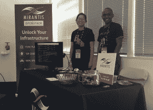

# SUSE 为 Mirantis OpenStack 提供 RHEL 支持，而 Red Hat 提出异议

> 原文：<https://thenewstack.io/mirantis-signs-deal-suse-offers-rhel-support/>

Mirantis 和 SUSE 联手，不仅为在[SUSE Linux Enterprise Server](https://www.suse.com/products/server)(SLES)上运行 [Mirantis OpenStack](https://www.mirantis.com/products/mirantis-openstack-software/) 发行版提供无缝支持，而且令人惊讶的是，还为 Red Hat Enterprise Linux (RHEL)和 CentOS 提供无缝支持。

“我们的许多大客户运行两三种不同的 Linux 版本。现在 OpenStack 用户可以从 Mirantis 的一个地方获得对其主要 Linux 发行版的支持，”Mirantis 联合创始人兼首席营销官 [Boris Renski](https://twitter.com/zer0tweets) 说。

这两家公司在本周于加州山景城举行的 OpenStack 硅谷 2016 大会上宣布了这一合作关系。

米兰蒂斯将在米兰蒂斯 OpenStack 上为 SLES 提供全面支持。“以前，Mirantis OpenStack 未经认证/支持，无法在 SUSE Linux Enterprise Server 上运行。这意味着选择了米兰蒂斯的 SUSE 客户需要引入另一个 Linux，”SUSE 战略、联盟和营销总裁[迈克尔·米勒](https://twitter.com/michaelwmiller)说。

客户现在可以在 SLES 上运行两家公司都支持的 Mirantis OpenStack。“这意味着他们将 SUSE Linux Enterprise Server 作为关键任务工作负载和 OpenStack 私有云的战略平台。”

Mirantis 将负责 L1 和 L2 的支持，与 SUSE 合作处理后端操作系统级 L3 支持。从顾客的角度来看，他们只与米兰提斯打交道。因此，客户获得了“一站式”体验。

“建立 SUSE Linux Enterprise Server 作为与 Mirantis OpenStack 一起使用的开发平台，将确保及时测试、验证和优化解决方案，”Miller 说。

随着时间的推移，SUSE 和 Mirantis 将探索协作选项，以进一步优化 SUSE Linux Enterprise Server for Mirantis open stack，并将所有更改贡献给各自的开源项目。

米兰蒂斯产品营销副总裁 [Kamesh Pemmaraju](https://twitter.com/kpemmaraju) 解释道:“关键是我们将开始在社区的上游合作，开始在认证和支持方面的合作，这将是一个持续的过程，让工程团队在上游进行开发和测试。

## **将 RHEL 加入其中**

Mirantis 已经和 Canonical 建立了 Ubuntu 集成的合作关系，现在也有了 SUSE 的支持。唯一没有正式支持 Mirantis 的主要企业 Linux 发行商是企业 Linux 世界中 800 磅重的大猩猩，Red Hat。

Red Hat 不是这笔交易的一部分，那么 Mirantis 和 SUSE 将如何支持 RHEL 的客户呢？“该产品基于 SUSE Linux Enterprise Server，支持范围有所扩展，涵盖 RHEL 和 CentOS。SUSE 在这方面非常有经验，几年来一直提供扩展支持，”Miller 说。

Mirantis 将在一年或三年内为当前版本的 SUSE Linux Enterprise Server、RHEL 和 CentOS 提供支持，包括安全和其他更新，以及 24 小时电子邮件和电话支持，保证一小时响应时间。

也许这是一个必要的举措，因为看起来 Red Hat 自己不会很快支持 Mirantis，而是选择支持自己的 OpenStack 发行版。

“从 OpenStack 的角度来看，每个企业供应商都选择了 Linux 操作系统来与各自的 OpenStack 集成，”Red Hat 全球产品营销高级总监玛格丽特·道森(Margaret Dawson)说。

“我们将 OpenStack 与 Red Hat Enterprise Linux 相集成，以确保 Red Hat Enterprise Linux 生态系统多年来享有的相同级别的安全性、可靠性、稳定性和支持。将操作系统和 OpenStack 分割开来会破坏我们的企业稳定性、支持和生命周期，并危及生态系统，”她说。

她说得很清楚。“我们的立场没有改变，因为我们无法在技术上支持其他供应商的 Linux/OpenStack 发行版。“这不是 Red Hat 独有的，因为所有 OpenStack 供应商——包括 Mirantis——都集成并支持他们自己的 Linux 版本。

红帽也不特别喜欢 SUSE 的 RHEL 支持的想法。Dawson 说，“Mirantis 和 SUSE 声称他们可以为另一家公司的产品提供支持，这不仅对我们来说毫无意义，而且对客户来说肯定会令人困惑并具有潜在的危险。与任何任务关键型基础架构一样，安全性、一致性和性能在部署的开始和整个生命周期中都至关重要。”

“这就是客户与 Red Hat 合作的原因。红帽订阅提供持续集成、更新和支持的技术平台，由红帽直接数字签名和提供，”道森说。当一个或多个包被第三方替换并交付时，产品的工程完整性就会受到损害，我们不再将该部署视为 Red Hat 产品

米兰蒂斯在 OpenStack 硅谷 2016。

“Red Hat 奉行 OpenStack 与他们的 Linux 发行版合作的策略，因此，实际上拒绝支持选择在其 Linux 上运行任何非 Red Hat 版本的 OpenStack 的客户。这种策略是红帽独有的，Canonical 和 SUSE 都没有追求同样的策略，”Renski 说。

Renski 指出，Mirantis 没有发行 Linux 发行版，而是选择与 Linux 发行商合作支持底层 Linux 操作系统。米兰蒂斯曾与红帽公司会面，但据伦斯基称，讨论没有产生任何有意义的结果。

“这整个争论的讽刺之处在于，通过在 SUSE 的操作系统上认证和优化其 OpenStack 平台，他们正在做我们认为需要的事情——拥有完全支持和集成的 OpenStack 和 Linux 操作系统，”Dawson 说。

## **记住用户**

这里的主要目标是让 OpenStack 客户的生活更轻松。简而言之，除了公司之间的所有竞争，这笔交易意味着 OpenStack 用户的灵活性和便利性。

“这种伙伴关系为客户提供了更多的选择，没有供应商和技术锁定，”米勒说。

因为 SUSE 已经提供了他们自己的 OpenStack 云，所以存在冲突的可能性。Miller 澄清说，这种合作关系专注于企业 Linux 支持，并不影响 SUSE 对 SUSE OpenStack Cloud 在 OpenStack 市场的承诺和关注。

“SUSE OpenStack Cloud 对于软件定义的数据中心的 SUSE 愿景具有战略性和基础性意义。SUSE 将继续在 SUSE OpenStack Cloud 上进行创新，并将这种创新提供给希望构建私有云的客户。SUSE 和 Mirantis 显然继续在 OpenStack 市场上直接竞争。”

随着与 Canonical 和 SUSE 建立合作伙伴关系，以及现在对 RHEL 和 CentOS 的支持，Mirantis 正在向成为一站式 OpenStack 商店迈进

<svg xmlns:xlink="http://www.w3.org/1999/xlink" viewBox="0 0 68 31" version="1.1"><title>Group</title> <desc>Created with Sketch.</desc></svg>