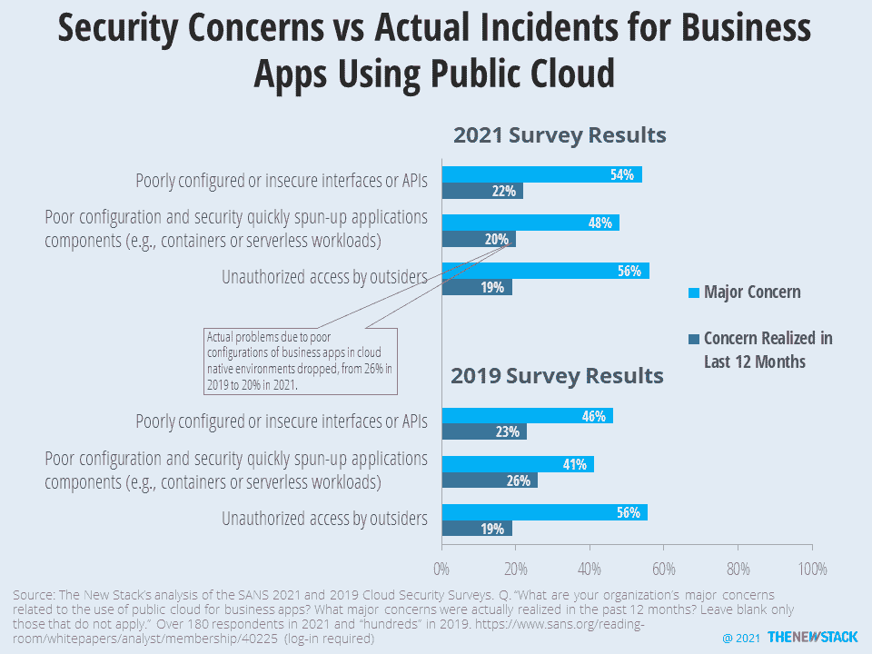

# 错误配置的担忧增加

> 原文：<https://thenewstack.io/misconfiguration-worries-grow/>

在公共云中运行业务应用程序时，错误配置是一个主要的安全问题。基础架构、应用程序和策略设置方面的错误可能会产生明显不同的影响，但它们都被标为“配置错误”

首先是坏消息。在 [SANS Institute](https://www.sans.org) 对信息安全专业人士的最新[调查](https://www.sans.org/reading-room/whitepapers/analyst/membership/40225)中，54%的人认为配置不佳或不安全的接口或 API 是业务应用程序的主要问题，这比 2019 年版本的研究中 46%的人有所增加。每 2.5 名担心这类错误配置的安全专家中就有一名在过去的 12 个月里亲眼目睹了他们的担心变成了现实，不安全的接口或 API 被利用。

与配置不佳或快速启动的云原生工作负载(无服务器或基于容器)的体验形成对比。对这一问题的关注也有所增加，从调查的 41%增加到 46%。然而，当谈到实际遇到的问题时，并没有以同样的速度。在 2021 年的研究中，只有 20%的人最近经历了相关事件，比 2019 年低了六个百分点。

当实际事件发生时，错误配置的云资源或服务在 49%的情况下是罪魁祸首。针对不安全的 API 和云提供商的攻击也在增加。尽管有所增长，但也有大幅下降。对于影响公共云中运行的业务应用程序的违规，特权用户滥用和未经授权的应用程序不太可能是根本原因。这对于所有人来说都是好消息，除了基于身份和角色的管理领域的公司投资者。

来源:SANS 2021 云安全调查。

<svg xmlns:xlink="http://www.w3.org/1999/xlink" viewBox="0 0 68 31" version="1.1"><title>Group</title> <desc>Created with Sketch.</desc></svg>