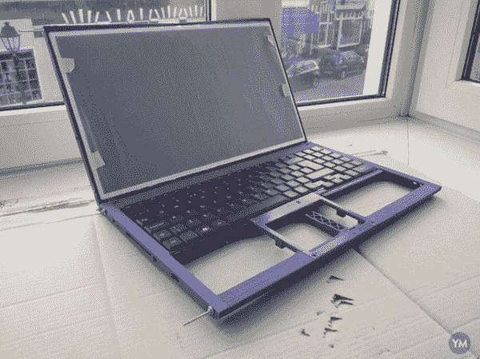
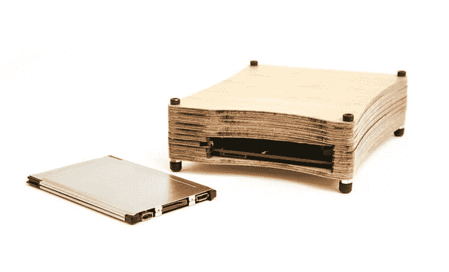

# 构建生态友好型“模块化”计算设备的使命

> 原文：<https://thenewstack.io/mission-build-eco-friendly-modular-computing-devices/>

Luke Leighton 是一位专注的自由软件工程师，他有一个更大的目标——试图推动自由硬件的发展。他的工作可能最终导致世界上第一个免费处理器，以及基于硬件的隐私保护的新突破。

他的公司 [Rhombus Tech](http://rhombus-tech.net/) 已经在[发起了一项众筹活动，按照](https://www.crowdsupply.com/eoma68/micro-desktop/) [EOMA68 标准](http://elinux.org/Embedded_Open_Modular_Architecture/EOMA-68)制造“模块化”计算机。借助 EOMA68，插入式 CPU 卡可以与各种设备交换，包括可互换的笔记本电脑“外壳”以及小型木制微型台式机外壳。根据 Leighton 的众筹页面，随着更多的开发，同样的卡最终可以被换成相机、智能手机、平板电脑或游戏机。

为了做到这一点，他首先制作了一个可以用于各种设备的主板，以及一些独立的、可回收的外壳。

他在众筹页面上写道:“每当我们与人们谈论我们正在做的事情时，他们都会对环保、灵活、可升级的设备感到兴奋，这些设备可以为他们省钱，给他们选择和更好的安全性，同时减少电子垃圾。”

根据该运动网站上的一段视频，这种“电脑卡”实际上可以放进你的钱包。对于 EOMA68 设备，“升级”只是将新的计算机卡插入现有设备。“安装一张新的 CPU 卡只需要几秒钟，”嵌入式 Linux wiki 报道说。

旧卡甚至可以作为二手 CPU 传递给其他设备，使零件回收变得非常容易，并使一些电子垃圾远离我们的垃圾填埋场。兼容 EOMA68 的笔记本电脑的机身也很容易回收，因为它从一开始就可以从主板上拆卸下来。“反对计划淘汰的浪费……”该运动的宣传视频敦促道。“在您需要的时候升级您需要的东西。”

由于它们是由 3D 打印机生成的，Leighton 还预测了一个更大的优势:如果你的笔记本电脑外壳损坏了，你可以简单地打印出一个替代品。

“见鬼，你不一定要打破任何东西才能享受笔记本电脑的乐趣:也许你想自由地改变颜色，从银色到浅绿色再到亮橙色……”

现在想一想:你如何确定你当前的主板上没有安装后门？这就是专有产品的问题，无论是软件还是硬件。你只需要相信制造商已经发现了所有的安全漏洞，并且他们没有安装任何后门。

但 Leighton 的主板将是非专有的，“以确保你的计算机数据的完整性，超过在北美、欧洲(或世界大部分地区)出售的任何东西。而且，因为我们有完整的来源，所以有机会清除那些慢慢进入我们计算设备的后门。”

“没有坚实的基础和对你的计算设备上运行的东西的理解，就没有安全可言，”Leighton 写道。

Linux 杂志称它不仅对环境负责，有安全意识，而且是一种可以在制造业中建立开放硬件的产品。该杂志回顾了 Leighton 以前的众筹项目——一个免费的平板电脑和一个免费许可的开发板——这两个项目都失败了，但同时让他接触到了制造商(以及一些关于风险投资的宝贵经验)。

该杂志断言，“如果生产出来，EOMA68 笔记本电脑将成为首批拥有从引导程序到操作系统的免费许可证的笔记本电脑之一”。因此，除了对环境友好之外，这些设备还可以将整个自由软件运动引向硬件安全的新焦点。

为了这个目标，Leighton 甚至正在向圣杯射击——通过了自由软件基金会令人垂涎的“[尊重你的自由](http://www.fsf.org/resources/hw/endorsement/respects-your-freedom)”认证。他的探索已经引起了很多关注。Phoronix 上的一篇[报道吸引了超过 193 条评论，引发了关于他能走多远的讨论。Leighton 在评论区](http://www.phoronix.com/scan.php?page=news_item&px=EOMA68-Campaign-Returns)回应[说:“如果你的目的是卖出 1000 或 2000 个，你就不会花五年时间去设计一个标准，然后走开。”。“这是一个*大规模*项目，旨在创造整个计算行业的范式转变，而这只是一个开始。](https://www.phoronix.com/forums/forum/phoronix/general-discussion/882160-that-open-upgradeable-arm-dev-board-is-trying-to-make-a-comeback/page2)

可更换的计算机卡创造了一些令人难以置信的场景。换成不同的操作系统变得非常容易。Leighton 的活动已经提供了四种不同风格的 GNU/Linux 操作系统。此外，“有人在论坛上讨论，比如获得两张独立的电脑卡，一张用于工作，另一张用于娱乐，并且可以在需要的时候切换……”Leighton 在 7 月初的一篇众筹更新中写道。西班牙的一个团队甚至正在开发[一款手持游戏控制台](http://rhombus-tech.net/community_ideas/games_console/)，它将由同样的插入式计算机卡驱动。

是的，直接集成到电路板上的功能越来越少，但这也使得可以使用更薄的卡(插座数量有限)，所以“仍然完全不需要风扇或任何特殊的散热考虑，”Leighton 解释道，当时他的活动[出现在 Slashdot](https://news.slashdot.org/story/16/07/31/0323255/new-crowdfunding-campaign-offers-modular-eoma68-computing-devices) 上，描述了热量如何自然地从系统中散发出去。“被动冷却是所有需要的，SoC(片上系统)恰好与不锈钢外壳接触，不锈钢外壳恰好与键盘的铝接触(就笔记本电脑而言)，”他写道。

他们活动的赠品包括一个兼容 EOMA68 的计算机卡(根据您选择的操作系统)、一个激光切割木箱或一个笔记本电脑外壳套件，包括电路板、电缆、电池、键盘，用于将 3D 打印外壳转变为笔记本电脑。当然，其中一个选择是一台完整的手工组装笔记本电脑，配有 EOMA68-A20 电脑卡和 3D 打印外壳。

截至发稿时，莱顿的竞选活动已经从 683 个不同的支持者那里筹集了 62，665 美元。乍看之下，这仍然让他距离竞选活动的 15 万美元的资金目标还差 87，335 美元，只剩下三周时间了。但这一美元门槛始终只是一个估计值，是从实现“大规模生产”成本节约所需的最低计算机卡数量(250 张)推断出来的。好消息是，根据上周的一个项目更新，他就快成功了。“我们发现自己的情况是，我们已经达到了最低订购量阈值的 85%(250 张计算机卡中的 213 张)，但只达到了美元阈值的 33%(筹集了 15 万美元中的 5 万美元)…”

这是一个感人的提醒，当谈到这个模块化、非专有计算机卡的疯狂梦想时，他并不孤单。

“我们很高兴有这么多的人相信我们正在做的事情。”

<svg xmlns:xlink="http://www.w3.org/1999/xlink" viewBox="0 0 68 31" version="1.1"><title>Group</title> <desc>Created with Sketch.</desc></svg>