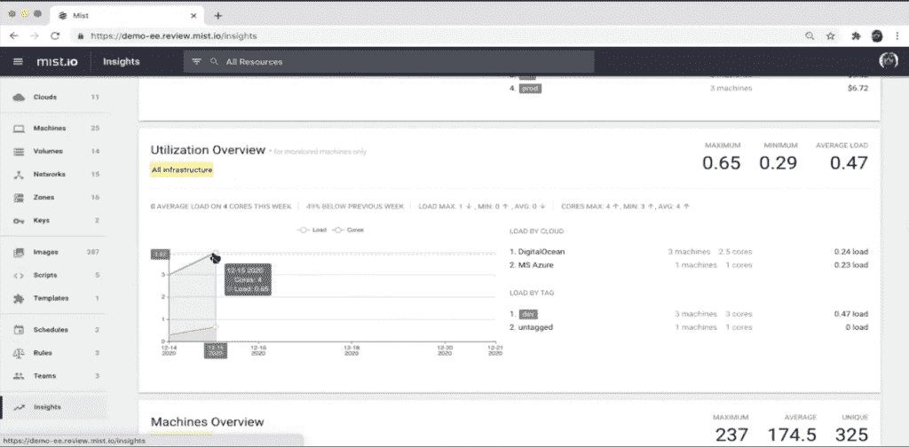
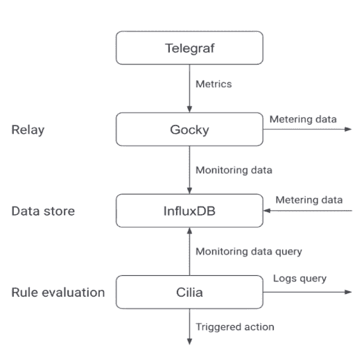
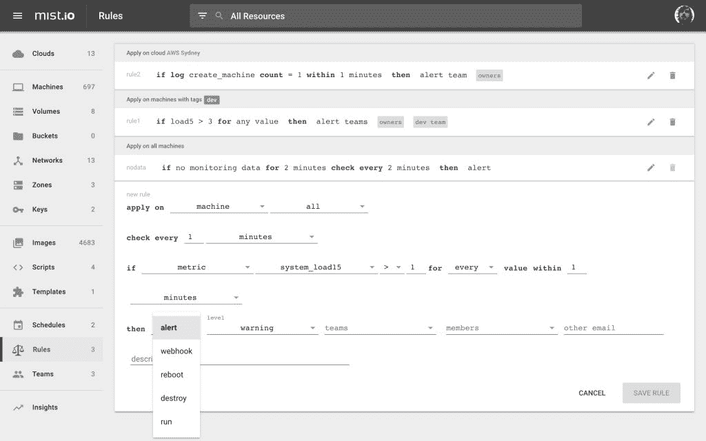

# 薄雾为多云团的可观测性扫清了道路

> 原文：<https://thenewstack.io/mist-clears-the-way-for-multicloud-observability/>

 [林达尔凯恩斯

林达尔为工程师撰写关于技术的文章。作为一名记者，有时也是一名开发人员，她一直对事物的工作方式感兴趣，并对开发运行世界的应用程序的人充满敬畏。她是 InfluxData 的高级文案。](https://www.linkedin.com/in/lyndalcairns) 

正如最近的 AWS 中断所表明的那样，多云策略对于现代企业来说是必要的，但管理这种基础设施仍然是一个巨大的挑战。基础设施管理团队长期以来一直在努力平衡各种技术解决方案、政策和服务，以获得对其资源的时间点视图。结果要么是过度配置造成的浪费，要么是挑剔的手动管理和重复性任务带来的巨大开销。

一种新的管理应用程序正逐步打破这种局面，为团队提供一个单一平台来观察和管理他们跨云的资源。由[时序数据库 InfluxDB](http://influxdata.com) 支持的 Mist，通过提供由灵活的 REST API 支持的统一接口，使 IT 团队能够管理他们的基础设施。

## 背景

[Mist](http://mist.io) 是一个开源的多云管理平台，它从公共云和私有云、虚拟机管理程序、容器和裸机服务器中获取洞察力。在同一个用户界面中，它支持简单的配置、流程编排、监控、成本管理和自动化。

该应用程序是在挫折中诞生的: [Mist 的联合创始人经营着一家 IT 咨询公司](https://thenewstack.io/mist-io-and-the-challenge-of-multicloud-management/)，他们的客户在云服务中激增，这给他们的管理带来了一场噩梦。

联合创始人 Chris Psaltis 表示，他们每天都要面对客户提出的问题，包括他们拥有的资源、资源在哪里、如何控制访问以及如何实现常见流程的自动化。

“我们的客户遍布世界各地，他们的基础架构无处不在:AWS、本地、协同定位…为了做出明智的决策，您需要数据，这就是为什么在管理基础架构时监控指标至关重要。自 Mist 早期以来，我们就集成了监控工具，因此我们可以在平台内汇集这些监控指标，然后帮助我们的用户做出明智的决策，”他说。

## 背景数据推动明智决策

跨不同云服务的总体虚拟机利用率视图。

Mist 通过本地 API 连接到基础设施提供商，以管理虚拟机并查看其性能，包括 CPU 使用情况和平均负载。它可以启动、调配、故障排除和销毁单个虚拟机，以及监控和比较不同云之间的性能。它可以显示每个云上有多少个虚拟机、它们的成本和性能。用户可以设置特定于机器或云的规则，并挖掘日志。他们可以跨机器执行脚本来安装应用程序并进行备份，或者跨云中的任何资源在集群中运行应用程序。

Mist 允许细粒度的资源权限，因此管理人员可以轻松地在云级别通过标签基于资源设置访问权限。例如，他们可以为管理员、开发人员和 QA 团队设置不同的策略。他们还可以配置 Mist，迫使他们的团队设定预算并管理资源的破坏，以避免成本超支。如果出现问题，可以在一个 Mist 仪表板中轻松访问日志。

尽管 Mist 最初是在 Collectd 和 Graphite 上构思和构建的，但该团队很快迁移到了 [InfluxDB](https://www.influxdata.com/products/influxdb-cloud/) 及其收集代理 Telegraf，因为它们是为时序数据构建的。

## 基础设施监控数据生命周期

Mist 监控子系统的体系结构。

Mist 应用建立在 InfluxDB 之上，使用[时间序列数据库](https://www.influxdata.com/time-series-database/)作为监控和计量数据的核心。Telegraf 代理从目标虚拟机或裸机服务器收集数据，并将监控数据流发送到 InfluxDB。计量数据由 Gocky 汇总，并被送入 InfluxDB。计量数据对于用户能够测量其容量非常重要，例如，每台机器和每个组织的数据点。从那里，Mist 插件 Cilia 充当规则引擎，根据一组规则评估流数据，并触发像执行脚本和运行警报或 webhooks 这样的操作。

以 InfluxDB 为核心，Mist 的开发人员可以利用其开源 MIT 许可证来构建它，并在生产中使用它。他们不必预配置度量粒度或预分配磁盘空间，因为 InfluxDB 默认提供这些功能。这减轻了 Mist 在扩展服务时的运营负担，也为他们节省了硬件成本。

使用 Telegraf 还意味着他们的用户可以访问其超过 200 个插件[的丰富阵列](https://www.influxdata.com/products/integrations/)，以最少的配置从几乎任何数据源收集数据。能够将 Telegraf 作为独立的二进制文件进行部署，并且没有依赖性，这也简化了 Mist 的部署过程。

## 在雾中监控虚拟机

用户几乎可以立即开始使用 Mist，从受支持的提供商列表中选择他们的云，然后粘贴一个 API 令牌开始收集数据。使用上游的未修改版本的 [Telegraf](https://www.influxdata.com/time-series-platform/telegraf/) ，Mist 立即开始录制表演。如果 Mist 不能通过 SSH 访问目标机器，用户可以手动部署代理。

默认情况下，控制面板为用户提供了该云的所有资源及其成本的视图。从这里，用户可以看到网络信息、文件系统、CPU 使用情况、进程，并深入查看各个虚拟机和日志。他们还可以编写定制的 Python 脚本来收集特定于他们需求的非默认信息；例如，ping 一个 IP 地址的次数。

## 自动化实现最佳性能

Mist 中的一些常见规则和自动化。

Cilia 插件不断向 InfluxDB 查询时间序列数据，向 Elasticsearch 查询日志数据。Cilia 允许用户基于特定的触发器管理警报和其他工作流。例如，如果每分钟有多台新机器运转，这可能表明过度配置，它将向特定团队发送电子邮件。

Mist 利用 InfluxDB 的自定义逻辑来识别动态阈值并自动扩展基础架构。用户可以触发 webhooks 或自动重启 tempestuous 虚拟机。他们可以按虚拟机、云、云组或标记创建规则，这些规则将应用于以后添加的新虚拟机，无需配置。

使用 InfluxDB 平台，Mist 开发了一个功能强大的应用程序，该应用程序使基础架构管理更加顺畅和民主化，为组织节省了资金，并为更多自动化铺平了道路。

要了解更多关于 InfluxDB 的信息，请访问 www.influxdata.com。

<svg xmlns:xlink="http://www.w3.org/1999/xlink" viewBox="0 0 68 31" version="1.1"><title>Group</title> <desc>Created with Sketch.</desc></svg>