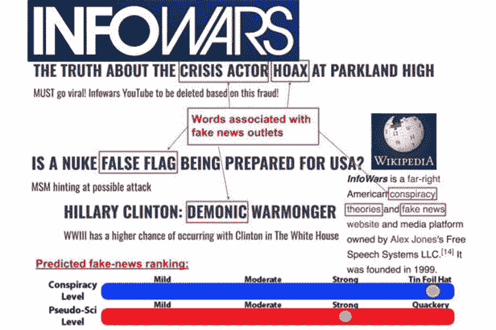

# 麻省理工学院的算法嗅出致力于“假新闻”的网站

> 原文：<https://thenewstack.io/mit-algorithm-sniffs-out-sites-dedicated-to-fake-news/>

互联网的兴起让普通人能够在有新闻价值的事件发生时进行报道，通过博客或社交媒体传播信息。信息的持续民主化意味着人们可以很容易地获得大型媒体渠道的替代品，但另一方面，现在也有可能产生和传播各种虚假信息，从[数字修改的图像或视频](https://thenewstack.io/synthesize-fake-obama-video-artificial-neural-networks/)，到网站或自私的政客发布疯狂的阴谋论。基本上，越来越难分辨什么是真的，什么不是。

值得庆幸的是，有一些[事实核查网站](https://mediabiasfactcheck.com/2016/07/20/the-10-best-fact-checking-sites/)作为日益严重的“假新闻”问题的重要对比但是就像无法控制的野火一样，虚假信息似乎可以传播得更快，并有可能在现实生活中造成更大的损害，即使它最终被揭穿(这方面的例子是离奇的 [#Pizzagate 阴谋论](https://en.wikipedia.org/wiki/Pizzagate_conspiracy_theory))。

但是，如果有一种方法可以从源头上自动检测假新闻，而不是煞费苦心地挑出个别谎言来补救，那会怎么样呢？这是来自麻省理工学院[计算机科学和人工智能实验室](https://www.csail.mit.edu/) (CSAIL)和[卡塔尔计算研究所](https://www.qcri.org/) (QCRI)的一组研究人员的目标，他们最近开发了一种新的机器学习算法，能够确定整个新闻网站——而不仅仅是一篇文章——是否经常提供准确或虚假的信息。这个想法是创造一个工具，可以自动识别假新闻的根源，在它像病毒一样传播之前。

“如果一个网站以前发布过假新闻，他们很有可能会再次发布，”Ramy Baly 解释说，他是这项研究的第一作者。“通过自动收集这些网站的数据，我们希望我们的系统可以帮助找出哪些网站可能会首先这样做。”

## 分析整个网站，而不仅仅是一篇文章

根据该团队的说法，与其他可能处理准确性其他方面的人工智能模型相比，该算法更广泛地专注于评估来源的可靠性，例如检查事实或识别操纵围绕某个问题的观点的巨魔。为了创建这个新系统，该团队使用了从网站[Media Bias/Fact Check](https://mediabiasfactcheck.com/)(MBFC)收集的数据，该网站使用人类研究人员人工评估各种新闻来源的准确性，从大型媒体到较小的运营。

该团队通过他们的机器学习算法运行 MBFC 的数据，并根据对网站内容的文本、句法和语义分析，训练它对 1000 多个新闻网站进行分类，重点关注结构、情感、参与度、主题、复杂性、偏见和道德等特征。根据该团队的说法，新系统只需要分析来自特定网站的大约 150 篇文章，就可以可靠地评估新闻来源是否值得信赖。

例如，更可靠的网站通常会在报道中使用中性语言，而虚假新闻网站会使用更具挑衅性和夸张的语言，如“危机演员”、“恶作剧”和“恶魔”等词甚至维基百科页面、Twitter 订阅和网站的 URL 也被分析:维基百科中关于新闻网站的较长条目被翻译成更可信，而包含特殊字符或奇怪子目录的 URL 被认为不太可信。

该团队指出，在大约 65%的情况下，该算法能够准确地确定某个新闻来源的真实性是低、中还是高。此外，大约 70%的时候，机器学习模型能够正确地将新闻网站分类为政治光谱的左边、中间或右边。虽然它不一定像人类执行同样的任务一样准确，但可以想象，当该算法与人类事实检查员结合使用时，揭露虚假新闻的艰巨任务变得更加自动化，因此也更加容易。

尽管该团队现在正在努力进一步完善算法，以包括其他语言的新闻网站和典型的左右框架之外的其他类型的偏见，但他们的研究仍然建立了目前世界上最大的[数据库](https://github.com/ramybaly/News-Media-Reliability/)，其中包含 1000 多个新闻来源的事实和偏见评级。在未来，该团队的目标是开发一款应用程序，为用户提供来自政治领域不同部分的事实新闻，希望能够超越人们熟悉和密切持有的偏见，扩大对特定问题的看法，并为世界各地社会日益加剧的政治两极分化创造一种可能的解毒剂。

要了解更多，请阅读该团队的[论文](https://arxiv.org/pdf/1810.01765.pdf)和[数据库](https://github.com/ramybaly/News-Media-Reliability/)。

图像:Unsplash 上的 rawpixel 麻省理工学院/昆士兰理工学院

<svg xmlns:xlink="http://www.w3.org/1999/xlink" viewBox="0 0 68 31" version="1.1"><title>Group</title> <desc>Created with Sketch.</desc></svg>