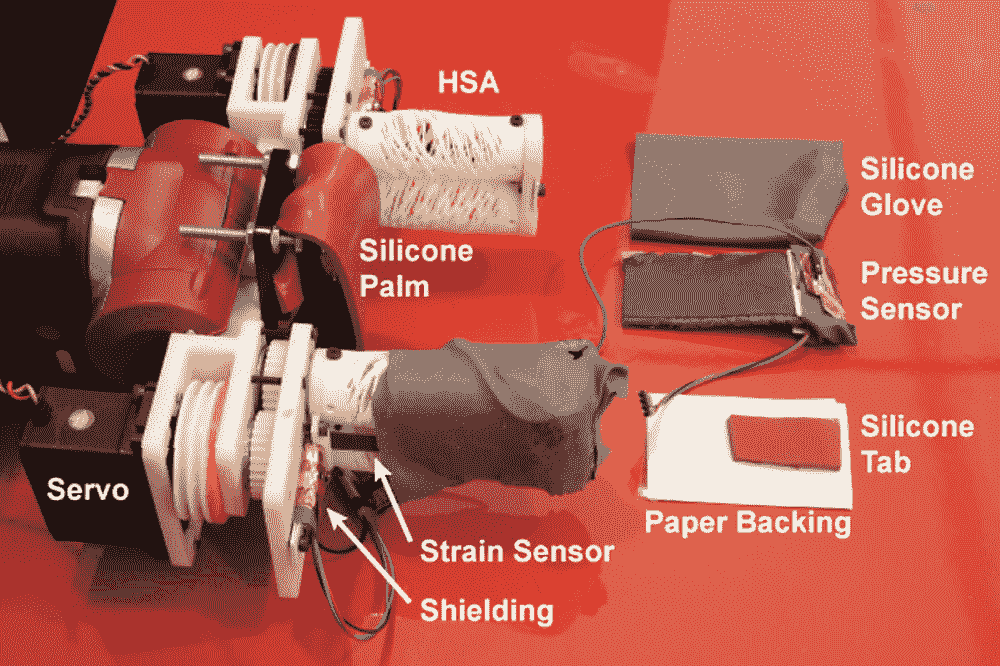
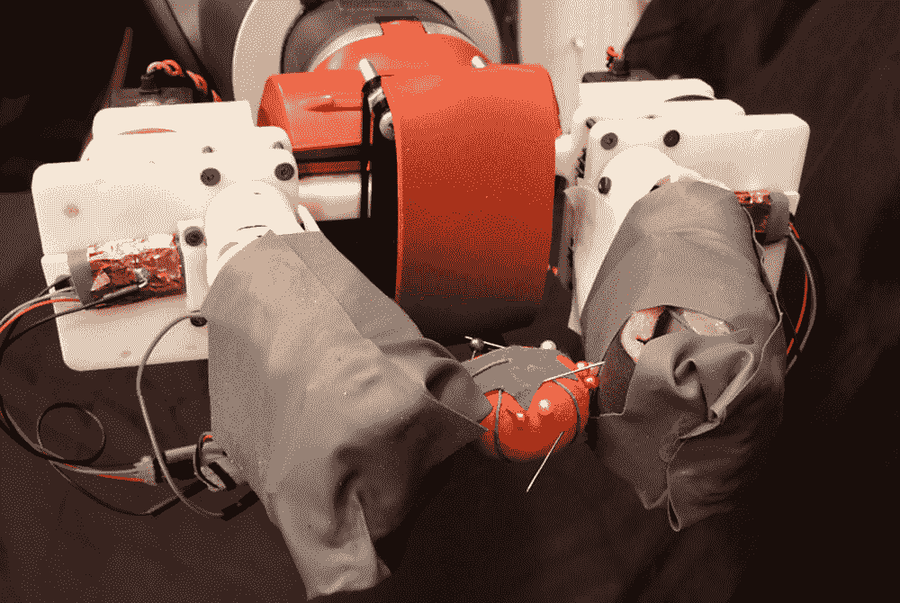

# 麻省理工学院和耶鲁大学的 RoCycle 机器人可以通过“感觉”对可回收物品进行分类

> 原文：<https://thenewstack.io/mit-and-yales-rocycle-robot-can-sort-recyclables-by-feeling-them/>

我们中的许多人已经习惯于将我们的纸张、塑料、玻璃和铝放在路边回收专用的特殊垃圾箱中，以便这些材料可以被回收并转化为新的消费品。但是在这些材料可以被转换成其他东西之前，它们必须被正确地分类。然而，如果分类不正确，这些物品最终会加入每年被送往垃圾填埋场的大约 25%的可回收材料中。这是一项重要的工作，大多数人会发现重复、枯燥、有潜在危险——更不用说对人类工人来说是劳动密集型的，对雇用他们的垃圾公司来说是昂贵的。

当然，这个过程可以自动化，通过使用机器人来更好地分类美国每年产生的 6800 万吨回收物。为了降低成本和提高回收率，麻省理工学院的[计算机科学和人工智能实验室](http://csail.mit.edu/) (CSAIL)和耶鲁大学正在开发 RoCycle，这是一种软机器人附加夹持器，与各种工业机器人平台兼容，能够“感觉”和“看到”物品，以便准确地对它们进行分类。观看并了解其工作原理:

[https://www.youtube.com/embed/TdzbDoEh44U?feature=oembed](https://www.youtube.com/embed/TdzbDoEh44U?feature=oembed)

视频

## 感觉比看见更好

令人惊讶的是，让机器人正确感知和识别物品并不像看起来那么容易。[计算机视觉](https://en.wikipedia.org/wiki/Computer_vision)技术在最近几年已经取得了长足的进步，但是通常一台机器仍然不能仅仅通过视觉来区分物体(比如看起来像金属的塑料)。这就是 RoCycle 可以发挥作用的地方:它使用一只由特氟隆制成的柔软的手，指尖上装有触觉传感器，这使它可以确定一件物品的大小和硬度。

“我们机器人的感知皮肤提供触觉反馈，使它能够区分从坚硬到柔软的各种物体，”麻省理工学院教授和论文作者之一 Daniela Rus 在 T2 的新闻发布会上解释道。“单靠计算机视觉无法解决赋予机器类似人类的感知的问题，因此能够使用触觉输入至关重要。”

正如该团队在他们的[论文](http://lillych.in/files/Chin-2019-robosoft.pdf)中所描述的那样，RoCycle 是使用[流体驱动](https://thenewstack.io/spider-like-microfluidic-soft-robot-is-built-for-precision-surgery/)的传统软机器人的一个进步，这意味着液体材料或空气被泵入使它们移动。然而，虽然这一方面使软机器人比它们的刚性对手更灵活，但缺点是这也使标准软机器人相当脆弱，容易被损坏或刺穿，特别是如果它们正在传送带上快速移动的可回收物流中进行分类。

为了防止可能的穿刺，研究小组的解决方案是使用一种称为[auxitics](https://en.wikipedia.org/wiki/Auxetics)的新材料作为致动器，结合常规电机。这些偏心结构的尖端拉胀材料表现出奇怪的方式:例如，当拉伸时，它们不是像弹性带一样变薄，而是变厚了。在 RoCycle 的案例中，研究小组在机器人的两对手指上使用了“手动剪切拉胀”(HSA)材料，当每个手指向左或向右扭曲时，它们就会张开并互锁，允许机器人通过触摸同时抓住和感知物体。

RoCycle 还配备了柔软的电容式硅压力和应变传感器，这使它能够感知物体的软硬程度。该机器人还能够感知一个物体是否导电，从而进一步区分金属和非金属。此外，RoCycle 使用一种算法，根据感应到的物体硬度和尺寸对纸张、塑料和金属物体进行分类。在测试中，该团队发现，RoCycle 在静止时分类物体的准确率达到 85%，在传送带上分类的准确率为 63%。

那么，这可能是提高回收利用率的一个潜在解决方案吗？无论如何，该团队正在努力通过添加更多传感器和改进其底层分类算法来进一步开发该系统。研究人员希望这种软机器人附件可以融入已经在使用的光学分类系统，从而提高回收效率，促进更可持续的废物处理实践——这是世界各地迫切需要的。

图片:麻省理工学院和耶鲁大学

<svg xmlns:xlink="http://www.w3.org/1999/xlink" viewBox="0 0 68 31" version="1.1"><title>Group</title> <desc>Created with Sketch.</desc></svg>