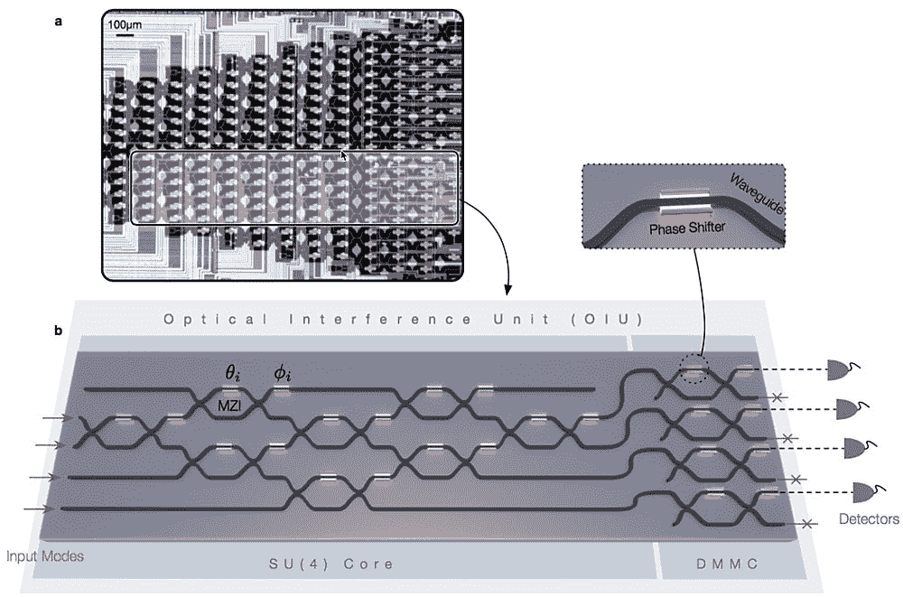

# 麻省理工学院设计光子处理器用于构建光学神经网络

> 原文：<https://thenewstack.io/mit-devises-photonic-processor-building-optical-neural-networks/>

随着人工智能领域技术的进步，对更高能效计算能力的需求也在增长。受所谓的[冯·诺依曼瓶颈](http://wiki.c2.com/?VonNeumannBottleneck)的限制，传统计算机架构的能力——即使是超级计算机中的那些——很快就会被神经网络的内存和带宽要求超越，神经网络支撑着深度学习应用，如语音识别和图像分类软件中的应用。

但是这个问题可以通过使用光代替电子来驱动深度学习计算来解决。麻省理工学院的一组研究人员正在提出一种他们称为可编程纳米光子处理器的原型，能够高效快速地执行深度学习任务中所需的矩阵(或数字阵列)的多次重复乘法，使用更少的功率。

研究人员的发现发表在最近一期的 [*自然光子学*](https://www.nature.com/nphoton/journal/v11/n7/full/nphoton.2017.93.html) 上，详细说明了基于光的神经网络系统相对于利用传统 CPU 或 GPU 芯片的系统的潜在优势。

“使用光进行矩阵乘法的天然优势在加速和节能方面发挥了很大作用，因为密集矩阵乘法是人工智能算法中最耗电和最耗时的部分，”麻省理工学院博士后研究员[沈浥尘](https://sites.google.com/site/yichenshenhomepage/)说，他是该论文的合著者之一。

## 光学神经网络

研究人员的可编程纳米光子处理器原型的功能类似于普通玻璃透镜将一束光分解成其组成波长。该团队的光子设备以硅光子集成电路中 56 个可编程[马赫-曾德尔干涉仪](https://en.wikipedia.org/wiki/Mach%E2%80%93Zehnder_interferometer)的级联阵列为特色。它能够通过其互联的光子[波导](https://en.wikipedia.org/wiki/Waveguide)阵列传输光线，这可以根据需要进行修改，以允许一组光束被“编程”用于特定的矩阵计算。然后，多个光束相互作用，产生传输预定操作的干涉图案。

在更大的规模上，该团队指出，这些设备可以交错配置，以执行所谓的非线性[激活功能](https://en.wikipedia.org/wiki/Activation_function)，类似于人类神经元的运作方式。典型的计算机芯片电路的数字网络根据线性激活函数的原理运行，该函数将节点的输出定义为“开”或“关”的二进制状态

然而，在模拟生物神经网络的运行方式时，人工神经网络依赖于所谓的非线性激活函数，这使得这些网络可以有效地计算问题，只使用少量的节点——随着计算问题变得更加复杂，这无疑是有用的。

麻省理工学院教授 Marin sol jai 说:“这种芯片，一旦你调整它，原则上，几乎可以立即以零能量执行矩阵乘法。“我们已经展示了关键的构建模块，但还没有展示完整的系统。”

该图显示了光学神经网络的一般架构。A)由输入层、若干隐藏层和输出层组成的通用人工神经网络结构。b)将一般的神经网络分解成单独的层。c)组成人工神经网络每一层的光学干涉和非线性单元。

在他们的实验中，研究小组发现，与标准电子芯片相比，可编程纳米光子处理器可以将标准人工智能算法中的计算速度提高两个数量级，每次操作使用的能量不到千分之一。该团队将他们的处理器用于一个只能识别四个元音的基本神经网络。即使使用相对简单的模型，处理器也能够达到 77%的准确率，相比之下，传统系统的准确率为 90%，传统系统使用更多的功率和更多的时间来执行相同的学习任务。

该团队设想，纳米光子处理器可以扩大规模，用于数据中心或安全系统等地方，以及自动驾驶汽车和无人机——任何需要进行大量计算但受功率和时间限制的领域。在所有不同类型的数据传输期间，该设备还可以用于更有效的模数转换信号处理。

论文作者之一、麻省理工学院教授 [Dirk Englund](http://www.rle.mit.edu/qp/people/) 说:“高速模拟信号处理是可以做到的。"这种方法可以直接在模拟域进行处理."

图片来自 Pixabay，其他图片来自麻省理工学院。

<svg xmlns:xlink="http://www.w3.org/1999/xlink" viewBox="0 0 68 31" version="1.1"><title>Group</title> <desc>Created with Sketch.</desc></svg>